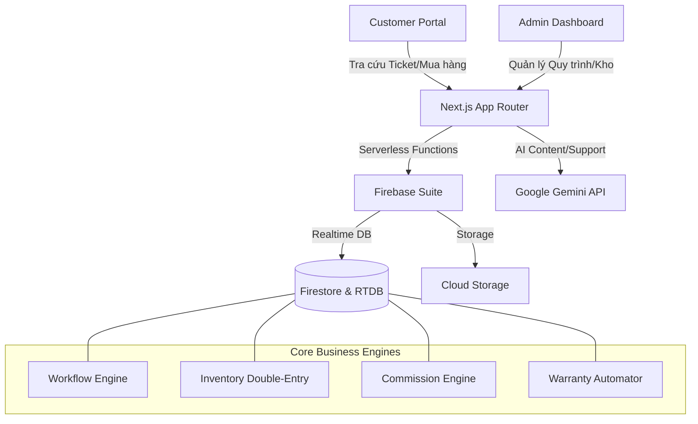

# PRD - Văn Lành Service Management System

## 1. Giới thiệu (Overview)
Hệ thống **Văn Lành Service** là một nền tảng quản lý dịch vụ sửa chữa và kinh doanh thiết bị điện tử (điện thoại, laptop) tích hợp AI. Hệ thống phục vụ hai nhóm đối tượng chính: khách hàng cá nhân (Customer) và đội ngũ quản lý/kỹ thuật viên (Admin).

## 2. Mục tiêu (Objectives)
- Số hóa quy trình sửa chữa từ lúc nhận máy đến khi trả máy và bảo hành.
- Tối ưu hóa trải nghiệm mua sắm trực tuyến với tốc độ tải trang cực nhanh (Lighthouse 90+).
- Quản lý tồn kho chính xác tuyệt đối bằng cơ chế **Double-Entry (Stock & Held)**.
- Tích hợp AI để hỗ trợ khách hàng và tự động hóa sáng tạo nội dung.
- Hệ thống báo cáo hoa hồng nhân viên minh bạch theo phân cấp.

## 3. Kiến trúc Hệ thống (System Architecture)

## 4. Phân hệ Khách hàng (Customer Module)
### 4.1. Cửa hàng trực tuyến (Storefront)
- **Trang chủ**: Banner động, danh mục sản phẩm nổi bật, dịch vụ sửa chữa phổ biến, đánh giá khách hàng.
- **Danh mục (Categories)**: Hệ thống phân loại đa cấp (Taxonomy) cho Sản phẩm và Dịch vụ.
- **Chi tiết Sản phẩm/Dịch vụ**: Thông tin chi tiết, giá cả, tình trạng kho, các lựa chọn (Variant) và video liên quan.
- **Tìm kiếm & Lọc**: Tìm kiếm theo từ khóa, lọc theo thương hiệu, giá và các thuộc tính kỹ thuật.

### 4.2. Quy trình Sửa chữa (Repair Services)
- **Đặt lịch/Yêu cầu sửa chữa**: Khách hàng có thể chọn loại máy, lỗi gặp phải và gửi yêu cầu.
- **Tra cứu tình trạng (Tracking)**: Theo dõi tiến độ sửa chữa realtime qua mã phiếu (Ticket ID).

### 4.3. Tương tác & Hỗ trợ
- **Đánh giá (Reviews)**: Hệ thống đánh giá có Geofence (chỉ cho phép đánh giá khi khách hàng thực sự đến cửa hàng hoặc hoàn tất đơn hàng).
- **AI Chatbot**: Hỗ trợ giải đáp nhanh các lỗi thường gặp và tư vấn dịch vụ 24/7.
- **Tin tức & Blog**: Các bài viết hướng dẫn, thủ thuật công nghệ được tối ưu SEO.

## 5. Phân hệ Quản trị (Admin Module)
### 5.1. Quản lý Bán hàng & Sửa chữa (POS & Tickets)
- **Quản lý Phiếu sửa chữa**: Tiếp nhận máy, phân công kỹ thuật viên, cập nhật trạng thái (Workflow), xuất hóa đơn.
- **Quản lý Linh kiện sử dụng**: Tự động trừ kho khi kỹ thuật viên thay thế linh kiện cho máy khách.
- **Quy trình Bảo hành**: Tạo phiếu bảo hành liên kết với phiếu gốc, tự động kiểm tra thời hạn linh kiện.

### 5.2. Quản lý Kho (Inventory)
- **Cơ chế Double-Entry**: Theo dõi hai trạng thái: `stock` (có sẵn) và `held` (đang giữ cho các máy đang sửa).
- **Nhập/Xuất kho**: Quản lý phiếu nhập kho, nhà cung cấp và giá vốn (COGS).
- **Draft Receipts**: Tự động tạo phiếu nhập nháp khi kỹ thuật viên yêu cầu linh kiện không có sẵn trong kho.

### 5.3. Quản lý Hệ thống & Marketing
- **Dynamic Config**: Chỉnh sửa Menu, Banner, Thông tin cửa hàng trực tiếp từ dashboard.
- **AI Content Tools**: Công cụ viết bài tự động sử dụng Gemini AI để tạo tin tức dựa trên từ khóa.
- **Hệ thống Hoa hồng (Commission)**: Tính toán tự động theo phân cấp: Sản phẩm cụ thể > Danh mục > Mặc định.

## 6. Yêu cầu Phi chức năng (Non-functional Requirements)
- **Hiệu suất**: Thời gian phản hồi trang < 1s, điểm Lighthouse Performance > 90.
- **Bảo mật**: Chặn spam analytics, bảo vệ API Key AI bằng server-side proxy, phân quyền Firestore chặt chẽ.
- **Khả dụng**: Hoạt động tốt trên cả Mobile và Desktop (Responsive).
- **SEO**: Tự động sinh Schema Markup (Structured Data) cho Sản phẩm và Dịch vụ.

