# 🧩 Workflows
## ai-plans
- **Title:** Kế hoạch và Công việc (AI Plans & Tasks)
- **Icon:** 🤖

### 📁 AI Plans & Tasks
- [master_hub_plan](../../ui/data/ai_plans/master_hub_plan.md)
- [plan_crm_customers_v2](../../ui/data/ai_plans/plan_crm_customers_v2.md)
- [plan_customer_ux](../../ui/data/ai_plans/plan_customer_ux.md)
- [plan_feature_expansion_v2](../../ui/data/ai_plans/plan_feature_expansion_v2.md)
- [plan_live_chat_omnichannel_v2](../../ui/data/ai_plans/plan_live_chat_omnichannel_v2.md)
- [plan_bug_otp_001_v2_idempotent_voucher_20260611](../../ui/data/ai_plans/plan_bug_otp_001_v2_idempotent_voucher_20260611.md)
- [plan_master_hub](../../ui/data/ai_plans/plan_master_hub.md)
- [roadmap_v2_plan](../../ui/data/ai_plans/roadmap_v2_plan.md)
- [roadmap_v2_task](../../ui/data/ai_plans/roadmap_v2_task.md)
- [roadmap_v2_walkthrough](../../ui/data/ai_plans/roadmap_v2_walkthrough.md)
- [task_crm_customers_v2](../../ui/data/ai_plans/task_crm_customers_v2.md)
- [task_customer_ux](../../ui/data/ai_plans/task_customer_ux.md)
- [task_feature_expansion_v2](../../ui/data/ai_plans/task_feature_expansion_v2.md)
- [task_live_chat_omnichannel_v2](../../ui/data/ai_plans/task_live_chat_omnichannel_v2.md)
- [task_bug_otp_001_v2_idempotent_voucher_20260611](../../ui/data/ai_plans/task_bug_otp_001_v2_idempotent_voucher_20260611.md)
- [task_master_hub](../../ui/data/ai_plans/task_master_hub.md)
- [walkthrough_customer_ux](../../ui/data/ai_plans/walkthrough_customer_ux.md)
- [walkthrough_live_chat_omnichannel_v2](../../ui/data/ai_plans/walkthrough_live_chat_omnichannel_v2.md)
- [walkthrough_master_hub](../../ui/data/ai_plans/walkthrough_master_hub.md)

```mermaid
graph TD
  AI_PLANS("📁 Thư mục AI Plans")
  AI_PLANS --> F0("master_hub_plan.md")
  AI_PLANS --> F1("plan_crm_customers_v2.md")
  AI_PLANS --> F2("plan_customer_ux.md")
  AI_PLANS --> F3("plan_feature_expansion_v2.md")
  AI_PLANS --> F4("plan_live_chat_omnichannel_v2.md")
  AI_PLANS --> F5("plan_bug_otp_001_v2_idempotent_voucher_20260611.md")
  AI_PLANS --> F6("plan_master_hub.md")
  AI_PLANS --> F7("roadmap_v2_plan.md")
  AI_PLANS --> F8("roadmap_v2_task.md")
  AI_PLANS --> F9("roadmap_v2_walkthrough.md")
  AI_PLANS --> F10("task_crm_customers_v2.md")
  AI_PLANS --> F11("task_customer_ux.md")
  AI_PLANS --> F12("task_feature_expansion_v2.md")
  AI_PLANS --> F13("task_live_chat_omnichannel_v2.md")
  AI_PLANS --> F14("task_bug_otp_001_v2_idempotent_voucher_20260611.md")
  AI_PLANS --> F15("task_master_hub.md")
  AI_PLANS --> F16("walkthrough_customer_ux.md")
  AI_PLANS --> F17("walkthrough_live_chat_omnichannel_v2.md")
  AI_PLANS --> F18("walkthrough_master_hub.md")
```

