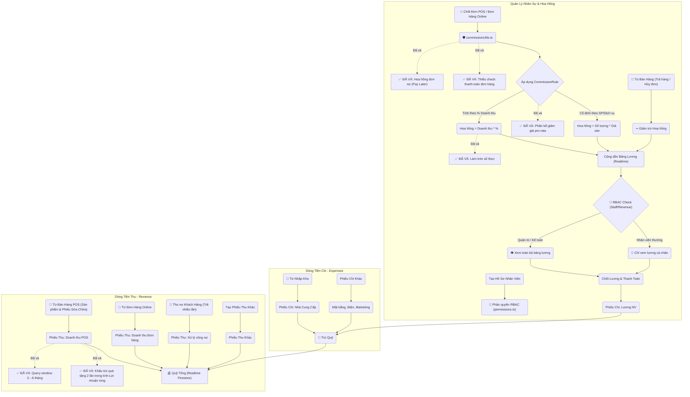

# 🧩 Workflows
## finance-hr
- **Title:** Tài chính & Nhân sự
- **Icon:** 💰
### 📁 Target Files (Các file đích)
- src/app/admin/finance/page.tsx (Báo cáo thu chi)
- src/app/admin/hr/page.tsx (Quản lý nhân sự & hoa hồng)
