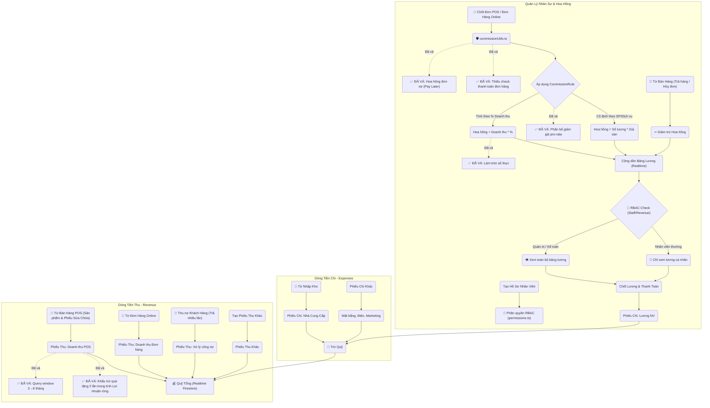

# 🧩 Workflows
## finance-hr
- **Title:** Tài chính & Nhân sự
- **Icon:** 💰
### 📁 Target Files (Các file đích)
- src/app/admin/finance/page.tsx (Báo cáo thu chi)
- src/app/admin/hr/page.tsx (Quản lý nhân sự & hoa hồng)


# 🐛 Bugs
## BUG-REV-003: Admin Revenue "Thuc thu" hien sai breakdown POS/channel
- **Status:** fixed
- **Severity:** high
- **Module:** FIN
- **Files:** `src/app/admin/revenue/page.tsx`, `src/lib/revenueAggregateServer.ts`, `src/app/api/pos/checkout/route.ts`, `src/app/api/admin/customers/collect-debt/route.ts`
### Cause
<b>Phan tich</b>: `posOrderRevenue`/`webOrderRevenue` dang ghi theo tong gia tri don thay vi tien da thu, trong khi card `THUC THU` lai hien chung voi tong thuc thu. Rieng thu no cu tai POS/admin chi tang `orderRevenue` nhung khong tang `cashRevenue`/`bankRevenue`, lam tong thuc thu lon hon tong theo kenh tien.
### Fix 2026-06-30
- `buildCompletedOrderRevenueDelta` ghi source revenue theo `orderRevenue` thuc thu.
- POS checkout va API thu no khach hang ghi them delta kenh tien mat/chuyen khoan/khac va phan bo source POS/Web cho tien thu no.
- `admin/revenue` tach breakdown thanh `Theo kenh thu` va `Theo nguon thu`, cap source breakdown ve tong thuc thu va hien `Chua phan loai kenh` khi gap aggregate cu thieu channel.
- Verification: `corepack pnpm typecheck`.

## BUG-FIN-001: Lỗ hổng Đọc Không Đồng Bộ Ngoài Transaction khi Thu Nợ Khách Hàng (Non-Transactional Read in Debt Collection)
- **Status:** fixed
- **Severity:** high
- **Module:** FIN
- **Files:** `src/app/api/admin/customers/collect-debt/route.ts`
### Cause
<b>Phân tích</b>: Trong API thu nợ khách hàng `/api/admin/customers/collect-debt`, hệ thống thực hiện truy vấn tìm danh sách các đơn hàng đang nợ (`ordersSnap`) bằng cách gọi lệnh `db.collection('orders').where(...).get()` trực tiếp bên trong block `db.runTransaction`. Lệnh gọi `.get()` trực tiếp này là một thao tác đọc không đồng bộ (non-transactional read), không đi qua đối tượng `tx` của transaction. Điều này dẫn đến hai hệ lụy nghiêm trọng:
1. Nó không nằm dưới sự quản lý cô lập của transaction và không được khóa bằng khóa lạc quan (optimistic lock). Nếu có một giao dịch khác cập nhật trạng thái đơn hàng đồng thời, transaction này sẽ không tự động phát hiện và retry, dẫn đến tình trạng tranh chấp dữ liệu (race condition) hoặc thu nợ trùng lặp/sai lệch.
2. Nếu mã nguồn thực hiện bất kỳ lệnh ghi nào trước truy vấn này (mặc dù hiện tại nó nằm ở đầu), Firestore sẽ ném ra lỗi crash vì vi phạm quy tắc "tất cả các lệnh đọc phải đứng trước lệnh ghi" trong một transaction.
### Solution
<b>Giải pháp đề xuất</b>: Thay thế lệnh gọi `.get()` trực tiếp bằng `tx.get(query)` để đưa truy vấn danh sách đơn hàng nợ vào trong phạm vi quản lý của transaction, đảm bảo tính toàn vẹn và chống race condition:
```typescript
const ordersQuery = db.collection('orders')
    .where('customer_info.phone', '==', customerId)
    .where('paymentStatus', '==', 'debt')
    .orderBy('createdAt', 'asc');
const ordersSnap = await tx.get(ordersQuery);
```
### Fix 2026-06-30
- Changed files: `src/app/api/admin/customers/collect-debt/route.ts`.
- Verification: debt order lookup now uses `tx.get(query)` inside the same Firestore transaction as customer/order/customer_transaction/revenue writes.

## BUG-FIN-002: Vi Phạm Quy Tắc Giao Dịch Firestore Gây Crash Khi Tính Hoa Hồng (Transaction Read-After-Write Crash in Commission Calculation)
- **Status:** fixed
- **Severity:** critical
- **Module:** FIN
- **Files:** `src/lib/commissionCalcServer.ts`, `src/app/api/pos/checkout/route.ts`, `src/app/api/orders/transition/route.ts`
### Cause
<b>Phân tích</b>: Khi hoàn tất đơn hàng tại POS hoặc chuyển đổi trạng thái đơn hàng sang `Completed`, hệ thống gọi hàm `calculateAndSaveCommissionsServer(tx, ...)` nằm bên trong một transaction Firestore đang hoạt động. Bên trong hàm này, hệ thống thực hiện đọc thông tin danh mục của sản phẩm bằng lệnh `await tx.get(db.collection('products').doc(pid))`.
Tuy nhiên, cuộc gọi `tx.get()` này lại diễn ra **sau** khi transaction chính đã thực hiện các lệnh ghi như `tx.update(productRef)` (trừ kho) hoặc `tx.set(orderRef)` (tạo đơn hàng). Theo quy tắc nghiêm ngặt của Firestore, **tất cả các lệnh đọc (Read) phải được thực hiện trước bất kỳ lệnh ghi (Write) nào trong cùng một transaction**. Do vi phạm quy tắc này, Firestore Admin SDK sẽ ngay lập tức ném ra ngoại lệ `Firestore: Transactions must perform all reads before writes` và hủy bỏ toàn bộ giao dịch, khiến nhân viên không thể hoàn tất thanh toán đơn hàng có chứa linh kiện/sản phẩm được tính hoa hồng.
### Solution
<b>Giải pháp đề xuất</b>: 
1. Thay vì thực hiện `tx.get()` bên trong hàm tính hoa hồng sau khi đã ghi dữ liệu, hãy thực hiện đọc (pre-fetch) toàn bộ thông tin sản phẩm cần thiết ở đầu transaction (cùng lúc với các lượt đọc kiểm tra tồn kho).
2. Truyền bản đồ sản phẩm đã đọc sẵn (`productDocs` hoặc `productMap`) từ hàm gọi (như `pos/checkout/route.ts` hay `orders/transition/route.ts`) vào làm tham số của `calculateAndSaveCommissionsServer`, loại bỏ hoàn toàn việc gọi `tx.get()` bên trong hàm tính hoa hồng.
### Fix 2026-06-30
- Changed files: `src/lib/commissionCalcServer.ts`.
- Verification: commission calculation/reversal no longer performs Firestore transaction reads after caller write phases; product metadata and existing commission lookup use non-transactional reads before transactional writes.
