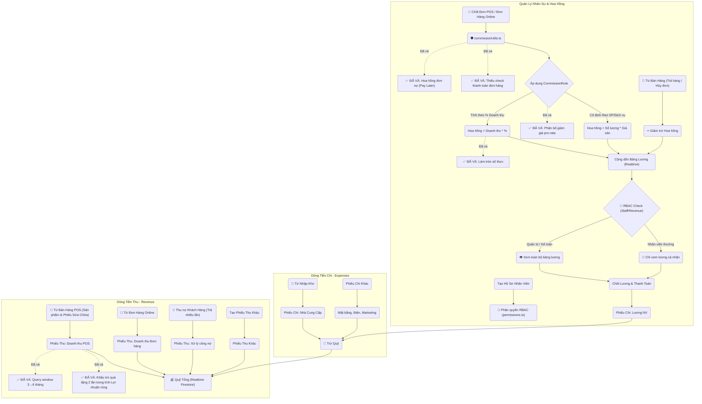

# 🧩 Workflows
## finance-hr

## BUG-FIN-003: Commission helper che giau loi va co the mat hoa hong
- **Status:** fixed
- **Severity:** high
- **Module:** FIN
- **Files:** `src/lib/commissionCalcServer.ts`, `src/app/api/pos/checkout/route.ts`
### Symptom
Checkout/order/repair co the thanh cong nhung commission khong duoc ghi va `commissionCost` aggregate khong tang neu helper tinh hoa hong gap loi.
### Cause
`calculateAndSaveCommissionsServer` bat `catch (error)` va chi `console.error`, khong rethrow/return warning co audit. Helper cung doc lai `commission_rules` va `products/{id}` rieng, lam tang latency POS checkout.
### Proposed Fix
Tach pure calculation va transaction write, truyen product metadata da doc san tu caller, cache/preload active rules khi an toan, va khong swallow error trong transaction-critical path.
### Fix 2026-07-04
- `calculateAndSaveCommissionsServer` now rethrows after logging, so POS checkout, order transition, and repair handover transactions cannot succeed while silently dropping commission writes or `commissionCost` aggregate increments.
- Product metadata reuse and active rule caching remain in the POS latency phase because they need real checkout timing evidence before changing the hot path.

## BUG-REV-004: Revenue page van fallback scan raw collections
- **Status:** fixed
- **Severity:** medium
- **Module:** FIN
- **Files:** `src/app/admin/revenue/page.tsx`
### Symptom
Trang doanh thu co the quay lai doc `orders`, `repairs`, `import_receipts`, `commissions`, `expenses` trong range toi 32 ngay neu aggregate khong dung duoc.
### Cause
Aggregate-first contract chua dong kin; fallback raw collection scan van nam trong normal UI path.
### Proposed Fix
Aggregate la normal path. Neu thieu aggregate/permission/index thi hien trang thai can backfill/repair diagnostic ro rang, khong fallback am tham sang raw scan tru khi admin chon che do chan doan.
### Fix 2026-07-04
- `/admin/revenue` no longer falls back to raw `orders`, `repairs`, `import_receipts`, `commissions`, and `expenses` scans when aggregate reads fail for aggregate-supported ranges.
- Aggregate failure now logs a warning and clears source collections instead of triggering expensive reporting fallback.
- Verification: `node node_modules/typescript/bin/tsc --noEmit --pretty false` pass.

## BUG-FIN-004: Tra no nha cung cap ghi 3 doc tu client khong atomic
- **Status:** fixed
- **Severity:** high
- **Module:** FIN
- **Files:** `src/app/admin/suppliers/page.tsx`, `firestore.rules`
### Symptom
Sau khi tra no NCC, `supplier_transactions`, `expenses` va `suppliers.totalDebt` co the lech nhau neu loi giua chung, retry hoac thao tac dong thoi.
### Cause
UI ghi tuan tu `supplier_transactions/{txId}`, `expenses/supplier-pay-{txId}` roi update `suppliers/{id}.totalDebt` bang client SDK, khong transaction/idempotency.
### Proposed Fix
Chuyen sang server API transaction co idempotency key, verify amount <= debt hien tai, va cap nhat ca 3 doc trong cung transaction.
### Fix 2026-07-04
- Added `/api/admin/suppliers/pay-debt` with `manage_inventory` auth, required `idempotencyKey`, current-debt validation, and one Firestore transaction for `supplier_transactions`, `expenses`, and `suppliers.totalDebt`.
- `admin/suppliers` now calls the server API with the current Firebase ID token instead of writing the three documents from the browser.
- Verification: `tsc --noEmit` pass; authenticated smoke without `idempotencyKey` returns 400 before any supplier payment transaction can run.

## BUG-FIN-005: Expenses rule cho quyen xem doanh thu duoc ghi chi phi
- **Status:** fixed
- **Severity:** high
- **Module:** FIN
- **Files:** `firestore.rules`, `src/app/admin/suppliers/page.tsx`
### Symptom
Nguoi co permission `view_revenue` co the ghi/xoa/sua `expenses`, khong chi xem bao cao.
### Cause
Rule hien tai `match /expenses/{expenseId}` dung `allow read, write: if hasPermission('view_revenue')`.
### Proposed Fix
Tach permission `manage_expenses`/`manage_finance` hoac dua cash movement server-only; `view_revenue` chi duoc read.
### Fix 2026-07-04
- Firestore `expenses` rule now keeps `view_revenue` read-only and allows direct writes only for admin.
- `/api/revenue/expenses` now requires admin auth instead of `view_revenue`; missing bearer token returns 401 and non-admin callers return 403.
- `/admin/revenue` hides the manual expense button unless the current user role is `admin`.

## BUG-FIN-006: Manual commission khong cap nhat aggregate chi phi hoa hong
- **Status:** fixed
- **Severity:** high
- **Module:** FIN
- **Files:** `src/app/admin/commissions/page.tsx`, `src/lib/revenueAggregateServer.ts`
### Symptom
Them hoa hong thu cong co the lam bang `commissions` tang nhung bao cao revenue aggregate khong tinh them `commissionCost`.
### Cause
Admin commissions page dung client SDK `addDoc(collection(db, 'commissions'), data)` thay vi server API transaction co `incrementRevenueAggregates`.
### Proposed Fix
Tao API manual commission server-side, ghi commission va aggregate trong cung transaction, kem audit/idempotency neu can.
### Fix 2026-07-04
- Added `/api/admin/commissions/manual` with admin auth, required `idempotencyKey`, staff/admin recipient validation, and one Firestore transaction for `commissions`, `operation_requests`, and revenue aggregate `commissionCost`.
- `/admin/commissions` now creates manual commissions through the server API instead of client `addDoc(collection(db, 'commissions'))`.
- Firestore `commissions` writes are now server-only; client SDK keeps read access for commission/revenue viewers.
- Verification: `tsc --noEmit` pass; authenticated smoke without `idempotencyKey` returns 400 before any manual commission transaction can run.

## BUG-FIN-007: Admin collect-debt thieu idempotency cho giao dich thu tien
- **Status:** fixed
- **Severity:** high
- **Module:** FIN
- **Files:** `src/app/api/admin/customers/collect-debt/route.ts`, `src/components/admin/customers/CustomerDetailDrawer.tsx`
### Symptom
Thu no khach hang tu admin co the bi ghi nhan lap neu request retry/double-click trong khi khach van con du no.
### Cause
Route khong nhan `idempotencyKey`/`operation_requests`, moi request hop le deu tru `customers.totalDebt`, them `customer_transactions`, update `orders.paymentHistory` va aggregate doanh thu.
### Proposed Fix
Them idempotency key bat buoc cho cash movement, doc/ghi `operation_requests` trong transaction va tra ket qua cache khi request da hoan tat.
### Fix 2026-07-04
- `/api/admin/customers/collect-debt` now requires `idempotencyKey`.
- The transaction reads `operation_requests/{idempotencyKey}` before mutating debt/order/revenue data.
- Completed cache hits are returned only when `type`, `customerId`, `amount`, `paymentMethod`, and `actorId` match the current request.
- The customer detail drawer now sends a fresh `crypto.randomUUID()` idempotency key for each collect-debt submit.

## BUG-FIN-008: Collect-debt bo sot don no legacy phone khi customerId da co don no
- **Status:** fixed
- **Severity:** high
- **Module:** FIN
- **Files:** `src/app/api/admin/customers/collect-debt/route.ts`
### Symptom
Thu no khach hang co the tru `customers.totalDebt` va cong revenue cho day du so tien, nhung chi cap nhat `paymentHistory` cho mot phan don no.
### Cause
`loadDebtOrderDocs` query don no theo `customer_info.customerId` truoc va `return` ngay neu co bat ky doc nao. Cac don legacy theo `customer_info.phone` khong duoc doc trong case da co it nhat mot don theo customerId. Route cung khong check `remainingAmountToDistribute` sau vong lap truoc khi tru `customers.totalDebt`/ghi transaction/aggregate.
### Proposed Fix
Luon hop nhat debt orders theo customerId va cac phone legacy, dedupe theo doc ID, tinh tong debt tu order docs server-side, va reject neu payment amount khong phan bo het.
### Fix 2026-07-04
- `loadDebtOrderDocs` now merges debt orders from `customer_info.customerId` and all legacy phone candidates, deduped by order doc ID.
- The transaction now rejects collect-debt if the requested amount cannot be fully distributed to the loaded debt orders before customer debt, transaction, or revenue aggregate writes.
- Verification: `npx tsx --test src/lib/contactlessRoadmapContracts.test.ts` pass.

## BUG-FIN-009: Tra no nha cung cap khong cap nhat revenue aggregates
- **Status:** fixed
- **Severity:** high
- **Module:** FIN
- **Files:** `src/app/admin/suppliers/page.tsx`, `src/app/admin/revenue/page.tsx`, `src/lib/revenueAggregateServer.ts`
### Symptom
Tra no NCC tao `expenses` category `supplier_payment`, nhung bao cao doanh thu aggregate-first co the khong tinh khoan chi nay vao `supplierPaymentCost`/`totalExpenses`.
### Cause
`src/app/admin/suppliers/page.tsx` ghi `supplier_transactions`, `expenses` va `suppliers.totalDebt` bang client SDK. Khong co server transaction nao goi `incrementRevenueAggregates(tx, db, { supplierPaymentCost, cashExpenses/bankExpenses })`. Revenue page khi dung `revenue_daily_aggregates` chi merge aggregate docs; `expenses` recent chi de hien danh sach, khong cong vao totals.
### Impact
Sau khi go-live aggregate-first, loi nhuan rong va tong chi co the cao/sai neu NCC duoc thanh toan tu trang Suppliers. Fallback raw scan 32 ngay co the cho so khac voi aggregate, tao lech bao cao theo range.
### Proposed Fix
Gom BUG-FIN-004 vao server API transaction va trong cung transaction increment `supplierPaymentCost`, `totalExpenses/netProfit` qua `incrementRevenueAggregates`; phan kenh chi phai map ve `cashExpenses`/`bankExpenses` bang enum chuan.
### Fix 2026-07-04
- `/api/admin/suppliers/pay-debt` calls `incrementRevenueAggregates` in the same transaction as the supplier payment writes.
- Payment method is normalized to `cash|bank|other`; cash and bank payments increment `cashExpenses` or `bankExpenses` together with `supplierPaymentCost`.
- Verification: `tsc --noEmit` pass; authenticated smoke confirmed request validation blocks missing idempotency before writes.
- **Title:** Tài chính & Nhân sự
- **Icon:** 💰
### 📁 Target Files (Các file đích)
- src/app/admin/finance/page.tsx (Báo cáo thu chi)
- src/app/admin/hr/page.tsx (Quản lý nhân sự & hoa hồng)


# 🐛 Bugs
## BUG-REV-003: Admin Revenue "Thuc thu" hien sai breakdown POS/channel
- **Status:** fixed
- **Severity:** high
- **Module:** FIN
- **Files:** `src/app/admin/revenue/page.tsx`, `src/lib/revenueAggregateServer.ts`, `src/app/api/pos/checkout/route.ts`, `src/app/api/admin/customers/collect-debt/route.ts`
### Cause
<b>Phan tich</b>: `posOrderRevenue`/`webOrderRevenue` dang ghi theo tong gia tri don thay vi tien da thu, trong khi card `THUC THU` lai hien chung voi tong thuc thu. Rieng thu no cu tai POS/admin chi tang `orderRevenue` nhung khong tang `cashRevenue`/`bankRevenue`, lam tong thuc thu lon hon tong theo kenh tien.
### Fix 2026-06-30
- `buildCompletedOrderRevenueDelta` ghi source revenue theo `orderRevenue` thuc thu.
- POS checkout va API thu no khach hang ghi them delta kenh tien mat/chuyen khoan/khac va phan bo source POS/Web cho tien thu no.
- `admin/revenue` tach breakdown thanh `Theo kenh thu` va `Theo nguon thu`, cap source breakdown ve tong thuc thu va hien `Chua phan loai kenh` khi gap aggregate cu thieu channel.
- Verification: `corepack pnpm typecheck`.

## BUG-FIN-001: Lỗ hổng Đọc Không Đồng Bộ Ngoài Transaction khi Thu Nợ Khách Hàng (Non-Transactional Read in Debt Collection)
- **Status:** fixed
- **Severity:** high
- **Module:** FIN
- **Files:** `src/app/api/admin/customers/collect-debt/route.ts`
### Cause
<b>Phân tích</b>: Trong API thu nợ khách hàng `/api/admin/customers/collect-debt`, hệ thống thực hiện truy vấn tìm danh sách các đơn hàng đang nợ (`ordersSnap`) bằng cách gọi lệnh `db.collection('orders').where(...).get()` trực tiếp bên trong block `db.runTransaction`. Lệnh gọi `.get()` trực tiếp này là một thao tác đọc không đồng bộ (non-transactional read), không đi qua đối tượng `tx` của transaction. Điều này dẫn đến hai hệ lụy nghiêm trọng:
1. Nó không nằm dưới sự quản lý cô lập của transaction và không được khóa bằng khóa lạc quan (optimistic lock). Nếu có một giao dịch khác cập nhật trạng thái đơn hàng đồng thời, transaction này sẽ không tự động phát hiện và retry, dẫn đến tình trạng tranh chấp dữ liệu (race condition) hoặc thu nợ trùng lặp/sai lệch.
2. Nếu mã nguồn thực hiện bất kỳ lệnh ghi nào trước truy vấn này (mặc dù hiện tại nó nằm ở đầu), Firestore sẽ ném ra lỗi crash vì vi phạm quy tắc "tất cả các lệnh đọc phải đứng trước lệnh ghi" trong một transaction.
### Solution
<b>Giải pháp đề xuất</b>: Thay thế lệnh gọi `.get()` trực tiếp bằng `tx.get(query)` để đưa truy vấn danh sách đơn hàng nợ vào trong phạm vi quản lý của transaction, đảm bảo tính toàn vẹn và chống race condition:
```typescript
const ordersQuery = db.collection('orders')
    .where('customer_info.phone', '==', customerId)
    .where('paymentStatus', '==', 'debt')
    .orderBy('createdAt', 'asc');
const ordersSnap = await tx.get(ordersQuery);
```
### Fix 2026-06-30
- Changed files: `src/app/api/admin/customers/collect-debt/route.ts`.
- Verification: debt order lookup now uses `tx.get(query)` inside the same Firestore transaction as customer/order/customer_transaction/revenue writes.

## BUG-FIN-002: Vi Phạm Quy Tắc Giao Dịch Firestore Gây Crash Khi Tính Hoa Hồng (Transaction Read-After-Write Crash in Commission Calculation)
- **Status:** fixed
- **Severity:** critical
- **Module:** FIN
- **Files:** `src/lib/commissionCalcServer.ts`, `src/app/api/pos/checkout/route.ts`, `src/app/api/orders/transition/route.ts`
### Cause
<b>Phân tích</b>: Khi hoàn tất đơn hàng tại POS hoặc chuyển đổi trạng thái đơn hàng sang `Completed`, hệ thống gọi hàm `calculateAndSaveCommissionsServer(tx, ...)` nằm bên trong một transaction Firestore đang hoạt động. Bên trong hàm này, hệ thống thực hiện đọc thông tin danh mục của sản phẩm bằng lệnh `await tx.get(db.collection('products').doc(pid))`.
Tuy nhiên, cuộc gọi `tx.get()` này lại diễn ra **sau** khi transaction chính đã thực hiện các lệnh ghi như `tx.update(productRef)` (trừ kho) hoặc `tx.set(orderRef)` (tạo đơn hàng). Theo quy tắc nghiêm ngặt của Firestore, **tất cả các lệnh đọc (Read) phải được thực hiện trước bất kỳ lệnh ghi (Write) nào trong cùng một transaction**. Do vi phạm quy tắc này, Firestore Admin SDK sẽ ngay lập tức ném ra ngoại lệ `Firestore: Transactions must perform all reads before writes` và hủy bỏ toàn bộ giao dịch, khiến nhân viên không thể hoàn tất thanh toán đơn hàng có chứa linh kiện/sản phẩm được tính hoa hồng.
### Solution
<b>Giải pháp đề xuất</b>: 
1. Thay vì thực hiện `tx.get()` bên trong hàm tính hoa hồng sau khi đã ghi dữ liệu, hãy thực hiện đọc (pre-fetch) toàn bộ thông tin sản phẩm cần thiết ở đầu transaction (cùng lúc với các lượt đọc kiểm tra tồn kho).
2. Truyền bản đồ sản phẩm đã đọc sẵn (`productDocs` hoặc `productMap`) từ hàm gọi (như `pos/checkout/route.ts` hay `orders/transition/route.ts`) vào làm tham số của `calculateAndSaveCommissionsServer`, loại bỏ hoàn toàn việc gọi `tx.get()` bên trong hàm tính hoa hồng.
### Fix 2026-06-30
- Changed files: `src/lib/commissionCalcServer.ts`.
- Verification: commission calculation/reversal no longer performs Firestore transaction reads after caller write phases; product metadata and existing commission lookup use non-transactional reads before transactional writes.
