# 🧩 Workflows
## inventory

### Fix INV-REV-001: Nhap hang ghi no khong tinh vao chi thuc
- **Status:** implemented-awaiting-verification
- **Date:** 2026-06-28
- **Files:** `src/app/api/inventory/import/route.ts`, `src/app/admin/revenue/page.tsx`, `src/lib/revenueAggregate.ts`, `src/lib/revenueAggregateServer.ts`
- **Summary:** Phieu nhap completed voi `paymentMethod=debt` tang `importDebt/debtExpenses` de hien cong no NCC, nhung khong tang `importCost`/`totalExpenses` cho den khi co dong tien chi thuc.
- **Guardrail:** Bao cao doanh thu phai tach `Tien mat`, `Chuyen khoan`, `Ghi no`; khong gom cong no NCC vao loi nhuan rong nhu chi da tra.

- **Title:** Kho hàng
- **Icon:** 📦
### 📁 Target Files (Các file đích)
- src/app/admin/inventory/page.tsx (Giao diện chính)
- src/components/admin/InventoryTable.tsx (Bảng quản lý kho)
- src/lib/services/inventory.ts (Logic xử lý kho)

```mermaid
graph TD
            subgraph INBOUND [Luồng Nhập Kho - Unified Inventory]
            I1("📝 Tạo Phiếu Nhập") --> I2("Nhà Cung Cấp (Tạo/Chọn)")
            I2 --> I3{"Loại Hàng?"}
            I3 -->|"Sản Phẩm Bán Lẻ"| I4("Tạo/Chọn Sản Phẩm")
            I3 -->|"Linh Kiện Sửa Chữa"| I5("Tạo/Chọn Linh Kiện")
            I5 -.->|Đã vá| BUG_INV_002["✅ ĐÃ VÁ: Đề xuất LK bị lưu thành SP bán lẻ"]
            I3 -.->|Đã vá| BUG_INV_004["✅ ĐÃ VÁ: Chưa đồng bộ DM ('Linh kiện', 'component')"]
            I4 -.->|Đã vá| BUG_INV_003["✅ ĐÃ VÁ: Server-side search (searchKeywords)"]
            I4 -.->|Đã vá| BUG_INV_007["✅ ĐÃ VÁ: Xóa SP gây mồ côi"]
            I4 --> I6("Nhập Số lượng & Giá")
            I5 --> I6
            I6 --> I7("Duyệt Phiếu Nhập")
            I7 -.->|Đã vá| BUG_INV_001["✅ ĐÃ VÁ: Race Condition cộng kho phiếu nhập"]
            I7 -.->|Đã vá| BUG_INV_008["✅ ĐÃ VÁ: Negative stock guard"]
            I7 -.->|Đã vá| BUG_INV_011["✅ ĐÃ VÁ: Giữ dư và liên kết mồ côi khi nhập LK"]
            I7 -.->|Đã vá| BUG_INV_012["✅ ĐÃ VÁ: Không thể loại linh kiện hết hàng khỏi phiếu gộp"]
            I7 -.->|Đã vá| BUG_PAR_001["✅ ĐÃ VÁ: Cập nhật bất đồng bộ Receipt & Ticket"]
            I7 -.->|Đã vá| BUG_PAR_002["✅ ĐÃ VÁ: Race Condition & Thiếu Log (Regression)"]
            I7 --> I7_TRANS("🛡️ Firestore Transaction (Atomic)")
            I7_TRANS --> I7_LOG["📑 Ghi nhận inventory_logs"]
            I7_LOG -.->|Đã vá| BUG_INV_005["✅ ĐÃ VÁ: Thiếu log lịch sử kho khi nhập"]
            I7_LOG -->|"Thành công"| I8("✅ Cập nhật Tồn Kho (Stock += N)")
            I7_LOG -->|"Thất bại/Hủy"| I_CANCEL("❌ Hủy Nhập")
            I8 --> F_IN("🔗 Ghi nhận Công Nợ / Chi Phí Nhập (Tài Chính)")
            I8 --> I_RET{"Phát hiện lỗi/hỏng?"}
            I_RET -->|"Có"| I_RET_ACT("🔁 Trả Hàng Nhà Cung Cấp (Stock -= N)")
            I_RET_ACT --> I_RET_FIN("🔗 Cấn trừ công nợ / Hoàn tiền (Tài chính)")
            end
            subgraph OUTBOUND [Luồng Xuất Kho & Phân Bổ]
            O_POS("🔗 Bán Hàng POS") --> O_POS_TRANS("🛡️ runTransaction")
            O_POS_TRANS --> O1("➖ Trừ Tồn Kho Sản Phẩm (Stock -= N)")
            O_REP("🔗 Sửa Chữa (KTV nhận LK)") --> O_REP_TRANS("🛡️ runTransaction")
            O_REP_TRANS --> O2("➖ Trừ Tồn Kho Linh Kiện (Stock -= N)")
            O_REP -.->|Đã vá| BUG_INV_010["✅ ĐÃ VÁ: KTV lấy hàng giữ chỗ"]
            O_ORD("🔗 Đơn Hàng Online") -->|"Khách Đặt Hàng"| O3("🔒 Giữ Chỗ (Held += N)")
            O3 --> O3_TRANS("🛡️ Transaction Lock")
            O3 -.->|Đã vá| BUG_INV_009["✅ ĐÃ VÁ: Trừ đúp tồn kho khả dụng"]
            O3_TRANS -->|"Hủy Đơn"| O4("🔓 Giải Phóng (Held -= N)")
            O3_TRANS -->|"Đang Giao Hàng"| O5("🚚 Trạng thái: Đang vận chuyển")
            O5 -->|"Giao Thất Bại (Hoàn Hàng)"| O4
            O5 -->|"Giao Thành Công"| O6("✅ Hoàn Tất Đơn")
            O6 --> O6_TRANS("🛡️ Decr Held & Decr Stock")
            O6_TRANS --> O6_DONE("🏁 Kết thúc vòng đời đơn")
            end
            subgraph MGMT [Quản Lý & Kiểm Kê]
            M1("📊 Cảnh báo tồn kho") -->|"Dưới định mức"| M2("🚨 Yêu cầu nhập thêm")
            M3("📋 Kiểm kê định kỳ") --> M4{"Có lệch kho (Hao hụt)?"}
            M4 -->|"Không"| M5("✅ Xác nhận khớp")
            M4 -->|"Có"| M6("Tạo Phiếu Điều Chỉnh")
            M6 --> M6_TRANS("🛡️ Transaction (Bù/Trừ)")
            M6_TRANS --> M6_LOG("📑 Ghi log điều chỉnh")
            M6_LOG -->|"Tăng"| M7("📈 Bù Tồn Kho (Stock += N)")
            M6_LOG -->|"Giảm"| M8("📉 Trừ Tồn Kho (Stock -= N)")
            M6_LOG --> F_ADJ("🔗 Ghi nhận Hao hụt / Lãi kiểm kê (Tài Chính)")
            end
            %% Liên kết
            I8 -.-> M1
            O1 -.-> M1
            O2 -.-> M1
            O6_DONE -.-> M1
            click F_IN call handleWorkflowClick("finance-hr") "Mở"
            click I_RET_FIN call handleWorkflowClick("finance-hr") "Mở"
            click F_ADJ call handleWorkflowClick("finance-hr") "Mở"
            click O_POS call handleWorkflowClick("pos-orders") "Mở"
            click O_ORD call handleWorkflowClick("pos-orders") "Mở"
            click O_REP call handleWorkflowClick("repair") "Mở"
            click BUG_INV_001 call handleBugClick("BUG-INV-001") "Mở chi tiết"
            click BUG_INV_002 call handleBugClick("BUG-INV-002") "Mở chi tiết"
            click BUG_INV_003 call handleBugClick("BUG-INV-003") "Mở chi tiết"
            click BUG_INV_004 call handleBugClick("BUG-INV-004") "Mở chi tiết"
            click BUG_INV_005 call handleBugClick("BUG-INV-005") "Mở chi tiết"
            click BUG_INV_007 call handleBugClick("BUG-INV-007") "Mở chi tiết"
            click BUG_INV_008 call handleBugClick("BUG-INV-008") "Mở chi tiết"
            click BUG_PAR_001 call handleBugClick("BUG-PAR-001") "Mở chi tiết"
            click BUG_PAR_002 call handleBugClick("BUG-PAR-002") "Mở chi tiết"
            click BUG_INV_009 call handleBugClick("BUG-INV-009") "Mở chi tiết"
            click BUG_INV_010 call handleBugClick("BUG-INV-010") "Mở chi tiết"
            click BUG_INV_011 call handleBugClick("BUG-INV-011") "Mở chi tiết"
            click BUG_INV_012 call handleBugClick("BUG-INV-012") "Mở chi tiết"
```

# 🐛 Bugs
## BUG-INV-001: Race Condition cộng kho phiếu nhập
- **Status:** fixed
- **Severity:** high
- **Module:** INV
- **Files:** 
### Cause
<b>Phân tích</b>: Việc tăng <code>stock</code> không nằm trong transaction. Read-Modify-Write không an toàn.
### Solution
<b>Giải pháp đã áp dụng</b>: Chuyển <code>executeFinalImport</code> sang <code>runTransaction</code> (xem PAR-002/PAR-003).
### Code
```javascript
// Giải pháp an toàn
transaction.update(productRef, {
  stock: firebase.firestore.FieldValue.increment(importedQuantity)
});
```
## BUG-INV-002: Đề xuất linh kiện bị lưu thành SP bán lẻ
- **Status:** fixed
- **Severity:** high
- **Module:** INV
- **Files:** 
### Cause
<b>Phân tích</b>: Lưu <code>category: 'component'</code> nhưng trang bán lẻ lọc phủ định <code>!= 'Linh kiện'</code>. Lỗi chuỗi tự do (Magic String).
### Solution
<b>Trạng thái</b>: Đã thay thế magic strings bằng Enum/Constant qua BUG-INV-004.
### Code
```javascript
// Hàm chuẩn hóa
export const isPartCategory = (category, categoryIds) => { ... }
```
## BUG-INV-003: KTV tải toàn bộ SP về client để tìm kiếm
- **Status:** fixed
- **Severity:** high
- **Module:** INV
- **Files:** 
### Cause
<b>Phân tích</b>: Dùng <code>getDocs</code> lấy hết về rồi filter bằng JS ở client.
### Solution
<b>Giải pháp tối ưu</b>: Chuyển sang Server-side search (dùng query <code>where</code> hoặc Algolia).
### Code
```javascript
// Tìm kiếm hiệu quả hơn bằng query
const q = query(productsRef, where('category', '==', 'component'), where('searchKeywords', 'array-contains', searchStr));
```
## BUG-INV-004: Danh mục chưa đồng bộ ('Linh kiện', 'component')
- **Status:** fixed
- **Severity:** high
- **Module:** INV
- **Files:** 
### Cause
<b>Phân tích</b>: Thiếu file định nghĩa Constants hoặc Enums tập trung. Thói quen dùng Magic String.
### Solution
<b>Giải pháp tối ưu</b>: Đã tạo hằng số tập trung và helper để kiểm tra.
### Code
```javascript
// constants.ts
export const PART_CATEGORY = 'component';
export const PART_CATEGORY_LABEL = 'Linh kiện';
export const isPartCategory = (category, categoryIds) => { ... };
```
## BUG-INV-005: Race Condition & Thiếu Log trong executeFinalImport
- **Status:** fixed
- **Severity:** high
- **Module:** INV
- **Files:** 
### Cause
<b>Phân tích</b>: Không dùng Transaction để đọc dữ liệu mới nhất. Tính toán dựa trên state client. Bỏ qua bước ghi log vào <code>inventory_logs</code>.
### Solution
<b>Giải pháp đã áp dụng</b>: Chuyển <code>executeFinalImport</code> sang <code>runTransaction</code> (xem PAR-002/PAR-003).
### Code
```javascript
// ✅ Đã fix - xem PAR-002/PAR-003
await runTransaction(db, async (transaction) => {
  const partDoc = await transaction.get(partRef);
  const currentStock = partDoc.data().stock;
  transaction.update(partRef, { stock: newStock });
  transaction.set(logRef, { ... });
});
```
## BUG-INV-006: Rò rỉ Held Stock trong luồng Sửa chữa
- **Status:** fixed
- **Severity:** high
- **Module:** INV
- **Files:** 
### Cause
<b>Phân tích</b>: Thiếu logic đồng bộ giữa luồng Nhập (tự động giữ hàng) và luồng Xuất (chỉ trừ tồn kho vật lý).
### Solution
<b>Giải pháp đã áp dụng</b>: <code>handleHandover</code> đã trừ đồng thời cả <code>stock</code> và <code>held</code> (xem REP-007).
### Code
```javascript
// ✅ Đã fix tại repairs/page.tsx handleHandover
const current = productUpdates.get(p.productId) || { stockChange: 0, heldChange: 0 };
current.stockChange -= qty;
current.heldChange -= qty;  // ← Đã có
productUpdates.set(p.productId, current);
```
## BUG-INV-007: Xóa sản phẩm gây mồ côi dữ liệu (Orphan Data)
- **Status:** fixed
- **Severity:** high
- **Module:** INV
- **Files:** 
### Cause
<b>Phân tích</b>: Thiếu ràng buộc toàn vẹn dữ liệu (Integrity Check) trước khi xóa.
### Solution
<b>Giải pháp đã áp dụng</b>: Soft Delete + stock check. SP inactive vẫn tồn tại trong DB để giữ tham chiếu lịch sử.
### Code
```javascript
// ✅ Đã fix tại parts/page.tsx
if (Number(part.stock) > 0) { toastError('Không thể xóa...'); return; }
await updateDocument('products', part.id, { status: 'inactive' });
// filteredParts filter: if (p.status === 'inactive') return false;
```
## BUG-INV-008: Nguy cơ Tồn kho âm (Negative Stock)
- **Status:** fixed
- **Severity:** high
- **Module:** INV
- **Files:** 
### Cause
<b>Phân tích</b>: Thiếu validation logic nghiệp vụ trước khi trừ kho.
### Solution
<b>Giải pháp tối ưu</b>: Thêm kiểm tra <code>if (totalQty < ticketQty) throw new Error(...)</code>.
### Code
```javascript
// Thêm validation
if (totalQty < ticketQty) {
  throw new Error("Số lượng không đủ!");
}
```
## BUG-INV-009: Trừ đúp tồn kho khả dụng (Systemic Double Deduction)
- **Status:** fixed
- **Severity:** high
- **Module:** INV
- **Files:** 
### Cause
<b>Phân tích</b>: Công thức tính <code>available</code> dựa trên giả định <code>held</code> là một phần của <code>stock</code>. Khi chuyển hàng vào trạng thái <code>held</code>, không được trừ <code>stock</code> cho đến khi đơn hàng hoàn tất.
### Solution
<b>Giải pháp tối ưu</b>: Khi giữ chỗ (Pending), chỉ tăng <code>held</code> và GIỮ NGUYÊN <code>stock</code>. Khi hoàn thành (Done), mới trừ <code>stock</code> và trừ <code>held</code>.
### Code
```javascript
// Sai:
// transaction.update(ref, { stock: currentStock - qty, held: currentHeld + qty });
// Đúng (chỉ giữ chỗ):
// transaction.update(ref, { held: currentHeld + qty });
```
## BUG-INV-010: KTV lấy hàng giữ chỗ (Technician Can Take Reserved Items)
- **Status:** fixed
- **Severity:** high
- **Module:** INV
- **Files:** 
### Cause
<b>Phân tích</b>: Bỏ qua trường <code>held</code> khi kiểm tra tồn kho khả dụng.
### Solution
<b>Giải pháp tối ưu</b>: Kiểm tra <code>(currentStock - currentHeld) < qty</code>.
### Code
```javascript
// Sửa điều kiện kiểm tra
const available = productData.stock - (productData.held || 0);
if (available < quantity) {
  alert("Không đủ hàng khả dụng!");
}
```

## BUG-INV-011: Phiếu nhập giữ dư và giữ liên kết linh kiện mồ côi
- **Status:** fixed
- **Severity:** critical
- **Module:** INV
- **Files:** `src/app/api/inventory/import/route.ts`, `src/app/api/repairs/confirm-parts/route.ts`, `src/lib/inventoryImportAllocation.ts`, `src/lib/types.ts`

### Cause
- Phiếu nhập giữ toàn bộ số lượng kế toán nhập thay vì chỉ giữ phần KTV còn yêu cầu.
- Khi KTV xoá hoặc từ chối dòng linh kiện, liên kết trong phiếu nhập nháp không được gỡ; lúc hoàn tất nhập, số lượng vẫn có thể bị giữ cho một dòng không còn tồn tại.
- Hệ thống chưa theo dõi số lượng đã giữ theo từng dòng, nên nhập nhiều đợt có thể giữ lặp hoặc chuyển trạng thái quá sớm.

### Solution
- Phân bổ theo `min(số lượng nhập, số lượng yêu cầu còn thiếu)`; phần dư luôn vào tồn khả dụng.
- Thêm `reservedQuantity` cho từng dòng sửa chữa để hỗ trợ nhập thiếu và nhập nhiều đợt; chỉ chuyển sang `selected` khi giữ đủ.
- Gỡ ngay dòng liên kết khỏi phiếu nhập nháp khi KTV xoá/từ chối; khi hoàn tất nhập vẫn kiểm tra lại và tự unlink liên kết mồ côi.
- Lưu `allocatedHeldQuantity`, `surplusQuantity`, `unlinkedReason` và liên kết gốc trong `inventory_logs` để truy vết.
- API rebuild `held` chuyển sang POST có quyền `manage_inventory`, tính lại theo `reservedQuantity` và tương thích dữ liệu cũ.

### Verification
- Unit test: 6/6 trường hợp phân bổ nhập dư, mồ côi, nhập nhiều đợt, đã giữ đủ và cộng dồn giá vốn.
- Targeted ESLint: pass.
- TypeScript toàn dự án: pass.

## BUG-INV-012: Không thể loại riêng linh kiện hết hàng khỏi phiếu đề xuất gộp
- **Status:** fixed
- **Severity:** high
- **Module:** INV
- **Files:** `src/app/admin/parts/page.tsx`, `src/app/api/inventory/import/route.ts`, `src/lib/importReceiptAvailability.ts`, `src/lib/repairStatus.ts`, `src/lib/types.ts`

### Cause
- UI chỉ hiện nút tình trạng khi phiếu có `repairTicketId` cấp phiếu, nhưng phiếu gộp lưu `ticketId`/`partLineId` trên từng dòng.
- API lưu tình trạng vào `item.status`, còn UI đọc trường legacy `item.availability`, nên lựa chọn không được phản ánh lại.
- Tổng tiền, kiểm tra nhà cung cấp và modal nhập kho vẫn tính cả dòng đã đánh dấu `unavailable`.

### Solution
- Cho phép đánh dấu từng dòng bằng `partLineId`, có fallback `itemIndex` cho dòng chưa có liên kết sửa chữa.
- Dùng một nguồn trạng thái thống nhất, ưu tiên `status` và tương thích `availability` cũ.
- Dòng `unavailable` được khóa chỉnh sửa, hiển thị rõ là đã loại, không cần nhà cung cấp và không tính vào tổng tiền/đặt hàng/nhập kho.
- Cho phép đổi lại từ `unavailable` sang `in_stock` ở cả tab đề xuất và tab đã đặt hàng.
- Chốt đặt hàng qua API transaction thay vì cập nhật Firestore trực tiếp; trạng thái dòng sửa chữa được cập nhật đồng bộ.

### Verification
- Unit test tình trạng và tổng tiền nhập: pass.
- TypeScript và targeted ESLint: pass.

## BUG-INV-013: Ảo tồn kho khi tích Có Hàng ở Đề xuất nhập
- **Status:** fixed
- **Severity:** high
- **Module:** INV
- **Files:** `src/app/admin/parts/page.tsx`, `src/app/api/inventory/import/route.ts`, `src/lib/importReceiptAvailability.ts`

### Cause
- Khi nhân viên tích "Có hàng" ở tab "Đề xuất nhập hàng" (draft receipt), hệ thống gọi API `mark_availability` truyền lên `in_stock`.
- `in_stock` làm hệ thống cập nhật thẳng trạng thái của linh kiện trong ticket thành có sẵn trong kho, khiến giao diện KTV và luồng sửa chữa tưởng hàng đã nhập kho, nhưng thực chất mới chỉ gọi điện hỏi giá nhà cung cấp.

### Solution
- Thêm trạng thái `approved` vào `ImportReceiptAvailability` (thể hiện "Nhà cung cấp đã báo có nguồn hàng").
- Frontend kiểm tra: nếu phiếu đang ở trạng thái `draft`, thay vì báo `in_stock` (có sẵn trong kho), sẽ truyền lên API là `approved`. Tại các phiếu nhập đã `ordered`, vẫn truyền `in_stock`.
- Frontend xử lý render UI "Có hàng" cho cả `in_stock` và `approved` để UI không đổi, nhưng luồng backend không bị nhảy vọt trạng thái.

### Verification
- TypeScript typecheck: pass.
- Thử duyệt phiếu `draft` chỉ nhảy sang `approved` trong DB mà UI vẫn báo có hàng. Màn hình KTV không bị ảo `in_stock` tồn kho khả dụng.

# 🚀 Planned Features

## FEAT-INV-001: Quản lý tồn kho theo Lô (Batch Tracking) kết hợp FIFO sổ sách
- **Status:** planned
- **Priority:** high
- **Module:** INV

### Mục tiêu
Theo dõi chính xác nguồn gốc, nhà cung cấp (NCC) và lịch sử nhập của từng linh kiện xuất kho phục vụ cho việc bảo hành/đổi trả, đồng thời không làm thay đổi thao tác của KTV trên app.

### Quy trình nghiệp vụ
1. **Lúc nhập kho:** Quản lý kho dán mã lô (hoặc mã phiếu nhập) lên từng linh kiện vật lý.
2. **Lúc xuất kho:** KTV chọn linh kiện như bình thường. Hệ thống tự động trừ FIFO ngầm định (trừ lô nhập trước) cho hệ thống sổ sách.
3. **Lúc bảo hành/lỗi:** KTV trả linh kiện vật lý. Quản lý kho tìm kiếm mã lô in trên tem dán để ra được lịch sử (NCC, ngày nhập, giá, phiếu nhập tương ứng).

### Kế hoạch Triển khai (Implementation Plan)

#### 1. Lưu trữ Lô hàng (Backend / DB Schema)
- Khởi tạo sub-collection hoặc collection mới: `inventory_lots`.
- Khi `complete_import` thành công, lưu thông tin lô: `receiptId`, `productId`, `supplierId`, `importPrice`, `initialQuantity`, `remainingQuantity`.

#### 2. Mở rộng UI Quản lý phiếu nhập (Admin/Inventory)
- Chi tiết phiếu nhập hoàn tất: Hiển thị rõ **Mã Lô (Lot ID)** hoặc **Mã phiếu nhập** dưới dạng ID ngắn dễ nhìn để quản lý kho dễ ghi tay / in lên tem dán vật lý.

#### 3. Backend: Cập nhật thuật toán trừ kho FIFO (API)
- Các api liên quan đến sử dụng linh kiện: Thay vì chỉ `stock -= qty` thì:
  - Query các `inventory_lots` của `productId` có `remainingQuantity > 0`, sort theo ngày tạo (cũ nhất xuất trước - FIFO).
  - Trừ dần `remainingQuantity` trên các lô này cho đến khi trừ đủ số lượng xuất kho.
  - Vẫn giữ nguyên logic trừ `stock` tổng để UI KTV và bán lẻ không bị ảnh hưởng.
  - Ghi nhận vào `inventory_logs` thông tin số lượng được trừ tương ứng với các mã lô nào.

#### 4. Tính năng Tra cứu Nguồn gốc linh kiện (Admin/Parts)
- Xây dựng một popup hoặc trang con "Tra cứu Mã Lô".
- Admin nhập mã Lô được ghi trên linh kiện lỗi hỏng trả về. Hệ thống truy vấn `inventory_lots` để hiển thị đầy đủ: Ngày nhập, phiếu nhập, thông tin NCC, lô này đã nhập bao nhiêu, giá bao nhiêu.

#### 5. Danh sách Lô trong chi tiết linh kiện (Tùy chọn)
- Trong trang chi tiết kho của sản phẩm, bổ sung tab "Tồn kho theo Lô" cho phép Admin xem sản phẩm này đang rải rác tồn ở những lô nào (NCC nào).
