# 🧩 Workflows
## inventory
- **Title:** Kho hàng
- **Icon:** 📦
### 📁 Target Files (Các file đích)
- src/app/admin/inventory/page.tsx (Giao diện chính)
- src/components/admin/InventoryTable.tsx (Bảng quản lý kho)
- src/lib/services/inventory.ts (Logic xử lý kho)

```mermaid
graph TD
            subgraph INBOUND [Luồng Nhập Kho - Unified Inventory]
            I1("📝 Tạo Phiếu Nhập") --> I2("Nhà Cung Cấp (Tạo/Chọn)")
            I2 --> I3{"Loại Hàng?"}
            I3 -->|"Sản Phẩm Bán Lẻ"| I4("Tạo/Chọn Sản Phẩm")
            I3 -->|"Linh Kiện Sửa Chữa"| I5("Tạo/Chọn Linh Kiện")
            I5 -.->|Đã vá| BUG_INV_002["✅ ĐÃ VÁ: Đề xuất LK bị lưu thành SP bán lẻ"]
            I3 -.->|Đã vá| BUG_INV_004["✅ ĐÃ VÁ: Chưa đồng bộ DM ('Linh kiện', 'component')"]
            I4 -.->|Đã vá| BUG_INV_003["✅ ĐÃ VÁ: Server-side search (searchKeywords)"]
            I4 -.->|Đã vá| BUG_INV_007["✅ ĐÃ VÁ: Xóa SP gây mồ côi"]
            I4 --> I6("Nhập Số lượng & Giá")
            I5 --> I6
            I6 --> I7("Duyệt Phiếu Nhập")
            I7 -.->|Đã vá| BUG_INV_001["✅ ĐÃ VÁ: Race Condition cộng kho phiếu nhập"]
            I7 -.->|Đã vá| BUG_INV_008["✅ ĐÃ VÁ: Negative stock guard"]
            I7 -.->|Đã vá| BUG_PAR_001["✅ ĐÃ VÁ: Cập nhật bất đồng bộ Receipt & Ticket"]
            I7 -.->|Đã vá| BUG_PAR_002["✅ ĐÃ VÁ: Race Condition & Thiếu Log (Regression)"]
            I7 --> I7_TRANS("🛡️ Firestore Transaction (Atomic)")
            I7_TRANS --> I7_LOG["📑 Ghi nhận inventory_logs"]
            I7_LOG -.->|Đã vá| BUG_INV_005["✅ ĐÃ VÁ: Thiếu log lịch sử kho khi nhập"]
            I7_LOG -->|"Thành công"| I8("✅ Cập nhật Tồn Kho (Stock += N)")
            I7_LOG -->|"Thất bại/Hủy"| I_CANCEL("❌ Hủy Nhập")
            I8 --> F_IN("🔗 Ghi nhận Công Nợ / Chi Phí Nhập (Tài Chính)")
            end
            subgraph OUTBOUND [Luồng Xuất Kho & Phân Bổ]
            O_POS("🔗 Bán Hàng POS") --> O_POS_TRANS("🛡️ runTransaction")
            O_POS_TRANS --> O1("➖ Trừ Tồn Kho Sản Phẩm (Stock -= N)")
            O_REP("🔗 Sửa Chữa (KTV nhận LK)") --> O_REP_TRANS("🛡️ runTransaction")
            O_REP_TRANS --> O2("➖ Trừ Tồn Kho Linh Kiện (Stock -= N)")
            O_REP -.->|Đã vá| BUG_INV_010["✅ ĐÃ VÁ: KTV lấy hàng giữ chỗ"]
            O_ORD("🔗 Đơn Hàng Online") -->|"Khách Đặt Hàng"| O3("🔒 Giữ Chỗ (Held += N)")
            O3 --> O3_TRANS("🛡️ Transaction Lock")
            O3 -.->|Đã vá| BUG_INV_009["✅ ĐÃ VÁ: Trừ đúp tồn kho khả dụng"]
            O3_TRANS -->|"Hủy Đơn"| O4("🔓 Giải Phóng (Held -= N)")
            O3_TRANS -->|"Đang Giao Hàng"| O5("🚚 Trạng thái: Đang vận chuyển")
            O5 -->|"Giao Thất Bại (Hoàn Hàng)"| O4
            O5 -->|"Giao Thành Công"| O6("✅ Hoàn Tất Đơn")
            O6 --> O6_TRANS("🛡️ Decr Held & Decr Stock")
            O6_TRANS --> O6_DONE("🏁 Kết thúc vòng đời đơn")
            end
            subgraph MGMT [Quản Lý & Kiểm Kê]
            M1("📊 Cảnh báo tồn kho") -->|"Dưới định mức"| M2("🚨 Yêu cầu nhập thêm")
            M3("📋 Kiểm kê định kỳ") --> M4{"Có lệch kho?"}
            M4 -->|"Không"| M5("✅ Xác nhận khớp")
            M4 -->|"Có"| M6("Tạo Phiếu Điều Chỉnh")
            M6 --> M6_TRANS("🛡️ Transaction (Bù/Trừ)")
            M6_TRANS --> M6_LOG("📑 Ghi log điều chỉnh")
            M6_LOG -->|"Tăng"| M7("📈 Bù Tồn Kho (Stock += N)")
            M6_LOG -->|"Giảm"| M8("📉 Trừ Tồn Kho (Stock -= N)")
            M6_LOG --> F_ADJ("🔗 Ghi nhận Hao hụt / Lãi kiểm kê (Tài Chính)")
            end
            %% Liên kết
            I8 -.-> M1
            O1 -.-> M1
            O2 -.-> M1
            O6_DONE -.-> M1
            click F_IN call handleWorkflowClick("finance-hr") "Mở"
            click F_ADJ call handleWorkflowClick("finance-hr") "Mở"
            click O_POS call handleWorkflowClick("pos-orders") "Mở"
            click O_ORD call handleWorkflowClick("pos-orders") "Mở"
            click O_REP call handleWorkflowClick("repair") "Mở"
            click BUG_INV_001 call handleBugClick("BUG-INV-001") "Mở chi tiết"
            click BUG_INV_002 call handleBugClick("BUG-INV-002") "Mở chi tiết"
            click BUG_INV_003 call handleBugClick("BUG-INV-003") "Mở chi tiết"
            click BUG_INV_004 call handleBugClick("BUG-INV-004") "Mở chi tiết"
            click BUG_INV_005 call handleBugClick("BUG-INV-005") "Mở chi tiết"
            click BUG_INV_007 call handleBugClick("BUG-INV-007") "Mở chi tiết"
            click BUG_INV_008 call handleBugClick("BUG-INV-008") "Mở chi tiết"
            click BUG_PAR_001 call handleBugClick("BUG-PAR-001") "Mở chi tiết"
            click BUG_PAR_002 call handleBugClick("BUG-PAR-002") "Mở chi tiết"
            click BUG_INV_009 call handleBugClick("BUG-INV-009") "Mở chi tiết"
            click BUG_INV_010 call handleBugClick("BUG-INV-010") "Mở chi tiết"
```

# 🐛 Bugs
## BUG-INV-001: Race Condition cộng kho phiếu nhập
- **Status:** fixed
- **Severity:** high
- **Module:** INV
- **Files:** 
### Cause
<b>Phân tích</b>: Việc tăng <code>stock</code> không nằm trong transaction. Read-Modify-Write không an toàn.
### Solution
<b>Giải pháp đã áp dụng</b>: Chuyển <code>executeFinalImport</code> sang <code>runTransaction</code> (xem PAR-002/PAR-003).
### Code
```javascript
// Giải pháp an toàn
transaction.update(productRef, {
  stock: firebase.firestore.FieldValue.increment(importedQuantity)
});
```
## BUG-INV-002: Đề xuất linh kiện bị lưu thành SP bán lẻ
- **Status:** fixed
- **Severity:** high
- **Module:** INV
- **Files:** 
### Cause
<b>Phân tích</b>: Lưu <code>category: 'component'</code> nhưng trang bán lẻ lọc phủ định <code>!= 'Linh kiện'</code>. Lỗi chuỗi tự do (Magic String).
### Solution
<b>Trạng thái</b>: Đã thay thế magic strings bằng Enum/Constant qua BUG-INV-004.
### Code
```javascript
// Hàm chuẩn hóa
export const isPartCategory = (category, categoryIds) => { ... }
```
## BUG-INV-003: KTV tải toàn bộ SP về client để tìm kiếm
- **Status:** fixed
- **Severity:** high
- **Module:** INV
- **Files:** 
### Cause
<b>Phân tích</b>: Dùng <code>getDocs</code> lấy hết về rồi filter bằng JS ở client.
### Solution
<b>Giải pháp tối ưu</b>: Chuyển sang Server-side search (dùng query <code>where</code> hoặc Algolia).
### Code
```javascript
// Tìm kiếm hiệu quả hơn bằng query
const q = query(productsRef, where('category', '==', 'component'), where('searchKeywords', 'array-contains', searchStr));
```
## BUG-INV-004: Danh mục chưa đồng bộ ('Linh kiện', 'component')
- **Status:** fixed
- **Severity:** high
- **Module:** INV
- **Files:** 
### Cause
<b>Phân tích</b>: Thiếu file định nghĩa Constants hoặc Enums tập trung. Thói quen dùng Magic String.
### Solution
<b>Giải pháp tối ưu</b>: Đã tạo hằng số tập trung và helper để kiểm tra.
### Code
```javascript
// constants.ts
export const PART_CATEGORY = 'component';
export const PART_CATEGORY_LABEL = 'Linh kiện';
export const isPartCategory = (category, categoryIds) => { ... };
```
## BUG-INV-005: Race Condition & Thiếu Log trong executeFinalImport
- **Status:** fixed
- **Severity:** high
- **Module:** INV
- **Files:** 
### Cause
<b>Phân tích</b>: Không dùng Transaction để đọc dữ liệu mới nhất. Tính toán dựa trên state client. Bỏ qua bước ghi log vào <code>inventory_logs</code>.
### Solution
<b>Giải pháp đã áp dụng</b>: Chuyển <code>executeFinalImport</code> sang <code>runTransaction</code> (xem PAR-002/PAR-003).
### Code
```javascript
// ✅ Đã fix - xem PAR-002/PAR-003
await runTransaction(db, async (transaction) => {
  const partDoc = await transaction.get(partRef);
  const currentStock = partDoc.data().stock;
  transaction.update(partRef, { stock: newStock });
  transaction.set(logRef, { ... });
});
```
## BUG-INV-006: Rò rỉ Held Stock trong luồng Sửa chữa
- **Status:** fixed
- **Severity:** high
- **Module:** INV
- **Files:** 
### Cause
<b>Phân tích</b>: Thiếu logic đồng bộ giữa luồng Nhập (tự động giữ hàng) và luồng Xuất (chỉ trừ tồn kho vật lý).
### Solution
<b>Giải pháp đã áp dụng</b>: <code>handleHandover</code> đã trừ đồng thời cả <code>stock</code> và <code>held</code> (xem REP-007).
### Code
```javascript
// ✅ Đã fix tại repairs/page.tsx handleHandover
const current = productUpdates.get(p.productId) || { stockChange: 0, heldChange: 0 };
current.stockChange -= qty;
current.heldChange -= qty;  // ← Đã có
productUpdates.set(p.productId, current);
```
## BUG-INV-007: Xóa sản phẩm gây mồ côi dữ liệu (Orphan Data)
- **Status:** fixed
- **Severity:** high
- **Module:** INV
- **Files:** 
### Cause
<b>Phân tích</b>: Thiếu ràng buộc toàn vẹn dữ liệu (Integrity Check) trước khi xóa.
### Solution
<b>Giải pháp đã áp dụng</b>: Soft Delete + stock check. SP inactive vẫn tồn tại trong DB để giữ tham chiếu lịch sử.
### Code
```javascript
// ✅ Đã fix tại parts/page.tsx
if (Number(part.stock) > 0) { toastError('Không thể xóa...'); return; }
await updateDocument('products', part.id, { status: 'inactive' });
// filteredParts filter: if (p.status === 'inactive') return false;
```
## BUG-INV-008: Nguy cơ Tồn kho âm (Negative Stock)
- **Status:** fixed
- **Severity:** high
- **Module:** INV
- **Files:** 
### Cause
<b>Phân tích</b>: Thiếu validation logic nghiệp vụ trước khi trừ kho.
### Solution
<b>Giải pháp tối ưu</b>: Thêm kiểm tra <code>if (totalQty < ticketQty) throw new Error(...)</code>.
### Code
```javascript
// Thêm validation
if (totalQty < ticketQty) {
  throw new Error("Số lượng không đủ!");
}
```
## BUG-INV-009: Trừ đúp tồn kho khả dụng (Systemic Double Deduction)
- **Status:** fixed
- **Severity:** high
- **Module:** INV
- **Files:** 
### Cause
<b>Phân tích</b>: Công thức tính <code>available</code> dựa trên giả định <code>held</code> là một phần của <code>stock</code>. Khi chuyển hàng vào trạng thái <code>held</code>, không được trừ <code>stock</code> cho đến khi đơn hàng hoàn tất.
### Solution
<b>Giải pháp tối ưu</b>: Khi giữ chỗ (Pending), chỉ tăng <code>held</code> và GIỮ NGUYÊN <code>stock</code>. Khi hoàn thành (Done), mới trừ <code>stock</code> và trừ <code>held</code>.
### Code
```javascript
// Sai:
// transaction.update(ref, { stock: currentStock - qty, held: currentHeld + qty });
// Đúng (chỉ giữ chỗ):
// transaction.update(ref, { held: currentHeld + qty });
```
## BUG-INV-010: KTV lấy hàng giữ chỗ (Technician Can Take Reserved Items)
- **Status:** fixed
- **Severity:** high
- **Module:** INV
- **Files:** 
### Cause
<b>Phân tích</b>: Bỏ qua trường <code>held</code> khi kiểm tra tồn kho khả dụng.
### Solution
<b>Giải pháp tối ưu</b>: Kiểm tra <code>(currentStock - currentHeld) < qty</code>.
### Code
```javascript
// Sửa điều kiện kiểm tra
const available = productData.stock - (productData.held || 0);
if (available < quantity) {
  alert("Không đủ hàng khả dụng!");
}
```