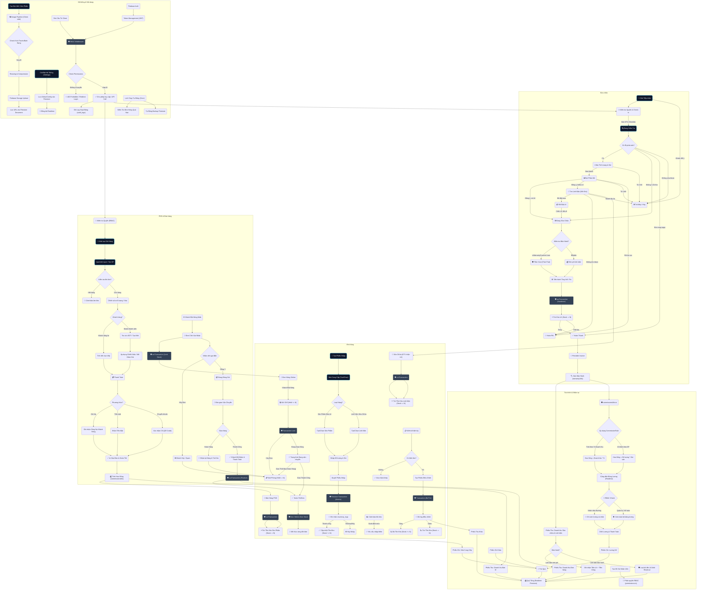

# 🧩 Workflows
## master
- **Title:** Master Hub
- **Icon:** 🌐

```mermaid
graph TD
  %% --- INVENTORY MODULE ---
  subgraph INVENTORY [Kho hàng]
    I1("📝 Tạo Phiếu Nhập") --> I2("Nhà Cung Cấp (Tạo/Chọn)")
    I2 --> I3{"Loại Hàng?"}
    I3 -->|"Sản Phẩm Bán Lẻ"| I4("Tạo/Chọn Sản Phẩm")
    I3 -->|"Linh Kiện Sửa Chữa"| I5("Tạo/Chọn Linh Kiện")
    I4 --> I6("Nhập Số lượng & Giá")
    I5 --> I6
    I6 --> I7("Duyệt Phiếu Nhập")
    I7 --> I7_TRANS("🛡️ Firestore Transaction (Atomic)")
    I7_TRANS --> I7_LOG["📑 Ghi nhận inventory_logs"]
    I7_LOG -->|"Thành công"| I8("✅ Cập nhật Tồn Kho (Stock += N)")
    I7_LOG -->|"Thất bại/Hủy"| I_CANCEL("❌ Hủy Nhập")
    O_POS("🔗 Bán Hàng POS") --> O_POS_TRANS("🛡️ runTransaction")
    O_POS_TRANS --> O1("➖ Trừ Tồn Kho Sản Phẩm (Stock -= N)")
    O_REP("🔗 Sửa Chữa (KTV nhận LK)") --> O_REP_TRANS("🛡️ runTransaction")
    O_REP_TRANS --> O2("➖ Trừ Tồn Kho Linh Kiện (Stock -= N)")
    O_ORD("🔗 Đơn Hàng Online") -->|"Khách Đặt Hàng"| O3("🔒 Giữ Chỗ (Held += N)")
    O3 --> O3_TRANS("🛡️ Transaction Lock")
    O3_TRANS -->|"Hủy Đơn"| O4("🔓 Giải Phóng (Held -= N)")
    O3_TRANS -->|"Đang Giao Hàng"| O5("🚚 Trạng thái: Đang vận chuyển")
    O5 -->|"Giao Thất Bại (Hoàn Hàng)"| O4
    O5 -->|"Giao Thành Công"| O6("✅ Hoàn Tất Đơn")
    O6 --> O6_TRANS("🛡️ Decr Held & Decr Stock")
    O6_TRANS --> O6_DONE("🏁 Kết thúc vòng đời đơn")
    M1("📊 Cảnh báo tồn kho") -->|"Dưới định mức"| M2("🚨 Yêu cầu nhập thêm")
    M3("📋 Kiểm kê định kỳ") --> M4{"Có lệch kho?"}
    M4 -->|"Không"| M5("✅ Xác nhận khớp")
    M4 -->|"Có"| M6("Tạo Phiếu Điều Chỉnh")
    M6 --> M6_TRANS("🛡️ Transaction (Bù/Trừ)")
    M6_TRANS --> M6_LOG("📑 Ghi log điều chỉnh")
    M6_LOG -->|"Tăng"| M7("📈 Bù Tồn Kho (Stock += N)")
    M6_LOG -->|"Giảm"| M8("📉 Trừ Tồn Kho (Stock -= N)")
  end
  %% --- POS & ORDERS MODULE ---
  subgraph POS_ORDERS [POS & Đơn hàng]
    P0("🔐 Kiểm tra Quyền (RBAC)") --> P1("🛒 Khởi tạo Giỏ Hàng")
    P1 --> P2("Quét Mã Vạch / Tìm SP")
    P2 --> P2_1{"Kiểm tra tồn kho?"}
    P2_1 -->|"Hết hàng"| P2_2("🚨 Cảnh báo âm kho")
    P2_1 -->|"Còn hàng"| P3("Chỉnh sửa số lượng / Xóa")
    P3 --> P4{"Khách hàng?"}
    P4 -->|"Khách vãng lai"| P5("Tính tiền trực tiếp")
    P4 -->|"Khách thành viên"| P6("Tra cứu SDT / Tạo Mới")
    P6 --> P7("Áp dụng Chiết Khấu / Mã Giảm Giá")
    P5 --> P8("💳 Thanh Toán")
    P7 --> P8
    P8 --> P9{"Phương thức?"}
    P9 -->|"Ghi Nợ"| P10("Ghi nhận Công Nợ Khách Hàng")
    P9 -->|"Tiền mặt"| P11_1("Nhận Tiền Mặt")
    P9 -->|"Chuyển khoản"| P11_2("Xác nhận CK (QR Code)")
    P10 --> P12("✅ In Hóa Đơn & Hoàn Tất")
    P11_1 --> P12
    P11_2 --> P12
    P12 --> P13("💰 Tính Hoa Hồng (commissionUtils)")
    ORD1("🌐 Khách Đặt Hàng Web") --> ORD2("📝 Đơn Chờ Xác Nhận")
    ORD2 --> ORD2_1("🛡️ runTransaction (Lock Stock)")
    ORD2 --> ORD3{"Nhân viên gọi điện"}
    ORD3 -->|"Hủy Đơn"| ORD4("❌ Khách Hủy / Spam")
    ORD3 -->|"Đồng Ý"| ORD5("📦 Đang Đóng Gói")
    ORD5 --> ORD6("🚚 Bàn giao Vận Chuyển")
    ORD6 --> ORD7{"Giao hàng"}
    ORD7 -->|"Hoàn Hàng"| ORD8("🔁 Nhận lại Hàng & Trả Kho")
    ORD7 -->|"Thành Công"| ORD9("✅ Khách Đã Nhận & Thanh Toán")
    ORD9 --> ORD9_1("🛡️ runTransaction (Finalize)")
  end
  %% --- REPAIR MODULE ---
  subgraph REPAIR_MOD [Sửa chữa]
    A("🚀 Chờ Tiếp nhận") --> A1("🔐 Kiểm tra Quyền & Check-in")
    A1 -->|"Gán KTV, Checklist"| B("🔍 Đang Kiểm Tra")
    A -->|"Khách đổi ý"| OUT("❌ Trả Máy / Hủy")
    B --> B1{"Có lỗi phát sinh?"}
    B1 -->|"Có"| C("📞 Báo Tình trạng & Giá")
    B1 -->|"Không / Lỗi nhẹ"| D("🛠️ Đang Sửa Chữa")
    B1 -->|"Sửa xong ngay"| DONE("✅ Hoàn Thành")
    B1 -->|"Không sửa được"| OUT
    C -->|"Báo khách"| E("⏳ Đợi Phản hồi")
    C -->|"Từ chối"| OUT
    E -->|"Đồng ý, có LK"| D
    E -->|"Đồng ý, thiếu LK"| F("🔎 Tìm Linh Kiện (Mở Kho)")
    E -->|"Từ chối"| OUT
    E -->|"Đòi lại cọc"| REFUND("💸 Hoàn Phí")
    F -->|"Đã đặt mua"| G("📦 Đã Đặt LK")
    F -->|"Không tìm được"| REFUND
    F -->|"Khách lấy lại"| OUT
    G -->|"Chốt: LK đã về"| D
    D --> D1{"Kiểm tra Bảo Hành?"}
    D1 -->|"isWarrantyCovered: true"| D2("🛡️ Filter Cost (Free Part)")
    D1 -->|"Billable"| D3("💰 Tính phí linh kiện")
    D2 --> D4("🛠️ Tiến hành Thay thế / Fix")
    D3 --> D4
    D4 --> D5("🛡️ runTransaction (Handover)")
    D5 --> D6("➖ Trừ Kho LK (Stock -= N)")
    D6 -->|"Xong"| DONE
    D6 -->|"Thất bại"| REFUND
    DONE --> DONE_INV("📑 Printable Invoice")
    DONE_INV --> DONE_WAR("🏷️ Gán Bảo Hành (warrantyUtils)")
  end
  %% --- FINANCE & HR MODULE ---
  subgraph FINANCE_HR [Tài chính & Nhân sự]
    RE1("Phiếu Thu: Doanh thu Bán lẻ") --> FUND("💰 Quỹ Tổng (Realtime Firestore)")
    RE2("Phiếu Thu: Doanh thu Đơn hàng") --> FUND
    RE3("Phiếu Thu: Doanh thu Sửa chữa & Linh kiện") --> CHECK_WARRANTY{"Bảo hành?"}
    CHECK_WARRANTY -->|"Linh kiện tính phí"| C1_FIN("Ghi nhận Tiền LK + Tiền Công")
    CHECK_WARRANTY -->|"Linh kiện bảo hành"| C2_FIN("🛡️ Loại bỏ tiền LK khỏi Revenue")
    RE4("Phiếu Thu Khác") --> FUND
    C1_FIN --> FUND
    C2_FIN --> FUND
    EX1("Phiếu Chi: Nhà Cung Cấp") --> OUT_FUND("💸 Trừ Quỹ")
    EX2("Phiếu Chi Khác") --> OUT_FUND
    OUT_FUND --> FUND
    H1("Tạo Hồ Sơ Nhân Viên") --> H2("🔐 Phân quyền RBAC (permissions.ts)")
    H4("🛡️ commissionUtils.ts") --> H_RULE{"Áp dụng CommissionRule"}
    H_RULE -->|"Tính theo % Doanh thu"| H5("Hoa hồng = Doanh thu * %")
    H_RULE -->|"Cố định theo SP"| H6("Hoa hồng = Số lượng * Giá sàn")
    H5 --> H7("Cộng dồn Bảng Lương (Realtime)")
    H6 --> H7
    H7 --> H8{"🔐 RBAC Check"}
    H8 -->|"Nhân viên thường"| H9("🙈 Chỉ xem lương cá nhân")
    H8 -->|"Quản trị / Kế toán"| H10("👁️ Xem toàn bộ bảng lương")
    H10 --> H11("Chốt Lương & Thanh Toán")
    H9 --> H11
    H11 --> EX3("Phiếu Chi: Lương NV")
    EX3 --> OUT_FUND
  end
  %% --- SYSTEM & CONTENT MODULE ---
  subgraph SYSTEM_CONTENT [Hệ thống & Nội dung]
    CMS1("Tạo Bài Viết / Sản Phẩm") --> CMS2("🖼️ Image Pipeline (Client-side)")
    CMS2 --> CMS3{"Check Kích Thước/Định Dạng"}
    CMS3 -->|"Hợp lệ"| CMS4("Resizing & Compression")
    CMS4 --> CMS5("Firebase Storage Upload")
    CMS5 --> CMS6("Lưu URL vào Firestore Document")
    SYS1("Cài Đặt Hệ Thống (Settings)") --> SYS2("Lưu Global Config vào Firestore")
    SYS2 --> SYS3("🔄 Đồng bộ Realtime")
    SYS4("Yêu Cầu Từ Client") --> SYS5("🛡️ RBAC Middleware")
    SYS5 --> SYS6{"Check Permissions"}
    SYS6 -->|"Không có quyền"| SYS7("🚫 403 Forbidden / Redirect Login")
    SYS6 -->|"Hợp lệ"| SYS8("✅ Cho phép truy cập / API Call")
    SYS8 --> SYS9("Ghi Log Hoạt Động (audit_logs)")
    CRON1("Lịch Chạy Tự Động (Cron)") --> CRON2("Kiểm Tra Đơn Hàng Quá Hạn")
    CRON1 --> CRON3("Tự Động Backup Firestore")
    AUTH1("Firebase Auth") --> AUTH2("Token Management (JWT)")
    AUTH2 --> SYS5
  end
  %% --- CROSS-LINKS ---
  P13 --> O_POS
  O_POS_TRANS --> O1
  ORD2_1 --> O_ORD
  ORD4 --> O4
  ORD8 --> O4
  ORD9_1 --> O6
  F --> O_REP
  O_REP_TRANS --> O2
  I8 --> EX1
  M6_LOG --> RE4
  P13 --> RE1
  ORD9_1 --> RE2
  DONE_WAR --> RE3
  DONE_WAR --> H4
  SYS8 --> P0
  SYS8 --> A1
  click I1 call handleMasterNodeClick("I1")
  click I2 call handleMasterNodeClick("I2")
  click I3 call handleMasterNodeClick("I3")
  click I4 call handleMasterNodeClick("I4")
  click I5 call handleMasterNodeClick("I5")
  click I6 call handleMasterNodeClick("I6")
  click I7 call handleMasterNodeClick("I7")
  click I7_TRANS call handleMasterNodeClick("I7_TRANS")
  click I7_LOG call handleMasterNodeClick("I7_LOG")
  click I8 call handleMasterNodeClick("I8")
  click I_CANCEL call handleMasterNodeClick("I_CANCEL")
  click O_POS call handleMasterNodeClick("O_POS")
  click O_POS_TRANS call handleMasterNodeClick("O_POS_TRANS")
  click O1 call handleMasterNodeClick("O1")
  click O_REP call handleMasterNodeClick("O_REP")
  click O_REP_TRANS call handleMasterNodeClick("O_REP_TRANS")
  click O2 call handleMasterNodeClick("O2")
  click O_ORD call handleMasterNodeClick("O_ORD")
  click O3 call handleMasterNodeClick("O3")
  click O3_TRANS call handleMasterNodeClick("O3_TRANS")
  click O4 call handleMasterNodeClick("O4")
  click O5 call handleMasterNodeClick("O5")
  click O6 call handleMasterNodeClick("O6")
  click O6_TRANS call handleMasterNodeClick("O6_TRANS")
  click O6_DONE call handleMasterNodeClick("O6_DONE")
  click M1 call handleMasterNodeClick("M1")
  click M2 call handleMasterNodeClick("M2")
  click M3 call handleMasterNodeClick("M3")
  click M4 call handleMasterNodeClick("M4")
  click M5 call handleMasterNodeClick("M5")
  click M6 call handleMasterNodeClick("M6")
  click M6_TRANS call handleMasterNodeClick("M6_TRANS")
  click M6_LOG call handleMasterNodeClick("M6_LOG")
  click M7 call handleMasterNodeClick("M7")
  click M8 call handleMasterNodeClick("M8")
  click P0 call handleMasterNodeClick("P0")
  click P1 call handleMasterNodeClick("P1")
  click P2 call handleMasterNodeClick("P2")
  click P2_1 call handleMasterNodeClick("P2_1")
  click P2_2 call handleMasterNodeClick("P2_2")
  click P3 call handleMasterNodeClick("P3")
  click P4 call handleMasterNodeClick("P4")
  click P5 call handleMasterNodeClick("P5")
  click P6 call handleMasterNodeClick("P6")
  click P7 call handleMasterNodeClick("P7")
  click P8 call handleMasterNodeClick("P8")
  click P9 call handleMasterNodeClick("P9")
  click P10 call handleMasterNodeClick("P10")
  click P11_1 call handleMasterNodeClick("P11_1")
  click P11_2 call handleMasterNodeClick("P11_2")
  click P12 call handleMasterNodeClick("P12")
  click P13 call handleMasterNodeClick("P13")
  click ORD1 call handleMasterNodeClick("ORD1")
  click ORD2 call handleMasterNodeClick("ORD2")
  click ORD2_1 call handleMasterNodeClick("ORD2_1")
  click ORD3 call handleMasterNodeClick("ORD3")
  click ORD4 call handleMasterNodeClick("ORD4")
  click ORD5 call handleMasterNodeClick("ORD5")
  click ORD6 call handleMasterNodeClick("ORD6")
  click ORD7 call handleMasterNodeClick("ORD7")
  click ORD8 call handleMasterNodeClick("ORD8")
  click ORD9 call handleMasterNodeClick("ORD9")
  click ORD9_1 call handleMasterNodeClick("ORD9_1")
  click A call handleMasterNodeClick("A")
  click A1 call handleMasterNodeClick("A1")
  click B call handleMasterNodeClick("B")
  click OUT call handleMasterNodeClick("OUT")
  click B1 call handleMasterNodeClick("B1")
  click C call handleMasterNodeClick("C")
  click D call handleMasterNodeClick("D")
  click DONE call handleMasterNodeClick("DONE")
  click E call handleMasterNodeClick("E")
  click F call handleMasterNodeClick("F")
  click REFUND call handleMasterNodeClick("REFUND")
  click G call handleMasterNodeClick("G")
  click D1 call handleMasterNodeClick("D1")
  click D2 call handleMasterNodeClick("D2")
  click D3 call handleMasterNodeClick("D3")
  click D4 call handleMasterNodeClick("D4")
  click D5 call handleMasterNodeClick("D5")
  click D6 call handleMasterNodeClick("D6")
  click DONE_INV call handleMasterNodeClick("DONE_INV")
  click DONE_WAR call handleMasterNodeClick("DONE_WAR")
  click RE1 call handleMasterNodeClick("RE1")
  click RE2 call handleMasterNodeClick("RE2")
  click RE3 call handleMasterNodeClick("RE3")
  click CHECK_WARRANTY call handleMasterNodeClick("CHECK_WARRANTY")
  click C1_FIN call handleMasterNodeClick("C1_FIN")
  click C2_FIN call handleMasterNodeClick("C2_FIN")
  click RE4 call handleMasterNodeClick("RE4")
  click FUND call handleMasterNodeClick("FUND")
  click EX1 call handleMasterNodeClick("EX1")
  click EX2 call handleMasterNodeClick("EX2")
  click EX3 call handleMasterNodeClick("EX3")
  click OUT_FUND call handleMasterNodeClick("OUT_FUND")
  click H1 call handleMasterNodeClick("H1")
  click H2 call handleMasterNodeClick("H2")
  click H4 call handleMasterNodeClick("H4")
  click H_RULE call handleMasterNodeClick("H_RULE")
  click H5 call handleMasterNodeClick("H5")
  click H6 call handleMasterNodeClick("H6")
  click H7 call handleMasterNodeClick("H7")
  click H8 call handleMasterNodeClick("H8")
  click H9 call handleMasterNodeClick("H9")
  click H10 call handleMasterNodeClick("H10")
  click H11 call handleMasterNodeClick("H11")
  click CMS1 call handleMasterNodeClick("CMS1")
  click CMS2 call handleMasterNodeClick("CMS2")
  click CMS3 call handleMasterNodeClick("CMS3")
  click CMS4 call handleMasterNodeClick("CMS4")
  click CMS5 call handleMasterNodeClick("CMS5")
  click CMS6 call handleMasterNodeClick("CMS6")
  click SYS1 call handleMasterNodeClick("SYS1")
  click SYS2 call handleMasterNodeClick("SYS2")
  click SYS3 call handleMasterNodeClick("SYS3")
  click SYS4 call handleMasterNodeClick("SYS4")
  click SYS5 call handleMasterNodeClick("SYS5")
  click SYS6 call handleMasterNodeClick("SYS6")
  click SYS7 call handleMasterNodeClick("SYS7")
  click SYS8 call handleMasterNodeClick("SYS8")
  click SYS9 call handleMasterNodeClick("SYS9")
  click CRON1 call handleMasterNodeClick("CRON1")
  click CRON2 call handleMasterNodeClick("CRON2")
  click CRON3 call handleMasterNodeClick("CRON3")
  click AUTH1 call handleMasterNodeClick("AUTH1")
  click AUTH2 call handleMasterNodeClick("AUTH2")
  classDef process fill:#0f172a,stroke:#38bdf8,stroke-width:2px,color:#ffffff,rx:8px,ry:8px
  classDef system fill:#334155,stroke:#94a3b8,stroke-dasharray: 5 5,color:#e2e8f0
  class I1,I2,P1,P2,A,B,CMS1,SYS1 process
  class I7_TRANS,O_POS_TRANS,O_REP_TRANS,O3_TRANS,O6_TRANS,M6_TRANS,ORD2_1,ORD9_1,D5,SYS5 system
```