# 🧩 Workflows
## pos-orders

### Audit POS-PERF-20260703: POS checkout latency and lookup scale
- **Status:** fixed
- **Severity:** high
- **Date:** 2026-07-03
- **Files:** `src/app/api/pos/checkout/route.ts`, `src/app/admin/pos/page.tsx`, `src/lib/commissionCalcServer.ts`, `src/lib/inventoryFifo.ts`, `src/lib/serverDocumentIds.ts`
- **Symptom:** `/admin/pos` thanh toan mot don dang cham; lookup khach hang tai POS cung co nguy co cham voi khach co nhieu phieu sua chua.
- **Cause:** Checkout gom qua nhieu doc/ghi vao mot transaction, co read trung lap cho commission, query active cashier shift bang collection query thay vi lock doc, FIFO/ID reservation doc tuan tu, va POS repair lookup doc `repairs` theo khach khong `limit`.
- **Direction:** Uu tien do `debugTiming.transactionSteps`, doi checkout sang cashier lock one-doc, truyen product metadata da doc san sang commission, batch doc reads, bound repair lookup theo active/unpaid workflow states.
### Close 2026-07-05
- POS checkout no longer queries open cashier shifts in the hot transaction; it reads the active shift lock document and target shift document directly.
- POS customer repair lookup is bounded by `createdAt desc limit(20)`.
- Related mutation/idempotency and completed-order refund bugs in this audit pass are closed in `BUG-POS-019`, `BUG-POS-020`, `BUG-ORD-021`, `BUG-ORD-022`, and `BUG-ORD-023`.
- Remaining deep latency work requires real `debugTiming` samples from slow production cases and is tracked as performance tuning, not an open correctness bug.
### Performance implementation 2026-07-10
- Checkout now records every Firestore transaction callback attempt and its phase timings, so retry/commit wait is no longer hidden by the final callback timing.
- `operation_requests` idempotency, product, taxonomy, staff, customer, repair, payable-order and new-client cashier-shift reads are batched in one initial read phase; FIFO product queries run in parallel. Completed idempotency replays deliberately perform this same batch before returning the cached result, removing one normal-checkout round trip.
- Checkout telemetry now separates workflow, repair-product and FIFO preparation/read phases; each FIFO product query reports duration and returned lot count so slow lot histories can be optimized without weakening FIFO correctness.
- Products now persist `inventoryTrackingMode`: legacy products skip empty `inventory_lots` queries while retaining `LEGACY_STOCK` audit entries; the first completed checkout safely classifies older products and `complete_import` always sets FIFO mode.
- POS preserves readable sequential document IDs but batches counter/candidate reads across inventory log, ledger, customer transaction and order reservations.
- FIFO lot reads and the independent readable-ID reservation now overlap inside the transaction read phase. Telemetry keeps `reserveIdsTotal` for full work and `reserveIdsWait` for only the remaining critical-path wait; checkout also reports token verification and `users/{uid}` profile-read time separately and reuses that profile name instead of a transaction staff re-read.
- `scripts/backfill-product-inventory-tracking.mjs` defaults to dry-run and can safely label historic products by active lot presence; its per-product transaction never overwrites a mode supplied by a concurrent completed import.
- A DEBT checkout that does not move cash/bank no longer reloads `/api/pos/cashier-shift`; the route fetches closed-shift history only when the Cashier tab explicitly requests it. Cash/bank checkout continues to refresh the active shift total.
- New cashier shifts use deterministic idempotent payment movements plus 16 tally shards. Existing open shifts retain the legacy aggregate update until they are closed, then the next shift automatically uses shards.
- Revenue deltas and commission cost are merged into one daily/monthly aggregate update per POS checkout.

## BUG-POS-019: POS checkout doc cashier shift bang query thay vi active lock
- **Status:** fixed
- **Severity:** high
- **Module:** POS
- **Files:** `src/app/api/pos/checkout/route.ts`, `src/app/api/pos/cashier-shift/route.ts`
### Symptom
Thanh toan POS bang tien mat/chuyen khoan/vi phai query `cashier_shifts.where(status == open).limit(1)` trong transaction. Neu du lieu legacy con nhieu ca open, checkout co the cong tien vao ca khong dung; neu khong co duplicate thi van ton them query trong hot path.
### Cause
Route open/close da dung lock `system_counters/active_cashier_shift`, nhung route checkout chua chuyen sang contract nay.
### Proposed Fix
Checkout doc lock doc trong transaction, verify shift doc con `status: open`, roi update ca do. Fallback query legacy chi nen nam trong flow reconcile/repair rieng co audit warning.
### Fix 2026-07-04
- `/api/pos/checkout` now reads `system_counters/active_cashier_shift` inside the transaction and then reads the locked `cashier_shifts/{activeShiftId}` document directly.
- Checkout rejects missing/stale locks instead of querying `cashier_shifts.where(status == open).limit(1)` in the hot payment path.
- Verification: `tsc --noEmit` pass.

## BUG-POS-020: POS lookup repair theo khach hang khong gioi han
- **Status:** fixed
- **Severity:** medium
- **Module:** POS
- **Files:** `src/app/admin/pos/page.tsx`
### Symptom
Tra khach hang tai POS co the cham khi khach co nhieu phieu sua chua.
### Cause
Query repairs theo `customer.id` va `customer.phone` khong co `limit`/`orderBy`; orders da duoc bound `limit(20)` nhung repairs thi chua.
### Proposed Fix
Chi doc repair active/unpaid/actionable theo workflow status, them `orderBy(createdAt desc)` va `limit(20)`, neu can xem lich su thi mo drawer/load-more rieng.
### Fix 2026-07-04
- `/admin/pos` repair lookup by `customer.id` and legacy `customer.phone` now uses `orderBy('createdAt', 'desc')` and `limit(20)`.
- Existing unpaid/partial filtering remains client-side on the bounded result set.
- Verification: `tsc --noEmit` pass.

## BUG-ORD-021: Huy don Completed chua dong bo payment/refund state
- **Status:** fixed
- **Severity:** high
- **Module:** Orders
- **Files:** `src/app/api/orders/transition/route.ts`, `src/app/admin/orders/page.tsx`
### Symptom
Huy don da `Completed` co the lam doanh thu/customer ledger/stock thay doi nhung payment history va dong tien hoan tra khong co ban ghi server tuong ung.
### Cause
`orders/transition` cho `Completed -> Cancelled`, tra stock, giam aggregate va ghi `customer_ledger` `refund_order`, nhung khong them `paymentHistory` refund, khong reset/cap nhat `paymentStatus`/`deposit_amount`, va khong ghi cash/bank refund movement. UI `admin/orders/page.tsx` lai tu them state local paymentHistory khi chuyen `Completed`, khong phai du lieu server.
### Proposed Fix
Tach flow huy don da thu tien thanh refund/cancel API ro rang: tinh paid amount tu `paymentHistory/deposit_amount`, ghi refund paymentHistory va cash/bank ledger neu that su hoan tien, cap nhat `paymentStatus`, aggregate va customer ledger trong cung transaction.
### Fix 2026-07-04
- `/api/orders/transition` now writes refund state when `Completed -> Cancelled`: `paymentStatus`, `refundedAt`, `refundAmount`, and a `paymentHistory` refund entry when collected money exists.
- Legacy completed orders without `paymentHistory` use retail total/deposit fallback for refund amount.
- `Order.paymentStatus` type now includes `refunded`.
- Verification: `node node_modules/typescript/bin/tsc --noEmit --pretty false` pass.

## BUG-ORD-022: Web checkout idempotency van optional o API boundary
- **Status:** fixed
- **Severity:** high
- **Module:** Orders
- **Files:** `src/app/api/checkout/route.ts`, `src/app/(customer)/checkout/page.tsx`
### Symptom
Goi truc tiep `/api/checkout` khong co `idempotencyKey` van tao don moi, tang `held` va `voucher.usedCount` moi lan request.
### Cause
BUG-ORD-007 da them client idempotency va server cache khi co key, nhung API khong bat buoc `idempotencyKey`. Nhanh chong lap chi chay khi body co key.
### Proposed Fix
Bat buoc `idempotencyKey` hop le cho public checkout; reject request thieu key. Ghi `operation_requests` trong transaction va tra original order id khi duplicate.
### Fix 2026-07-04
- `/api/checkout` now requires a string `idempotencyKey` before entering the order transaction.
- Duplicate cache hits are accepted only for completed `type='web_checkout'`; reused keys from other operations are rejected.
- The route always records `operation_requests/{idempotencyKey}` for successful web checkout.
- Verification: `tsc --noEmit` pass.

## BUG-ORD-023: Voucher code khong unique gay ap dung/usedCount nham ma
- **Status:** fixed
- **Severity:** high
- **Module:** ORD
- **Files:** `src/app/admin/vouchers/page.tsx`, `src/app/api/vouchers/validate/route.ts`, `src/app/api/checkout/route.ts`, `src/app/api/pos/checkout/route.ts`, `firestore.rules`
### Symptom
Hai voucher active co cung `code` co the cung ton tai. Validate/checkout/POS checkout chi query `where('code','==', code).where('isActive','==', true).limit(1)` va lay document dau tien, nen customer/POS co the ap dung nham voucher, sai gia tri giam, sai `ownerId`/usageLimit, va `usedCount` tang tren mot doc khong duoc admin mong doi.
### Cause
Schema type comment noi `code` la unique, nhung admin vouchers tao moi bang `addDoc(collection(db, 'vouchers'), ...)` auto-ID, khong co transaction/API server-side check duplicate va khong dung normalized code lam document ID. Firestore rules cho staff `manage_discounts` create/update truc tiep nen khong co invariant unique o server boundary.
### Proposed Fix
Chuyen tao/sua voucher sang server API transaction, normalize code uppercase, dung `vouchers/{code}` hoac collection unique index/lock doc, reject duplicate active/code collision khi create/update. Validate/checkout phai doc one-doc deterministic theo normalized code va migration can hop nhat/xu ly duplicate hien co truoc khi enforce.
### Fix 2026-07-04
- Added `/api/admin/vouchers` for create/update/delete with `manage_discounts` auth, transaction checks, normalized uppercase codes, and deterministic `vouchers/code_<CODE>` document IDs for new writes.
- `/admin/vouchers` now mutates vouchers through the server API instead of direct client Firestore writes.
- Firestore rules now block direct client create/update/delete on `vouchers`; checkout/order APIs remain the only path that can mutate usage counters through Admin SDK.
- `/api/vouchers/validate`, web checkout, POS checkout, and order-cancel voucher rollback now query active voucher codes with `limit(2)` and reject duplicate active codes instead of silently using the first document.
- Verification: `node node_modules/typescript/bin/tsc --noEmit --pretty false` pass.

### Feature POS-CASHIER-001: Tab thu ngan va so dau ca
- **Status:** implemented-awaiting-e2e
- **Date:** 2026-06-29
- **Files:** `src/app/admin/pos/page.tsx`, `src/app/api/pos/cashier-shift/route.ts`, `src/app/api/pos/checkout/route.ts`
- **Summary:** POS co tab `Ban hang`/`Thu ngan`. Tab thu ngan mo ca bang tien mat/chuyen khoan dau ca, khoa so dau ca, hien tien hien co va phat sinh POS theo ca; sau khi chot ca hien lich su cac ca da chot gan nhat de doi chieu.
- **Guardrail:** Thanh toan POS bang tien mat/chuyen khoan/vi bat buoc co ca thu ngan dang mo; checkout cong phat sinh vao `cashier_shifts` trong transaction. Khong con dem so to theo menh gia.

### Fix POS-DEBT-001: Dong bo thu no cu tai POS
- **Status:** implemented-awaiting-e2e
- **Date:** 2026-06-30
- **Files:** `src/app/admin/pos/page.tsx`, `src/features/pos/PosCartPanel.tsx`, `src/app/api/pos/checkout/route.ts`
- **Summary:** POS checkout gom `Thu no` va `lay tien du can no cu` vao cung mot path `orderPaymentTotals`. Tien khach dua duoc tach thanh thanh toan don hien tai, thu no don cu, va tien thoi lai.
- **Guardrail:** Thu no cu luon cap nhat don no `paymentHistory`, `customer_transactions`, ledger, aggregate doanh thu, va ca thu ngan trong cung Firestore transaction; don moi khong luu line item thu no vao `items` hay base hoa hong.

### Feature POS-REV-001: Dong tien POS va phi ship
- **Status:** in-progress
- **Date:** 2026-06-28
- **Files:** `src/app/admin/pos/page.tsx`, `src/app/api/pos/checkout/route.ts`, `src/lib/revenueAggregateServer.ts`, `src/lib/commissionCalcServer.ts`
- **Summary:** Checkout dua `paymentHistory.method` vao aggregate de tach thuc thu tien mat/chuyen khoan/khac. `shipping_fee` van nam tren don hang, khong nam trong line item tinh hoa hong san pham.
- **Guardrail:** Phi ship la chi phi phat sinh cua cua hang va khong duoc dua vao base hoa hong nhan vien. Mua may cu cua khach can schema/luong rieng trong plan ops 2026-06-28.

- **Title:** POS & Đơn hàng
- **Icon:** 🛍️
### 📁 Target Files (Các file đích)
- src/app/admin/pos/page.tsx (Màn hình bán hàng)
- src/app/admin/orders/page.tsx (Quản lý đơn hàng)
- src/components/admin/POSCart.tsx (Giỏ hàng POS)

### ✅ Feature POS-QR-001: Quét QR/mã sản phẩm tại POS
- **Status:** implemented-awaiting-device-validation
- **Date:** 2026-05-30
- **Files:** `src/app/admin/pos/page.tsx`, `src/app/admin/products/page.tsx`, `src/app/admin/parts/page.tsx`, `src/components/admin/ProductQrLabelModal.tsx`, `src/lib/productCodes.ts`
- **Summary:** Sản phẩm/phụ kiện/linh kiện dùng chung mã `sku`/`barcode`/`productCode`; admin in tem QR; POS thêm vào giỏ bằng máy quét dạng bàn phím, camera `BarcodeDetector`, hoặc nhập mã tay.
- **Guardrail:** Quét QR chỉ thay thao tác chọn hàng. Checkout vẫn chạy `/api/pos/checkout` để validate stock/held và ghi đơn.

### ✅ Feature POS-QR-002: Tối ưu in tem QR/barcode vừa giấy thực tế
- **Status:** implemented-awaiting-hardware-validation
- **Date:** 2026-06-07
- **Branch:** `codex/optimize-qr-barcode-label-printing`
- **Files:** `src/components/admin/ProductQrLabelModal.tsx`, `roadmap/ui/data/ai_plans/plan_qr_barcode_label_print_fit.md`, `roadmap/ui/data/ai_plans/task_qr_barcode_label_print_fit.md`, `roadmap/ui/data/ai_plans/walkthrough_qr_barcode_label_print_fit.md`
- **Summary:** Thêm preset tem nhỏ, custom width/height theo mm, bố cục `2 tem/dòng` với số lượng tính theo hàng, chỉnh khe giữa tem, dòng brand tên cửa hàng, barcode ngắn cho tem nhỏ, chế độ chữ gọn, scale nội dung và lề an toàn để tem QR + `CODE128` không tràn khổ giấy đang dùng.
- **Guardrail:** Chỉ tối ưu rendering/print và scan alias. QR vẫn dùng mã hàng chính; barcode có thể dùng alias ngắn. Không đổi schema sản phẩm, `product_code_registry` hoặc `/api/pos/checkout`.
- **Manual check còn lại:** In thử trên đúng máy/giấy của cửa hàng và scan lại bằng máy quét/camera POS.

### ✅ Feature POS-VOU-001: Áp dụng Voucher (Bounty/Discount) tại quầy POS
- **Status:** merged-master-awaiting-e2e
- **Date:** 2026-06-13
- **Files:** `src/app/admin/pos/page.tsx`, `src/app/api/pos/checkout/route.ts`
- **Summary:** Cho phép thu ngân nhập mã giảm giá (voucher) hoặc mã thưởng (bounty) tại màn hình POS. Hệ thống gọi `/api/vouchers/validate` để kiểm tra độ hợp lệ. Backend checkout (`pos/checkout`) tiếp nhận `voucherCode`, kiểm tra lại trong Transaction, trừ số lượng lượt dùng (`usedCount`), lưu vết voucher vào đơn hàng và cập nhật nhiệm vụ nhận thưởng (bounty) cho hồ sơ khách hàng.
- **Guardrail:** Logic tính hoa hồng và xử lý giảm giá được tách bạch rành mạch giữa giảm giá thủ công của nhân viên và giảm từ voucher.

```mermaid
graph TD
            subgraph POS [Bán Hàng Tại Quầy - POS]
            P0("🔐 Kiểm tra Quyền (RBAC)") --> P1("🛒 Khởi tạo Đơn / Giỏ hàng")
            P1 --> P_SRC{"Nguồn dữ liệu?"}
            P_SRC -->|"Sản phẩm lẻ"| P2("Quét Mã Vạch / Tìm SP")
            P_SRC -->|"Từ Sửa Chữa"| P_REP("🔗 Import Phiếu Sửa Chữa (Kèm LK, Công)")
            P_REP --> P3("Chỉnh sửa số lượng / Xóa")
            P2 --> P2_1{"Kiểm tra tồn kho?"}
            P2_1 -->|"Hết hàng"| P2_2("🚨 Cảnh báo âm kho")
            P2_1 -->|"Còn hàng"| P3
            P3 -.->|Đã vá| BUG_POS_007["✅ ĐÃ VÁ: Bán dưới giá vốn"]
            P3 --> P4{"Khách hàng?"}
            P4 -->|"Khách vãng lai"| P5("Tính toán Tổng tiền")
            P4 -->|"Khách thành viên"| P6("Tra cứu SDT / Tạo Mới")
            P6 --> P7("Áp dụng Chiết Khấu / Mã Giảm Giá")
            P7 --> P7_1("Combo Phụ kiện / VIP Discount")
            P7_1 -.->|Đã vá| BUG_POS_004["✅ ĐÃ VÁ: Làm tròn số thực"]
            P7_1 -.->|Đã vá| BUG_POS_005["✅ ĐÃ VÁ: Cho phép nhập số âm"]
            P5 --> P8("💳 Thanh Toán")
            P7_1 --> P8
            P8 -.->|Đã vá| BUG_POS_002["✅ ĐÃ VÁ: Race Condition POS"]
            P8 --> P9{"Phương thức?"}
            P9 -->|"Ghi Nợ"| P10("Ghi nhận Công Nợ Khách Hàng")
            P9 -->|"Tiền mặt / CK"| P11("Xác nhận Đã Thu Tiền")
            P10 --> P12("✅ In Hóa Đơn & Hoàn Tất")
            P11 --> P12
            P12 --> P13("💰 Tính Hoa Hồng (commissionUtils)")
            P13 -.->|Đã vá| BUG_POS_006["✅ ĐÃ VÁ: Gọi tính hoa hồng ngoài Transaction"]
            P13 --> L_POS_STOCK("🔗 Xuất Kho Sản Phẩm (Stock -= N)")
            L_POS_STOCK -.->|Đã vá| BUG_POS_003["✅ ĐÃ VÁ: Held Stock Leak"]
            P13 --> L_POS_FIN("🔗 Ghi nhận Doanh Thu POS (Tài Chính)")
            P12 --> P_RET{"Trả hàng?"}
            P_RET -->|"Khách trả lại hàng"| P_REFUND("💸 Hoàn tiền & Nhập lại kho (Stock += N)")
            P_REFUND --> P_COMM_REV("➖ Giảm trừ Hoa hồng KTV (Tài chính)")
            end
            subgraph ORDERS [Đơn Hàng Trực Tuyến - Orders]
            O1("🌐 Khách Đặt Hàng Web") --> O2("📝 Đơn Chờ Xác Nhận")
            O1 -.->|Đã vá| BUG_ORD_003["✅ ĐÃ VÁ: Thiếu check cộng dồn số lượng"]
            O2 --> O2_1("🛡️ runTransaction (Lock Stock)")
            O2_1 --> L_ORD_HELD1("🔗 Giữ Chỗ Tồn Kho (Tăng Held)")
            O2 --> O3{"Nhân viên gọi điện"}
            O3 -->|"Hủy Đơn / Spam"| O4("❌ Khách Hủy")
            O3 -->|"Cọc nhưng không lấy"| O4_1("❌ Hủy Cọc")
            O4 --> L_ORD_HELD2("🔗 Giải phóng Tồn Kho (Giảm Held)")
            O4_1 --> L_ORD_HELD2
            L_ORD_HELD2 -.->|Đã vá| BUG_ORD_002["✅ ĐÃ VÁ: Hủy đơn Completed gây âm held"]
            O3 -->|"Đồng Ý"| O5("📦 Đang Đóng Gói")
            O5 --> O6("🚚 Bàn giao Vận Chuyển")
            O6 --> O7{"Giao hàng"}
            O7 -->|"Giao thất bại / Bùng đơn"| O8("🔁 Nhận lại Hàng & Trả Kho")
            O8 --> L_ORD_HELD3("🔗 Giải phóng Tồn Kho (Giảm Held)")
            O7 -->|"Thành Công"| O9("✅ Khách Đã Nhận & Thanh Toán")
            O9 --> O9_1("🛡️ runTransaction (Finalize)")
            O9_1 --> L_ORD_STOCK("🔗 Xuất Kho Hoàn Tất (Giảm Held, Giảm Stock)")
            O9_1 --> L_ORD_FIN("🔗 Ghi nhận Doanh Thu Online (Tài Chính)")
            end
            %% Cross-links
            click L_POS_STOCK call handleWorkflowClick("inventory") "Mở"
            click L_ORD_HELD1 call handleWorkflowClick("inventory") "Mở"
            click L_ORD_HELD2 call handleWorkflowClick("inventory") "Mở"
            click L_ORD_HELD3 call handleWorkflowClick("inventory") "Mở"
            click L_ORD_STOCK call handleWorkflowClick("inventory") "Mở"
            click L_POS_FIN call handleWorkflowClick("finance-hr") "Mở"
            click L_ORD_FIN call handleWorkflowClick("finance-hr") "Mở"
            click P_REP call handleWorkflowClick("repair") "Mở luồng Sửa chữa"
            click BUG_POS_002 call handleBugClick("BUG-POS-002") "Mở chi tiết"
            click BUG_POS_003 call handleBugClick("BUG-POS-003") "Mở chi tiết"
            click BUG_POS_004 call handleBugClick("BUG-POS-004") "Mở chi tiết"
            click BUG_POS_005 call handleBugClick("BUG-POS-005") "Mở chi tiết"
            click BUG_POS_006 call handleBugClick("BUG-POS-006") "Mở chi tiết"
            click BUG_POS_007 call handleBugClick("BUG-POS-007") "Mở chi tiết"
            click BUG_ORD_002 call handleBugClick("BUG-ORD-002") "Mở chi tiết"
            click BUG_ORD_003 call handleBugClick("BUG-ORD-003") "Mở chi tiết"
```



# 🐛 Bugs
## BUG-POS-003: Held Stock Leak (Rò rỉ tồn kho giữ chân)
- **Status:** fixed
- **Severity:** high
- **Module:** POS
- **Files:**
### Cause
<b>Phân tích</b>: Line 329-331 trong <code>pos/page.tsx</code> luôn chỉ <code>stock: increment(-qty)</code>, không phân biệt status. Web checkout (<code>api/checkout/route.ts</code>) đã xử lý đúng: <code>stock -= qty AND held += qty</code>.
### Solution
<b>Giải pháp đã áp dụng</b>: Trích biến <code>isPending = orderData.status !== 'Completed'</code>. Conditional spread <code>...(isPending ? { held: increment(qty) } : {})</code>.
### Code
```javascript
// ✅ Code đã áp dụng (src/app/admin/pos/page.tsx)
const isPending = orderData.status !== 'Completed';
transaction.update(p.ref, {
    stock: increment(-group.totalQty),
    ...(isPending ? { held: increment(group.totalQty) } : {}),
});
```
## BUG-POS-002: Race Condition POS (Tranh chấp tài nguyên)
- **Status:** fixed
- **Severity:** high
- **Module:** POS
- **Files:**
### Cause
<b>Phân tích</b>: Dùng lệnh đọc và ghi riêng rẽ (Read-Modify-Write không an toàn). Không có khóa (Lock).
### Solution
<b>Giải pháp đã áp dụng</b>: Sử dụng <code>runTransaction</code> cho toàn bộ quá trình checkout. Phase 1: đọc tất cả products. Phase 2: validate stock. Phase 3: ghi order + update stock atomically.
### Code
```javascript
// ✅ Code đã áp dụng (src/app/admin/pos/page.tsx)
await runTransaction(db, async (transaction) => {
  // Phase 1: Read all product docs
  // Phase 2: Validate total qty against available
  // Phase 3: Write order + decrement stock atomically
  transaction.set(orderRef, orderData);
  transaction.update(productRef, { stock: increment(-qty) });
});
```
## BUG-POS-004: Lưu trữ số thực gây lệch tiền (Float Precision)
- **Status:** fixed
- **Severity:** high
- **Module:** POS
- **Files:**
### Cause
<b>Phân tích</b>: Thiếu hàm làm tròn số nguyên cho các input tiền tệ.
### Solution
<b>Giải pháp tối ưu</b>: Dùng <code>Math.round()</code> trước khi lưu trữ.
### Code
```javascript
setDiscount(Math.round(Number(e.target.value)));
```
## BUG-POS-005: Cho phép nhập số âm (Negative Input)
- **Status:** fixed
- **Severity:** high
- **Module:** POS
- **Files:**
### Cause
<b>Phân tích</b>: Thiếu validation kiểm tra giá trị lớn hơn hoặc bằng 0.
### Solution
<b>Giải pháp tối ưu</b>: Thêm kiểm tra <code>value < 0</code> và chặn lại.
### Code
```javascript
if (discount < 0) throw new Error("Giảm giá không được âm!");
```
## BUG-POS-006: Gọi tính hoa hồng ngoài Transaction
- **Status:** fixed
- **Severity:** high
- **Module:** POS
- **Files:**
### Cause
<b>Phân tích</b>: Commission logic tách rời khỏi transaction nhưng có cơ chế bảo vệ riêng.
### Solution
<b>Giải pháp đã áp dụng</b>: Giữ commission ngoài Tx (thiết kế chấp nhận được). Guard <code>status === 'Completed'</code> + idempotency đã có sẵn.
### Code
```javascript
// ✅ Fire-and-forget pattern (pos/page.tsx dòng 358-364)
calculateAndSaveCommissions(staff, 'order', orderData).catch(console.error);
// commissionUtils.ts đã có guard:
if (orderStatus !== 'Completed') return; // Skip
```
## BUG-POS-007: Bán dưới giá vốn (Selling below Cost)
- **Status:** fixed
- **Severity:** high
- **Module:** POS
- **Files:**
### Cause
<b>Phân tích</b>: Thiếu business rule kiểm tra biên lợi nhuận.
### Solution
<b>Giải pháp tối ưu</b>: Thêm cảnh báo hoặc yêu cầu quyền admin khi giá bán nhỏ hơn giá vốn.
### Code
```javascript
if (item.sellingPrice < item.costPrice) {
  alert("Cảnh báo: Giá bán thấp hơn giá vốn!");
}
```
## BUG-POS-008: Camera QR scan không hoạt động trên mobile (Permissions-Policy conflict)
- **Status:** fixed
- **Severity:** high
- **Module:** POS
- **Date:** 2026-06-09
- **Files:** `firebase.json`
### Cause
<b>Phân tích</b>: Hai nguồn header `Permissions-Policy` xung đột — `next.config.mjs` gửi `camera=(self)` (cho phép) nhưng `firebase.json` rule `**` gửi `camera=()` (chặn hoàn toàn). Khi browser nhận 2 headers cùng key, nó áp dụng cái restrictive nhất. Chrome desktop lỏng lẻo nên vẫn chạy, Chrome mobile enforce nghiêm ngặt nên camera bị chặn — không hiện popup xin quyền, không có mục cấp quyền trong site settings.
### Solution
<b>Giải pháp đã áp dụng</b>: Đổi `camera=()` thành `camera=(self)` trong rule `**` của `firebase.json`, và đưa rule `/admin/**` lên trước rule `**` để đảm bảo thứ tự ưu tiên. Trang customer không dùng camera nên không có rủi ro bảo mật.
### Code
```diff
# firebase.json — rule "**"
- { "key": "Permissions-Policy", "value": "camera=(), microphone=(), geolocation=(self)" }
+ { "key": "Permissions-Policy", "value": "camera=(self), microphone=(), geolocation=(self)" }
```

## BUG-POS-009: Lỗi Firestore "Read before Write" trong POS Checkout API
- **Status:** fixed
- **Severity:** critical
- **Module:** POS
- **Date:** 2026-06-13
- **Files:** `src/app/api/pos/checkout/route.ts`
### Cause
<b>Phân tích</b>: Firestore Transactions yêu cầu toàn bộ lệnh Read (`tx.get`) phải chạy trước các lệnh Write (`tx.set`/`tx.update`). Trong `pos/checkout`, hệ thống đã thực hiện Write tồn kho (`stock`), sau đó lại gọi Read để lấy dữ liệu User, Customer, RepairTicket và tính hoa hồng, vi phạm rule của Firebase Admin SDK dẫn đến crash lúc checkout POS.
### Solution
<b>Giải pháp đã áp dụng</b>: Refactor lại thứ tự lệnh trong Transaction. Di chuyển toàn bộ các lệnh Read (kéo Customer, User, RepairTicket, và thực hiện tính toán Hoa hồng) lên block trên cùng (Pre-fetch for Transaction Reads), và đưa toàn bộ lệnh Write xuống block cuối (All Writes Start Here).

## BUG-ORD-002: Hủy đơn Completed gây âm held
- **Status:** fixed
- **Severity:** high
- **Module:** POS
- **Files:**
### Cause
<b>Phân tích</b>: Đơn `Completed` đã trừ `stock` và giải phóng `held`. Nếu hủy đơn (chuyển sang `Cancelled`), hệ thống lại gọi giải phóng `held` thêm lần nữa gây âm.
### Solution
<b>Giải pháp đã áp dụng</b>: Kiểm tra trạng thái cũ (nếu `Completed` thì trả lại `stock`, không đụng `held`).

## BUG-ORD-003: Thiếu check cộng dồn số lượng
- **Status:** fixed
- **Severity:** high
- **Module:** POS
- **Files:**
### Cause
<b>Phân tích</b>: Khách hàng mua nhiều sản phẩm online nhưng checkout không gộp quantity đúng cách gây trừ hụt kho.
### Solution
<b>Giải pháp đã áp dụng</b>: Gộp các item cùng SKU trước khi update.

## BUG-POS-010: Discount Rules của Phụ kiện không hoạt động ở POS
- **Status:** fixed
- **Severity:** high
- **Module:** POS
- **Files:** `src/lib/discountCalc.ts`, `src/app/admin/pos/page.tsx`
### Cause
<b>Phân tích</b>: POS không truyền `category` và `categoryIds` của sản phẩm vào cart item, khiến việc matching rule dựa trên Category bị bỏ qua. Ngoài ra, POS chỉ truyền danh sách linh kiện của phiếu sửa vào calculator trong khi rule mới được tạo theo taxonomy dịch vụ (`triggerServiceCategory`) và từ khóa bệnh/dịch vụ, nên trigger theo dịch vụ không có dữ liệu để khớp.
### Solution
<b>Giải pháp đã áp dụng</b>: Sửa `src/lib/discountCalc.ts` để tối ưu hóa matching theo 3 mức ưu tiên (Keywords -> CategoryId Prefix -> Fallback name matching), hỗ trợ cấu trúc phân cấp (e.g. `phu-kien/op-lung` match rule `phu-kien`) và nhận thêm context phiếu sửa (`serviceName`, `categoryPath`, issue category). Cập nhật `src/app/admin/pos/page.tsx` để truy vấn danh mục (`category`, `categoryIds`) từ state `products`, map đúng dữ liệu phiếu sửa mới (`customer`, `deviceInfo`) và đưa service/category context vào calculator.

## BUG-POS-011: Không load được phiếu sửa chữa của khách hàng bằng SĐT tại POS
- **Status:** fixed
- **Severity:** high
- **Module:** POS
- **Files:** `src/app/admin/pos/page.tsx`
### Cause
<b>Phân tích</b>: Firestore query tìm kiếm phiếu sửa chữa trong `repairs` collection sử dụng trường `customerPhone` ở root level thay vì trường lồng `customer.phone`. Ngoài ra, query composite kết hợp lọc theo status và sắp xếp theo `createdAt` yêu cầu một chỉ mục (composite index) Firestore chưa được khởi tạo, gây lỗi truy vấn trên client.
### Solution
<b>Giải pháp đã áp dụng</b>: Chuyển target query sang field `customer.phone`. Đơn giản hóa query Firestore (chỉ lọc theo `customer.phone` để tránh yêu cầu index composite phức tạp) và thực hiện lọc trạng thái (`unpaid` / `partial`) cùng với sắp xếp theo ngày giảm dần trực tiếp trên bộ nhớ client (in-memory). Thêm fallbacks an toàn cho dữ liệu khách hàng từ nested object.

## BUG-ORD-008: Mất mã giảm giá (Voucher Burn) khi Hủy Đơn
- **Status:** fixed
- **Severity:** high
- **Module:** POS
- **Files:** `src/app/api/orders/transition/route.ts`
### Cause
<b>Phân tích</b>: Khi đơn hàng bị hủy (chuyển sang trạng thái `cancelled`), hệ thống không có logic hoàn lại lượt sử dụng (`usedCount`) của mã giảm giá (Voucher) đã áp dụng. Điều này khiến khách hàng mất mã giảm giá vĩnh viễn dù giao dịch chưa thành công.
### Solution
<b>Giải pháp đề xuất</b>: Trong `orders/transition/route.ts`, nếu `targetStatus` là `cancelled` (hoặc `refunded`) và đơn hàng có `appliedVoucherCode`, cần decrement `usedCount` của voucher đó trong cơ sở dữ liệu.
### Fix 2026-06-30
- Changed files: `src/app/api/orders/transition/route.ts`.
- Verification: cancelling an order with `voucherCode` now decrements the matching voucher `usedCount` in the same transaction, clamped at zero.

## BUG-ORD-006: Xung đột Trạng thái Đơn hàng và Lỗi Cập nhật Kho (State Transition Bypass)
- **Status:** fixed
- **Severity:** critical
- **Module:** POS
- **Files:** `src/app/api/orders/transition/route.ts`
### Cause
<b>Phân tích</b>: API chuyển trạng thái đơn hàng `/api/orders/transition` không kiểm tra tính hợp lệ của luồng chuyển trạng thái (State Transition Matrix). Nhân viên hoặc kẻ gian có thể chuyển đơn hàng từ `Completed` quay lại `Pending` (không thay đổi kho), sau đó duyệt từ `Pending` sang `Completed` lần nữa (khiến kho bị trừ đúp). Ngược lại, chuyển đơn từ `Cancelled` thẳng sang `Completed` sẽ làm `needsStockChange` bằng `false`, dẫn đến đơn hoàn tất mà không hề trừ kho vật lý.
### Solution
<b>Giải pháp đề xuất</b>: Thiết lập ma trận trạng thái cho phép (ví dụ: `Pending` -> `Confirmed` -> `Shipping` -> `Completed`), chặn tất cả các luồng chuyển ngược không hợp lệ (như từ trạng thái terminal quay lại active) và ném lỗi trực tiếp trên API.
### Fix 2026-06-30
- Changed files: `src/app/api/orders/transition/route.ts`.
- Verification: order transitions now use an allow-list matrix and reject terminal-to-active, reverse, and `Cancelled -> Completed` bypass paths before stock/customer/revenue writes.

## BUG-ORD-007: Thiếu Cơ chế Chống Gửi Trùng (Idempotency) ở Web Storefront Checkout
- **Status:** fixed
- **Severity:** high
- **Module:** POS
- **Files:** `src/app/api/checkout/route.ts`
### Cause
<b>Phân tích</b>: API đặt hàng của Web Storefront không hỗ trợ `idempotencyKey` hay kiểm tra giao dịch trùng lặp. Nếu khách hàng nhấn nút "Đặt hàng" nhiều lần do mạng chậm hoặc trình duyệt tự động gửi lại request, hệ thống sẽ tạo nhiều đơn hàng giống hệt nhau, làm tăng lượng hàng tạm giữ (`held`) ảo và trừ đúp số lượt sử dụng voucher.
### Solution
<b>Giải pháp đề xuất</b>: Sinh `idempotencyKey` tại client trước khi submit form và truyền lên API `/api/checkout`. Sử dụng bảng `operation_requests` trong Transaction để kiểm tra chống trùng lặp tương tự như luồng POS checkout.
### Fix 2026-06-30
- Changed files: `src/app/(customer)/checkout/page.tsx`, `src/app/api/checkout/route.ts`.
- Verification: storefront checkout now sends an `idempotencyKey`; the API stores completed `web_checkout` requests in `operation_requests` and returns the original order id on duplicate submission.
### Follow-up Fix 2026-06-30
- Changed files: `src/app/(customer)/checkout/page.tsx`.
- Verification: the checkout page now keeps one `idempotencyKey` per submit attempt and only resets it after success, so manual retry after a timeout reuses the same `operation_requests` key instead of creating a duplicate order.

## BUG-POS-012: POS Checkout Chấp nhận Giá Âm (Negative Price Exploit)
- **Status:** fixed
- **Severity:** critical
- **Module:** POS
- **Files:** `src/app/api/pos/checkout/route.ts`
### Cause
<b>Phân tích</b>: Tại API Checkout của POS, giá trị `item.price` gửi từ client được parse trực tiếp `Number(item.price) || 0` mà không hề có validation `price >= 0`. Thu ngân gian lận có thể truyền một sản phẩm hoặc một khoản thanh toán đơn hàng (order payment) với giá âm (ví dụ: `-5,000,000`). Điều này sẽ làm giảm tổng tiền đơn hàng, tạo ra số dư "tiền thừa" (surplus) ảo lớn. Lợi dụng tính năng `use_surplus_to_pay_debt`, kẻ gian có thể dùng số tiền ảo này để xóa sạch công nợ thật của khách hàng, hoặc rút bòn tiền mặt từ ca thu ngân (cập nhật âm vào `cashierShiftCollectedAmount`). Đồng thời có thể chèn thêm các sản phẩm đắt tiền khác để mang về với giá 0 đồng (do tổng tiền bị cấn trừ về 0).
### Solution
<b>Giải pháp đề xuất</b>: Bổ sung validation cực kỳ nghiêm ngặt tại backend: tất cả `item.price` (bán lẻ, sửa chữa, trả nợ) đều phải `>= 0`. Nếu có nhu cầu giảm giá, phải sử dụng đúng luồng `discount_amount` hoặc voucher, tuyệt đối không chấp nhận giá item âm.
### Fix 2026-06-30
- Changed files: `src/app/api/pos/checkout/route.ts`.
- Verification: POS checkout now validates every line `price >= 0` and `quantity > 0` before subtotal, stock, debt, repair, or order-payment calculations.

## BUG-POS-013: Race Condition khi Mở Ca Thu Ngân (Multiple Active Shifts)
- **Status:** fixed
- **Severity:** high
- **Module:** POS
- **Files:** `src/app/api/pos/cashier-shift/route.ts`
### Cause
<b>Phân tích</b>: Khi thu ngân mở ca, API kiểm tra các ca đang mở bằng lệnh đọc truy vấn (query) bên trong Transaction: `tx.get(db.collection('cashier_shifts').where('status', '==', 'open').limit(1))`. Firebase Firestore Transactions không hỗ trợ khóa cấp truy vấn (Predicate Lock/Phantom Read protection) khi truy vấn rỗng. Nếu hai yêu cầu mở ca diễn ra cùng một mili-giây, cả hai giao dịch đều thấy `activeSnap.empty` là true và cùng chèn một bản ghi ca mới. Hậu quả là hệ thống có nhiều ca mở cùng lúc, làm hỏng luồng cập nhật tiền của `pos/checkout` (nó chỉ query limit 1 ca mở đầu tiên để cộng tiền).
### Solution
<b>Giải pháp đề xuất</b>: Sử dụng mô hình Single-Document Lock. Tạo một tài liệu cấu hình duy nhất (ví dụ: `system_counters/active_cashier_shift`) lưu ID của ca đang mở. Khi mở ca, transaction sẽ `tx.get` tài liệu này, kiểm tra ID, nếu trống thì tạo ca mới và cập nhật ID vào tài liệu đó. Điều này đảm bảo tính độc quyền thông qua khóa tài liệu (Document Lock).
### Fix 2026-06-30
- Changed files: `src/app/api/pos/cashier-shift/route.ts`.
- Verification: opening a cashier shift now uses the single document lock `system_counters/active_cashier_shift`; closing a shift clears the lock in the same transaction, with fallback support for legacy open shifts.
### Follow-up Fix 2026-06-30
- Changed files: `src/app/api/pos/cashier-shift/route.ts`.
- Verification: duplicate active-shift attempts now throw and compare the same ASCII constant, returning HTTP 409 instead of falling through to 500 because of mojibake string matching.

## BUG-ORD-008: Lỗ hổng Xóa & Sửa Đơn Hàng Bypass Luồng Hoàn Tiền/Trả Kho
- **Status:** fixed
- **Severity:** critical
- **Module:** POS
- **Files:** `firestore.rules`
### Cause
<b>Phân tích</b>: Trong `firestore.rules`, `orders` cho phép `delete: if hasPermission('manage_orders')` và cho phép `update` nhưng không chặn các trường nhạy cảm như `items`, `total_amount`, `subtotal_amount`, `discount_amount`. Nhân viên có thể sử dụng Client SDK để xóa (delete) hoặc sửa đổi tổng tiền, số lượng sản phẩm của một đơn hàng đã hoàn tất (`Completed`). Điều này làm hỏng tính toàn vẹn dữ liệu: kho không được hoàn trả (vì logic hoàn kho nằm ở API hủy đơn), và doanh thu không khớp, dẫn đến thất thoát tiền bạc mà hệ thống không tự động phát hiện được.
### Solution
<b>Giải pháp đề xuất</b>: 1. Đổi `allow delete` thành `if isAdmin()`. Yêu cầu hủy đơn phải thông qua luồng đổi/trả hoặc API. 2. Cập nhật `allow update` để chặn thay đổi các trường tài chính/hàng hóa: bổ sung `['items', 'total_amount', 'subtotal_amount', 'discount_amount', 'shipping_fee']` vào block list `affectedKeys()`.
### Fix 2026-06-30
- Changed files: `firestore.rules`.
- Verification: `/orders` delete now requires `isAdmin()` and direct client updates cannot change item, total, discount, shipping, or voucher fields.
### Follow-up Fix 2026-06-30
- Changed files: `firestore.rules`.
- Verification: direct client delete for `/orders` is now denied for every role; all delete/cancel/refund behavior must go through server-controlled transition flows.

## BUG-POS-015: Thiếu kiểm tra số tiền trả trước (deposit_amount) gây lạm phát công nợ và bypass kiểm tra thu ngân
- **Status:** fixed
- **Severity:** critical
- **Module:** POS
- **Files:** `src/app/api/pos/checkout/route.ts`
### Cause
<b>Phân tích</b>: Khi thu ngân thanh toán đơn POS bằng hình thức 'Debt' (Ghi nợ), hệ thống không kiểm tra giá trị của biến `paidNow` (được gán bằng `deposit_amount` truyền từ client). Thu ngân có thể truyền một số tiền âm. Điều này giúp bypass điều kiện kiểm tra thanh toán không đủ `paidNow < serverTotal` (chỉ ném lỗi khi không phải ghi nợ). Hậu quả là `newDebt` được tính bằng `Math.max(0, serverTotal - paidNow)` sẽ bị đội lên rất cao, dẫn tới công nợ của khách hàng bị làm giả tăng vọt. Hơn nữa, vì số tiền đưa vào ca thu ngân `cashierShiftCollectedAmount` mang giá trị âm, hệ thống sẽ bỏ qua đoạn mã cập nhật ca thu ngân (`if (cashierShiftCollectedAmount > 0)`), che xử hành vi gian lận và gây sai lệch toàn bộ báo cáo doanh thu và công nợ.
### Solution
<b>Giải pháp đề xuất</b>: Cần bổ sung kiểm tra bắt buộc `if (Number(deposit_amount) < 0) throw new Error('Số tiền thanh toán trước không được nhỏ hơn 0.');` đối với tất cả các giao dịch POS. Ngoài ra, cần chặn hoàn toàn việc nhận một giá trị âm cho bất kỳ tham số tiền tệ (payment amount) nào trong hệ thống.
### Fix 2026-06-30
- Changed files: `src/app/api/pos/checkout/route.ts`.
- Verification: POS now rejects negative or non-finite `deposit_amount`, `discount_amount`, `total_amount`, item prices, and payment amounts before debt/cashier-shift math.

## BUG-POS-017: Lỗ hổng Sửa đổi Giá Trị Thanh Toán Phiếu Sửa Chữa (Repair Payment Price Bypass)
- **Status:** fixed
- **Severity:** critical
- **Module:** POS
- **Files:** `src/app/api/pos/checkout/route.ts`
### Cause
<b>Phân tích</b>: Khi thanh toán gộp Phiếu sửa chữa tại POS, hệ thống tính toán `repairPaymentTotals` dựa trên `item.price` trực tiếp do Client gửi lên: `const price = Number(item.price) || 0;`. Sau đó, API cập nhật trực tiếp `repairTicket.payment.amount = repairPrice` và đổi trạng thái thanh toán thành `paid` cùng trạng thái phiếu thành hoàn tất. Hệ thống KHÔNG HỀ so sánh số tiền Client gửi lên (`repairPrice`) với số tiền thực tế cần thanh toán của Phiếu sửa chữa (`repairTicket.payment.amount` trong database). Thu ngân có thể dùng Postman hoặc chặn bắt request gửi `price: 1` cho một phiếu sửa chữa trị giá 5.000.000đ. Hệ thống sẽ ghi nhận thu 1đ và đóng phiếu thành công mà không báo thiếu nợ.
### Solution
<b>Giải pháp đề xuất</b>: Tại `src/app/api/pos/checkout/route.ts`, trước khi tính toán `serverSubtotal`, cần đối chiếu số tiền sửa chữa với `repairTicket.payment.amount`. Tránh tin tưởng giá trị `price` truyền từ Client đối với các item thuộc loại `isRepairTicket` và `isOrderPayment`.
### Fix 2026-06-30
- Changed files: `src/app/api/pos/checkout/route.ts`.
- Verification: POS aggregates submitted repair-payment lines, compares the request total against `repairTicket.payment.amount`, and records only the server-side expected amount.

## BUG-POS-018: Lỗ hổng Thanh Toán Kép Phiếu Sửa Chữa tại POS (Double Billing/Revenue Duplication)
- **Status:** fixed
- **Severity:** high
- **Module:** POS
- **Files:** `src/app/api/pos/checkout/route.ts`
### Cause
<b>Phân tích</b>: Khi tính toán phiếu sửa chữa trong đơn hàng POS, hệ thống bỏ qua việc kiểm tra xem phiếu sửa chữa đó đã được thanh toán trước đó hay chưa (`payment.status === 'paid'`). Nếu một phiếu sửa chữa ở trạng thái hoàn tất (terminal) bị đẩy lại vào luồng thanh toán POS, hệ thống sẽ bỏ qua việc trừ kho (`shouldCountCompletion = false`), nhưng VẪN tiếp tục cộng số tiền thu được vào `repairPaymentTotals` và cập nhật lại `payment.status = 'paid'`. Điều này dẫn đến doanh thu sửa chữa (`repairRevenue`) bị tính đúp (Double Revenue) vào Báo cáo doanh thu tài chính và làm sai lệch nghiêm trọng tiền quỹ trong Ca Thu Ngân.
### Solution
<b>Giải pháp đề xuất</b>: Trước khi xử lý thanh toán bất kỳ phiếu sửa chữa nào trong POS Checkout (`api/pos/checkout/route.ts`), cần ném lỗi `throw new Error(...)` ngay lập tức nếu `repairTicket.payment?.status === 'paid'`, ngăn chặn hoàn toàn việc thanh toán đúp một phiếu đã hoàn tất.
### Fix 2026-06-30
- Changed files: `src/app/api/pos/checkout/route.ts`.
- Verification: POS now rejects repair tickets whose `payment.status` is already `paid` before completion, revenue, cashier-shift, or payment-history writes.
