# 🧩 Workflows
## pos-orders
- **Title:** POS & Đơn hàng
- **Icon:** 🛍️
### 📁 Target Files (Các file đích)
- src/app/admin/pos/page.tsx (Màn hình bán hàng)
- src/app/admin/orders/page.tsx (Quản lý đơn hàng)
- src/components/admin/POSCart.tsx (Giỏ hàng POS)

### ✅ Feature POS-QR-001: Quét QR/mã sản phẩm tại POS
- **Status:** implemented-local
- **Date:** 2026-05-30
- **Files:** `src/app/admin/pos/page.tsx`, `src/app/admin/products/page.tsx`, `src/app/admin/parts/page.tsx`, `src/components/admin/ProductQrLabelModal.tsx`, `src/lib/productCodes.ts`
- **Summary:** Sản phẩm/phụ kiện/linh kiện dùng chung mã `sku`/`barcode`/`productCode`; admin in tem QR; POS thêm vào giỏ bằng máy quét dạng bàn phím, camera `BarcodeDetector`, hoặc nhập mã tay.
- **Guardrail:** Quét QR chỉ thay thao tác chọn hàng. Checkout vẫn chạy `/api/pos/checkout` để validate stock/held và ghi đơn.

### ✅ Feature POS-QR-002: Tối ưu in tem QR/barcode vừa giấy thực tế
- **Status:** implemented-local
- **Date:** 2026-06-07
- **Branch:** `codex/optimize-qr-barcode-label-printing`
- **Files:** `src/components/admin/ProductQrLabelModal.tsx`, `roadmap/ui/data/ai_plans/plan_qr_barcode_label_print_fit.md`, `roadmap/ui/data/ai_plans/task_qr_barcode_label_print_fit.md`, `roadmap/ui/data/ai_plans/walkthrough_qr_barcode_label_print_fit.md`
- **Summary:** Thêm preset tem nhỏ, custom width/height theo mm, bố cục `2 tem/dòng` với số lượng tính theo hàng, chỉnh khe giữa tem, dòng brand tên cửa hàng, barcode ngắn cho tem nhỏ, chế độ chữ gọn, scale nội dung và lề an toàn để tem QR + `CODE128` không tràn khổ giấy đang dùng.
- **Guardrail:** Chỉ tối ưu rendering/print và scan alias. QR vẫn dùng mã hàng chính; barcode có thể dùng alias ngắn. Không đổi schema sản phẩm, `product_code_registry` hoặc `/api/pos/checkout`.
- **Manual check còn lại:** In thử trên đúng máy/giấy của cửa hàng và scan lại bằng máy quét/camera POS.

```mermaid
graph TD
            subgraph POS [Bán Hàng Tại Quầy - POS]
            P0("🔐 Kiểm tra Quyền (RBAC)") --> P1("🛒 Khởi tạo Giỏ Hàng")
            P1 --> P2("Quét Mã Vạch / Tìm SP")
            P2 --> P2_1{"Kiểm tra tồn kho?"}
            P2_1 -->|"Hết hàng"| P2_2("🚨 Cảnh báo âm kho")
            P2_1 -->|"Còn hàng"| P3("Chỉnh sửa số lượng / Xóa")
            P3 -.->|Đã vá| BUG_POS_007["✅ ĐÃ VÁ: Bán dưới giá vốn"]
            P3 --> P4{"Khách hàng?"}
            P4 -->|"Khách vãng lai"| P5("Tính tiền trực tiếp")
            P4 -->|"Khách thành viên"| P6("Tra cứu SDT / Tạo Mới")
            P6 --> P7("Áp dụng Chiết Khấu / Mã Giảm Giá")
            P7 -.->|Đã vá| BUG_POS_004["✅ ĐÃ VÁ: Làm tròn số thực"]
            P7 -.->|Đã vá| BUG_POS_005["✅ ĐÃ VÁ: Cho phép nhập số âm"]
            P5 --> P8("💳 Thanh Toán")
            P7 --> P8
            P8 -.->|Đã vá| BUG_POS_002["✅ ĐÃ VÁ: Race Condition POS"]
            P8 --> P9{"Phương thức?"}
            P9 -->|"Ghi Nợ"| P10("Ghi nhận Công Nợ Khách Hàng")
            P9 -->|"Tiền mặt"| P11_1("Nhận Tiền Mặt")
            P9 -->|"Chuyển khoản"| P11_2("Xác nhận CK (QR Code)")
            P10 --> P12("✅ In Hóa Đơn & Hoàn Tất")
            P11_1 --> P12
            P11_2 --> P12
            P12 --> P13("💰 Tính Hoa Hồng (commissionUtils)")
            P13 -.->|Đã vá| BUG_POS_006["✅ ĐÃ VÁ: Gọi tính hoa hồng ngoài Transaction"]
            P13 --> L_POS_STOCK("🔗 Xuất Kho Sản Phẩm (Stock -= N)")
            L_POS_STOCK -.->|Đã vá| BUG_POS_003["✅ ĐÃ VÁ: Held Stock Leak"]
            P13 --> L_POS_FIN("🔗 Ghi nhận Doanh Thu POS (Tài Chính)")
            end
            subgraph ORDERS [Đơn Hàng Trực Tuyến - Orders]
            O1("🌐 Khách Đặt Hàng Web") --> O2("📝 Đơn Chờ Xác Nhận")
            O1 -.->|Đã vá| BUG_ORD_003["✅ ĐÃ VÁ: Thiếu check cộng dồn số lượng"]
            O2 --> O2_1("🛡️ runTransaction (Lock Stock)")
            O2_1 --> L_ORD_HELD1("🔗 Giữ Chỗ Tồn Kho (Tăng Held)")
            O2 --> O3{"Nhân viên gọi điện"}
            O3 -->|"Hủy Đơn"| O4("❌ Khách Hủy / Spam")
            O4 --> L_ORD_HELD2("🔗 Giải phóng Tồn Kho (Giảm Held)")
            L_ORD_HELD2 -.->|Đã vá| BUG_ORD_002["✅ ĐÃ VÁ: Hủy đơn Completed gây âm held"]
            O3 -->|"Đồng Ý"| O5("📦 Đang Đóng Gói")
            O5 --> O6("🚚 Bàn giao Vận Chuyển")
            O6 --> O7{"Giao hàng"}
            O7 -->|"Hoàn Hàng"| O8("🔁 Nhận lại Hàng & Trả Kho")
            O8 --> L_ORD_HELD3("🔗 Giải phóng Tồn Kho (Giảm Held)")
            O7 -->|"Thành Công"| O9("✅ Khách Đã Nhận & Thanh Toán")
            O9 --> O9_1("🛡️ runTransaction (Finalize)")
            O9_1 --> L_ORD_STOCK("🔗 Xuất Kho Hoàn Tất (Giảm Held, Giảm Stock)")
            O9_1 --> L_ORD_FIN("🔗 Ghi nhận Doanh Thu Online (Tài Chính)")
            end
            %% Cross-links
            click L_POS_STOCK call handleWorkflowClick("inventory") "Mở"
            click L_ORD_HELD1 call handleWorkflowClick("inventory") "Mở"
            click L_ORD_HELD2 call handleWorkflowClick("inventory") "Mở"
            click L_ORD_HELD3 call handleWorkflowClick("inventory") "Mở"
            click L_ORD_STOCK call handleWorkflowClick("inventory") "Mở"
            click L_POS_FIN call handleWorkflowClick("finance-hr") "Mở"
            click L_ORD_FIN call handleWorkflowClick("finance-hr") "Mở"
            click BUG_POS_002 call handleBugClick("BUG-POS-002") "Mở chi tiết"
            click BUG_POS_003 call handleBugClick("BUG-POS-003") "Mở chi tiết"
            click BUG_POS_004 call handleBugClick("BUG-POS-004") "Mở chi tiết"
            click BUG_POS_005 call handleBugClick("BUG-POS-005") "Mở chi tiết"
            click BUG_POS_006 call handleBugClick("BUG-POS-006") "Mở chi tiết"
            click BUG_POS_007 call handleBugClick("BUG-POS-007") "Mở chi tiết"
            click BUG_ORD_002 call handleBugClick("BUG-ORD-002") "Mở chi tiết"
            click BUG_ORD_003 call handleBugClick("BUG-ORD-003") "Mở chi tiết"
```


# 🐛 Bugs
## BUG-POS-003: Held Stock Leak (Rò rỉ tồn kho giữ chân)
- **Status:** fixed
- **Severity:** high
- **Module:** POS
- **Files:** 
### Cause
<b>Phân tích</b>: Line 329-331 trong <code>pos/page.tsx</code> luôn chỉ <code>stock: increment(-qty)</code>, không phân biệt status. Web checkout (<code>api/checkout/route.ts</code>) đã xử lý đúng: <code>stock -= qty AND held += qty</code>.
### Solution
<b>Giải pháp đã áp dụng</b>: Trích biến <code>isPending = orderData.status !== 'Completed'</code>. Conditional spread <code>...(isPending ? { held: increment(qty) } : {})</code>.
### Code
```javascript
// ✅ Code đã áp dụng (src/app/admin/pos/page.tsx)
const isPending = orderData.status !== 'Completed';
transaction.update(p.ref, {
    stock: increment(-group.totalQty),
    ...(isPending ? { held: increment(group.totalQty) } : {}),
});
```
## BUG-POS-002: Race Condition POS (Tranh chấp tài nguyên)
- **Status:** fixed
- **Severity:** high
- **Module:** POS
- **Files:** 
### Cause
<b>Phân tích</b>: Dùng lệnh đọc và ghi riêng rẽ (Read-Modify-Write không an toàn). Không có khóa (Lock).
### Solution
<b>Giải pháp đã áp dụng</b>: Sử dụng <code>runTransaction</code> cho toàn bộ quá trình checkout. Phase 1: đọc tất cả products. Phase 2: validate stock. Phase 3: ghi order + update stock atomically.
### Code
```javascript
// ✅ Code đã áp dụng (src/app/admin/pos/page.tsx)
await runTransaction(db, async (transaction) => {
  // Phase 1: Read all product docs
  // Phase 2: Validate total qty against available
  // Phase 3: Write order + decrement stock atomically
  transaction.set(orderRef, orderData);
  transaction.update(productRef, { stock: increment(-qty) });
});
```
## BUG-POS-004: Lưu trữ số thực gây lệch tiền (Float Precision)
- **Status:** fixed
- **Severity:** high
- **Module:** POS
- **Files:** 
### Cause
<b>Phân tích</b>: Thiếu hàm làm tròn số nguyên cho các input tiền tệ.
### Solution
<b>Giải pháp tối ưu</b>: Dùng <code>Math.round()</code> trước khi lưu trữ.
### Code
```javascript
setDiscount(Math.round(Number(e.target.value)));
```
## BUG-POS-005: Cho phép nhập số âm (Negative Input)
- **Status:** fixed
- **Severity:** high
- **Module:** POS
- **Files:** 
### Cause
<b>Phân tích</b>: Thiếu validation kiểm tra giá trị lớn hơn hoặc bằng 0.
### Solution
<b>Giải pháp tối ưu</b>: Thêm kiểm tra <code>value < 0</code> và chặn lại.
### Code
```javascript
if (discount < 0) throw new Error("Giảm giá không được âm!");
```
## BUG-POS-006: Gọi tính hoa hồng ngoài Transaction
- **Status:** fixed
- **Severity:** high
- **Module:** POS
- **Files:** 
### Cause
<b>Phân tích</b>: Commission logic tách rời khỏi transaction nhưng có cơ chế bảo vệ riêng.
### Solution
<b>Giải pháp đã áp dụng</b>: Giữ commission ngoài Tx (thiết kế chấp nhận được). Guard <code>status === 'Completed'</code> + idempotency đã có sẵn.
### Code
```javascript
// ✅ Fire-and-forget pattern (pos/page.tsx dòng 358-364)
calculateAndSaveCommissions(staff, 'order', orderData).catch(console.error);
// commissionUtils.ts đã có guard:
if (orderStatus !== 'Completed') return; // Skip
```
## BUG-POS-007: Bán dưới giá vốn (Selling below Cost)
- **Status:** fixed
- **Severity:** high
- **Module:** POS
- **Files:** 
### Cause
<b>Phân tích</b>: Thiếu business rule kiểm tra biên lợi nhuận.
### Solution
<b>Giải pháp tối ưu</b>: Thêm cảnh báo hoặc yêu cầu quyền admin khi giá bán nhỏ hơn giá vốn.
### Code
```javascript
if (item.sellingPrice < item.costPrice) {
  alert("Cảnh báo: Giá bán thấp hơn giá vốn!");
}
```
## BUG-POS-008: Camera QR scan không hoạt động trên mobile (Permissions-Policy conflict)
- **Status:** fixed
- **Severity:** high
- **Module:** POS
- **Date:** 2026-06-09
- **Files:** `firebase.json`
### Cause
<b>Phân tích</b>: Hai nguồn header `Permissions-Policy` xung đột — `next.config.mjs` gửi `camera=(self)` (cho phép) nhưng `firebase.json` rule `**` gửi `camera=()` (chặn hoàn toàn). Khi browser nhận 2 headers cùng key, nó áp dụng cái restrictive nhất. Chrome desktop lỏng lẻo nên vẫn chạy, Chrome mobile enforce nghiêm ngặt nên camera bị chặn — không hiện popup xin quyền, không có mục cấp quyền trong site settings.
### Solution
<b>Giải pháp đã áp dụng</b>: Đổi `camera=()` thành `camera=(self)` trong rule `**` của `firebase.json`, và đưa rule `/admin/**` lên trước rule `**` để đảm bảo thứ tự ưu tiên. Trang customer không dùng camera nên không có rủi ro bảo mật.
### Code
```diff
# firebase.json — rule "**"
- { "key": "Permissions-Policy", "value": "camera=(), microphone=(), geolocation=(self)" }
+ { "key": "Permissions-Policy", "value": "camera=(self), microphone=(), geolocation=(self)" }
```
