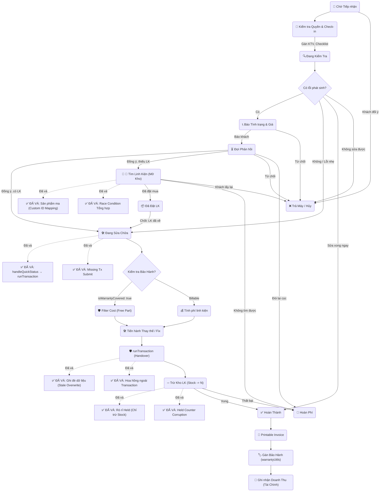
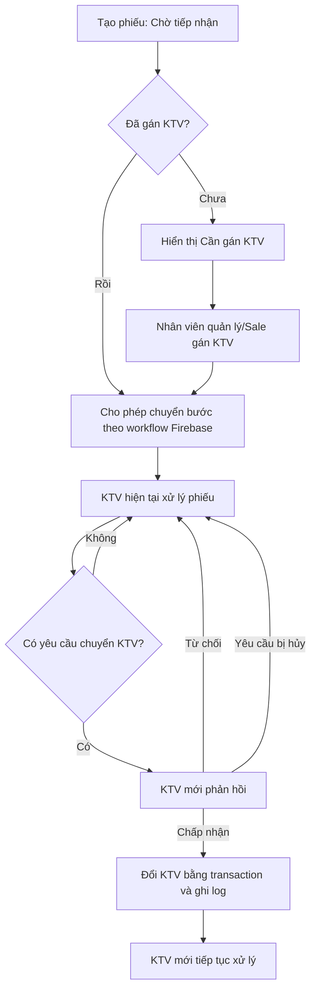

# 🧩 Workflows
## repair
- **Title:** Sửa chữa
- **Icon:** 🔧
### 📁 Target Files (Các file đích)
- src/app/admin/repair/page.tsx (Danh sách sửa chữa)
- src/app/admin/repair/[id]/page.tsx (Chi tiết phiếu sửa chữa)
- src/lib/services/repair.ts (Cập nhật trạng thái)

# 🚧 Kế hoạch nâng cấp workflow KTV và UI mobile

- **Status:** planned
- **Plan:** [Workflow sửa chữa, phân công KTV và chuyển giao có xác nhận](../../ui/data/ai_plans/plan_repair_technician_handoff_mobile_20260612.md)
- **Tasks:** [Danh sách triển khai](../../ui/data/ai_plans/task_repair_technician_handoff_mobile_20260612.md)

## Quy tắc nghiệp vụ đã chốt

1. Phiếu mới luôn ở **Chờ tiếp nhận**; có thể gán KTV ngay hoặc sau bước kiểm tra lần đầu.
2. Không được chuyển sang bước tiếp theo nếu chưa có KTV phụ trách.
3. KTV chỉ thao tác phiếu được giao; nhân viên quản lý/Sale có thể can thiệp nhưng phải xác nhận, nhập lý do và được ghi log.
4. KTV hiện tại hoặc nhân viên quản lý/Sale có thể đề nghị chuyển sang KTV mới.
5. KTV mới phải bấm **Chấp nhận** thì assignment và trách nhiệm mới chính thức thay đổi. Từ chối hoặc hủy yêu cầu không làm đổi KTV hiện tại.
6. Trong thời gian chờ phản hồi, KTV cũ tiếp tục phụ trách và thao tác phiếu.
7. UI phải mobile-first; KTV, blocker, yêu cầu chuyển và hành động bắt buộc hiển thị trực tiếp trên thẻ phiếu, không cần mở chi tiết mới thấy.



# 🐛 Bugs
## BUG-REP-011: Thiếu chuyển KTV và audit log chống gian lận
- **Status:** open
- **Severity:** high
- **Module:** REP
- **Files:** src/app/admin/technician/page.tsx, src/app/api/repairs/technician/transfer/route.ts, src/lib/types.ts
### Cause
Trang KTV chỉ có nút phản hồi yêu cầu đến, không có thao tác tạo/hủy yêu cầu chuyển. API tin dữ liệu KTV từ client và log thiếu actor, lý do, KTV cũ/mới cùng mã đối soát.
### Solution
Đã triển khai local luồng request/accept/reject/cancel bằng transaction; chỉ KTV hiện tại hoặc quản lý Sale được đề nghị và chỉ KTV nhận được chấp nhận. Chờ browser QA ba vai trò trước khi đổi trạng thái sang fixed.

## BUG-REP-010: UI KTV khó thao tác trên mobile
- **Status:** open
- **Severity:** high
- **Module:** REP
- **Files:** src/app/admin/technician/page.tsx
### Cause
Thẻ phiếu dồn nhiều thông tin vào bố cục desktop, checklist bốn cột và các nút thao tác nhỏ; blocker theo workflow bị giấu trong chi tiết.
### Solution
Đã triển khai local thẻ một cột trên mobile, blocker theo `allowedFeatures`, checklist hai cột, touch target 44px và nút chuyển KTV trực tiếp. Chờ browser QA mobile trước khi đóng bug.

## BUG-REP-009: Staff nhìn thấy nút xóa phiếu
- **Status:** fixed
- **Severity:** high
- **Module:** REP
- **Files:** src/app/admin/repairs/page.tsx, firestore.rules
### Cause
UI hiển thị nút xóa cho mọi người có thể mở modal dù Firestore rules chỉ cho Admin xóa.
### Solution
Chỉ render nút xóa cho role admin, thêm guard trong handler và giữ rule delete admin-only.

## BUG-REP-003: Sản phẩm ma (Custom ID Mapping) — By-Design
- **Status:** fixed
- **Severity:** high
- **Module:** REP
- **Files:** 
### Cause
<b>Phân tích</b>: Cho phép nhập text tự do và tạo ID ngẫu nhiên không liên kết bảng chuẩn.
### Solution
<b>Giải pháp tối ưu</b>: Bắt buộc chọn từ danh sách. Nếu tạo mới phải vào trạng thái 'Chờ duyệt' (Pending).
### Code
```javascript
// Ràng buộc khi tạo linh kiện trong Repair
if (!validCategories.includes(inputCategory)) {
  category = 'pending_classification'; // Gán vào danh mục chờ xử lý
}
```
## BUG-REP-002: Ghi đè dữ liệu (Stale Overwrite)
- **Status:** fixed
- **Severity:** high
- **Module:** REP
- **Files:** 
### Cause
<b>Phân tích</b>: Đọc về client rồi ghi đè toàn bộ (updateDoc) mà không check version (Optimistic Locking).
### Solution
<b>Giải pháp đã áp dụng</b>: Dùng <code>runTransaction</code> + <code>version</code> field. Mỗi lần save sẽ increment version. Nếu version trên server > version lúc mở form → reject với thông báo lỗi.
### Code
```javascript
// ✅ Đã fix tại repairs/page.tsx handleSubmit
await runTransaction(db, async (transaction) => {
  const freshDoc = await transaction.get(ticketRef);
  if (freshDoc.data()?.version > editingTicket.version) {
    throw new Error('Phiếu đã được cập nhật bởi người khác!');
  }
  transaction.update(ticketRef, { ...ticketData, version: freshVersion + 1 });
});
```
## BUG-REP-001: Gọi tính hoa hồng ngoài Transaction (Repairs)
- **Status:** fixed
- **Severity:** high
- **Module:** REP
- **Files:** 
### Cause
<b>Phân tích</b>: Commission logic tách rời khỏi transaction nhưng có cơ chế bảo vệ riêng.
### Solution
<b>Giải pháp đã áp dụng</b>: Giữ commission ngoài transaction (thiết kế chấp nhận được vì commission có idempotency guard). Đã thêm guard check payment status trong <code>commissionUtils.ts</code>.
### Code
```javascript
// ✅ commissionUtils.ts đã có guard
if (ticket.payment?.status !== 'paid') return; // Chỉ tính khi đã thanh toán
```
## BUG-REP-004: Cập nhật trạng thái nhanh không dùng Transaction
- **Status:** fixed
- **Severity:** high
- **Module:** REP
- **Files:** 
### Cause
<b>Phân tích</b>: Sử dụng <code>updateDoc</code> cho các dữ liệu có tính cạnh tranh cao mà không có cơ chế khóa.
### Solution
<b>Giải pháp tối ưu</b>: Chuyển sang dùng <code>runTransaction</code> để đảm bảo tính nguyên tử và cô lập.
### Code
```javascript
// Giải pháp: Chuyển sang runTransaction
await runTransaction(db, async (transaction) => {
  const docSnap = await transaction.get(docRef);
  transaction.update(docRef, update);
});
```
## BUG-REP-005: Race Condition trong tổng hợp phiếu nhập
- **Status:** fixed
- **Severity:** high
- **Module:** REP
- **Files:** 
### Cause
<b>Phân tích</b>: Hàm <code>ensureConsolidatedImportReceiptForTicket</code> dùng <code>getDoc</code> rồi <code>updateDoc</code>/<code>setDoc</code> riêng rẽ thay vì dùng <code>runTransaction</code>.
### Solution
<b>Giải pháp tối ưu</b>: Chuyển toàn bộ logic đọc-ghi phiếu nhập tổng hợp vào trong một <code>runTransaction</code>.
### Code
```javascript
// Cần chuyển sang transaction
await runTransaction(db, async (transaction) => {
  const receiptDoc = await transaction.get(receiptRef);
  if (!receiptDoc.exists()) {
    transaction.set(receiptRef, newData);
  } else {
    transaction.update(receiptRef, updatedData);
  }
});
```
## BUG-REP-006: Missing Transaction trong handleNoteSubmit
- **Status:** fixed
- **Severity:** high
- **Module:** REP
- **Files:** 
### Cause
<b>Phân tích</b>: Hàm <code>handleSubmit</code> dùng <code>updateDoc</code> trực tiếp mà không kiểm tra version hoặc dùng transaction.
### Solution
<b>Giải pháp tối ưu</b>: Sử dụng <code>runTransaction</code> kết hợp với cơ chế Optimistic Locking (dùng trường <code>version</code> đã có).
### Code
```javascript
// Cần dùng transaction + version check
await runTransaction(db, async (transaction) => {
  const ticketDoc = await transaction.get(ticketRef);
  if (ticketDoc.data().version !== currentVersion) {
    throw new Error("Stale data");
  }
  transaction.update(ticketRef, { ...data, version: currentVersion + 1 });
});
```
## BUG-REP-007: Held Counter Corruption trong handleHandover
- **Status:** fixed
- **Severity:** high
- **Module:** REP
- **Files:** 
### Cause
<b>Phân tích</b>: Trong <code>handleHandover</code> (khi action === 'done'), hệ thống trừ cả <code>stock</code> và <code>held</code>. Tuy nhiên, luồng sửa chữa không có bước tăng <code>held</code> khi gán linh kiện vào phiếu (ví dụ ở trạng thái <code>processing</code>).
### Solution
<b>Giải pháp tối ưu</b>: Bổ sung logic tăng <code>held</code> khi linh kiện được gán vào phiếu sửa chữa, HOẶC nếu không dùng cơ chế giữ chỗ cho sửa chữa thì không trừ <code>held</code> ở bước Handover.
### Code
```javascript
// Nếu dùng held cho sửa chữa:
// 1. Khi thêm linh kiện vào phiếu: tăng held
transaction.update(productRef, { held: increment(qty) });
// 2. Khi bàn giao (Done): giảm stock và held
transaction.update(productRef, { stock: increment(-qty), held: increment(-qty) });
```
## BUG-REP-008: Race Condition mảng statusTimeline trong handleQuickStatus
- **Status:** fixed
- **Severity:** high
- **Module:** REP
- **Files:** 
### Cause
<b>Phân tích</b>: Hàm <code>handleQuickStatus</code> không dùng Transaction để đọc dữ liệu mới nhất từ Firestore trước khi push phần tử mới vào mảng <code>statusTimeline</code>.
### Solution
<b>Giải pháp tối ưu</b>: Dùng <code>FieldValue.arrayUnion</code> để append phần tử mới vào mảng một cách atomic, hoặc đưa vào <code>runTransaction</code> nếu cần kiểm tra điều kiện phức tạp.
### Code
```javascript
// Giải pháp 1: Dùng arrayUnion (Atomic)
transaction.update(ticketRef, {
  statusTimeline: FieldValue.arrayUnion(newTimelineEntry)
});
```

## BUG-REP-012: Syntax Error cuối file repairs/page.tsx
- **Status:** fixed
- **Severity:** high
- **Module:** REP
- **Date:** 2026-06-13
- **Files:** `src/app/admin/repairs/page.tsx`
### Cause
<b>Phân tích</b>: Quá trình copy-paste logic trước đó tạo ra các dòng code thừa (props của component `Modal` và thẻ đóng bị lặp) nằm bên dưới thẻ đóng của Component gốc khiến Next.js ném lỗi `Syntax Error: Unexpected token`.
### Solution
<b>Giải pháp đã áp dụng</b>: Xóa bỏ toàn bộ phần rác (dangling JSX) sau dòng đóng `}` của component cuối cùng. Đảm bảo cấu trúc file hợp lệ.
