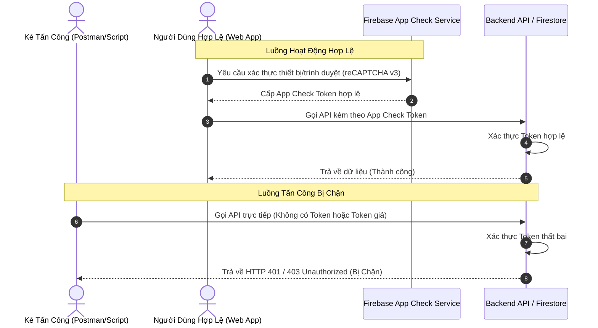

# 🛡️ Hệ Thống Giám Sát Lỗi, Phát Hiện Bất Thường & Khôi Phục Thảm Họa (Production)

Tài liệu này phân tích chi tiết các giải pháp giám sát lỗi (Error Tracking), phát hiện hành vi bất thường (Anomaly Detection), chống tấn công API bằng script, và thiết lập cơ chế rollback dữ liệu (Disaster Recovery) cho hệ thống QLCH_VanLanh chạy trên nền tảng Next.js và Firebase.

---

## 1. Trường Hợp 1: Giám Sát Lỗi & Khắc Phục Lỗi Vượt Giới Hạn Bộ Nhớ (OOM)

### 1.1. Chẩn Đoán Lỗi Memory Limit Exceeded
Lỗi <code>Memory limit of 512 MiB exceeded with 513 MiB used</code> xảy ra khi một Cloud Function hoặc API Route xử lý tác vụ tiêu thụ RAM vượt quá cấu hình tối đa được cấp phát (ở đây là 512 MiB). Container Node.js bị crash ngay lập tức do cơ chế Out of Memory (OOM) của V8 Engine.

**Nguyên nhân phổ biến trong dự án:**
- Đọc hoặc xử lý các tệp Excel lớn (sử dụng thư viện `xlsx`) bằng cách load toàn bộ dữ liệu vào RAM thay vì xử lý theo dòng.
- Xử lý hình ảnh độ phân giải cao bằng thư viện `sharp` mà không cấu hình giới hạn cache bộ nhớ.
- Thực hiện các truy vấn Firestore trả về hàng vạn tài liệu cùng lúc để tính toán doanh thu/hoa hồng thay vì sử dụng các truy vấn đếm (`count()`), tổng hợp (`aggregate`) hoặc phân trang.
- Memory leaks do các biến toàn cục giữ tham chiếu đến các mảng dữ liệu lớn không được giải phóng.

**Các phương án khắc phục:**
1. **Tăng cấu hình giới hạn bộ nhớ (Memory Limit):**
   Trong Firebase Functions V2, cấu hình trực tiếp giới hạn bộ nhớ cho từng Cloud Function tại thời điểm khai báo. Ví dụ nâng lên 1 GiB hoặc 2 GiB:
   ```typescript
   import { onRequest } from "firebase-functions/v2/https";

   export const importExcelData = onRequest({
     memory: "1GiB", // Cấu hình khả dụng: 256MiB, 512MiB, 1GiB, 2GiB, 4GiB, 8GiB
     timeoutSeconds: 120
   }, async (req, res) => {
     // Logic xử lý tệp Excel lớn
   });
   ```
2. **Cấu hình bộ nhớ cho Next.js API Routes trên Google Cloud Run / App Hosting:**
   Cập nhật cấu hình bộ nhớ trong tệp `firebase.json` hoặc cấu hình trực tiếp tài nguyên của dịch vụ Cloud Run tương ứng trên Google Cloud Console (tăng Memory allocation từ 512 MiB lên 1 GiB hoặc 2 GiB).
3. **Tối ưu hóa mã nguồn:**
   - Sử dụng cơ chế Streams để đọc/ghi tệp tin lớn thay vì `fs.readFileSync()`.
   - Giới hạn kích thước cache của thư viện `sharp`:
     ```typescript
     import sharp from "sharp";
     sharp.cache(false); // Vô hiệu hóa cache bộ nhớ để giải phóng RAM ngay sau khi xử lý xong ảnh
     ```
   - Áp dụng phân trang nghiêm ngặt cho tất cả các API truy vấn danh sách dữ liệu.

---

### 1.2. Hướng Dẫn Tích Hợp & Sử Dụng Sentry Chi Tiết
Sentry giúp tự động phát hiện, gom nhóm và báo cáo mọi lỗi phát sinh trên cả môi trường Client-side (trình duyệt của người dùng/nhân viên) và Server-side (Next.js API Routes, Cloud Functions) theo thời gian thực.

#### Bước 1: Khởi tạo Sentry cho dự án Next.js
Chạy lệnh cấu hình tự động thông qua công cụ Wizard của Sentry tại thư mục gốc của dự án:
```bash
npx @sentry/wizard@latest -i nextjs
```
Công cụ này sẽ tự động thực hiện các thao tác:
- Tạo tệp `sentry.client.config.ts` để cấu hình giám sát lỗi trên trình duyệt.
- Tạo tệp `sentry.server.config.ts` để giám sát lỗi trên Next.js Server-side API.
- Tạo tệp `sentry.edge.config.ts` cho môi trường Edge Middleware.
- Cập nhật tệp `next.config.mjs` để wrap cấu hình Webpack, tự động upload Source Maps lên Sentry (giúp hiển thị chính xác dòng code bị lỗi thay vì code đã compile/minify).
- Tạo tệp `.sentryclirc` chứa Auth Token để xác thực khi build hệ thống.

#### Bước 2: Cấu hình mã nguồn thu thập lỗi chủ động
Mặc dù Sentry tự động bắt tất cả các lỗi chưa được xử lý (Uncaught Exceptions), lập trình viên nên chủ động ghi nhận lỗi trong các block `try-catch` nghiệp vụ quan trọng:
```typescript
import * as Sentry from "@sentry/nextjs";

try {
  // Logic xử lý giao dịch Firestore quan trọng
} catch (error) {
  // Ghi nhận lỗi kèm theo thông tin ngữ cảnh để dễ dàng debug
  Sentry.captureException(error, {
    extra: {
      action: "checkout_pos",
      customerId: "0987654321",
      amount: 150000
    }
  });
}
```

#### Bước 3: Tích hợp Sentry cho Firebase Cloud Functions (Node.js)
Đối với các Cloud Functions độc lập chạy ngoài Next.js, cài đặt thư viện `@sentry/node` và khởi tạo ở dòng đầu tiên của tệp entry point (`index.ts` của thư mục functions):
```typescript
import * as Sentry from "@sentry/node";

Sentry.init({
  dsn: "YOUR_SENTRY_DSN_URL",
  tracesSampleRate: 0.1, // Đo lường hiệu năng 10% số lượng request để tiết kiệm dung lượng
  environment: "production"
});
```
Bọc các handler bằng hàm xử lý lỗi của Sentry:
```typescript
export const paymentWebhook = onRequest(async (req, res) => {
  try {
    // Logic xử lý webhook
  } catch (error) {
    Sentry.captureException(error);
    res.status(500).send("Internal Server Error");
  }
});
```

#### Bước 4: Thiết lập cảnh báo thời gian thực (Alerting)
1. Truy cập vào **Sentry Dashboard -> Alerts -> Create Alert Rule**.
2. Chọn loại cảnh báo **Issue** (Khi xuất hiện lỗi mới) hoặc **Metric** (Khi tỉ lệ lỗi vượt quá ngưỡng cho phép trong khoảng thời gian nhất định).
3. Cấu hình hành động gửi thông báo đến các kênh liên lạc:
   - **Slack / Telegram webhook:** Gửi trực tiếp thông tin lỗi kèm link chi tiết vào nhóm vận hành của cửa hàng.
   - **Email:** Gửi đến hộp thư của quản trị viên hệ thống.

---

## 2. Trường Hợp 2: Giám Sát Hoạt Động Bất Thường & Chống Tấn Công Trực Tiếp API (Bypass Client)

### 2.1. Giám Sát Lưu Lượng & Phát Hiện Request Bất Thường
Hệ thống sử dụng các công cụ có sẵn trong Google Cloud Platform (GCP) để theo dõi hành vi truy cập hệ thống.

#### Cách 1: Sử dụng Google Cloud Logging (Log Explorer)
Tất cả các lượt truy cập vào API Routes và Cloud Functions đều được ghi nhận tự động.
1. Truy cập **GCP Console -> Logging -> Log Explorer**.
2. Sử dụng bộ lọc để tìm kiếm các yêu cầu không đến từ Client-side (Web trình duyệt):
   - **Lọc theo User-Agent bất thường:** Các script tấn công hoặc công cụ như Postman, curl thường có User-Agent dạng `axios/1.x`, `node-fetch`, `python-requests/x.x`, hoặc hoàn toàn trống.
   - Cú pháp truy vấn mẫu trong Log Explorer:
     ```sql
     resource.type="cloud_run_revision"
     AND httpRequest.userAgent : "axios" OR httpRequest.userAgent : "Postman" OR httpRequest.userAgent : "curl"
     ```
3. **Phát hiện Spam IP:** Đếm số lượng request được gửi từ cùng một IP trong khoảng thời gian ngắn bằng cách quan sát trường `httpRequest.remoteIp`.

#### Cách 2: Thiết lập Dashboard Giám Sát trên Cloud Monitoring
1. Truy cập **GCP Console -> Monitoring -> Dashboards -> Create Dashboard**.
2. Thêm các biểu đồ hiển thị trực quan các chỉ số:
   - **Request Count (RPS):** Tốc độ request trên giây của từng API Route. Lưu lượng tăng vọt đột ngột là dấu hiệu của tấn công spam hoặc DDoS.
   - **Error Rate (4xx/5xx):** Tỉ lệ lỗi phản hồi. Tỉ lệ lỗi 4xx tăng cao đột biến cho thấy kẻ tấn công đang tìm cách quét lỗ hổng bảo mật hoặc thử các API với tham số sai lệch.
   - **Latency:** Thời gian phản hồi của hệ thống. Latency tăng đột biến báo hiệu quá tải tài nguyên (CPU/RAM).

---

### 2.2. Giải Pháp Chặn Truy Cập Trái Phép Tầng API: Firebase App Check
Khi kẻ tấn công biết được URL của API Endpoints (ví dụ qua F12 Network tab), họ có thể viết script hoặc dùng Postman để gửi yêu cầu trực tiếp bỏ qua Client-side nhằm tạo dữ liệu rác hoặc đọc trộm dữ liệu. **Firebase App Check** là giải pháp tối ưu để ngăn chặn triệt để hành vi này.



#### Cơ chế hoạt động của App Check:
1. **Tích hợp reCAPTCHA v3 / reCAPTCHA Enterprise** vào ứng dụng Web Client.
2. Khi người dùng thao tác trên trình duyệt hợp lệ, SDK của App Check sẽ gửi yêu cầu xác thực thiết bị và nhận về một **App Check Token** tạm thời.
3. Mọi yêu cầu từ Client gửi tới Firestore, Firebase Storage hoặc Cloud Functions/API Routes sẽ tự động được đính kèm App Check Token này trong Header (`X-Firebase-AppCheck`).
4. Ở phía Backend, Firebase sẽ tự động kiểm tra tính hợp lệ của Token này. Nếu yêu cầu xuất phát từ script, curl, Postman (không có cơ chế chạy reCAPTCHA trên trình duyệt thật), yêu cầu sẽ bị **từ chối ngay lập tức ở tầng cổng vào** trước khi chạm vào logic nghiệp vụ hoặc database của bạn.

---

## 3. Trường Hợp 3: Cơ Chế Khôi Phục Thảm Họa (Disaster Recovery) & Phân Tích Chi Phí

Khi hệ thống bị xâm nhập thành công và kẻ tấn công tạo ra một lượng lớn dữ liệu rác hoặc làm sai lệch dữ liệu tài chính, hệ thống cần có cơ chế rollback về trạng thái an toàn trước thời điểm xảy ra vụ tấn công.

### 3.1. Các Phương Án Rollback Dữ Liệu Firestore

#### Phương án 1: Point-in-Time Recovery (PITR) (Khuyên Dùng)
Đây là tính năng mạnh mẽ nhất của Firestore, cho phép khôi phục toàn bộ database về **bất kỳ thời điểm nào** trong vòng 7 ngày gần nhất, chính xác đến từng microsecond (một phần triệu giây).

- **Cơ chế hoạt động:** Firestore tự động lưu giữ lịch sử thay đổi của tất cả các tài liệu. Khi xảy ra sự cố tấn công vào lúc 10:15:30 ngày hôm nay, quản trị viên có thể chạy lệnh export toàn bộ database tại thời điểm chính xác là 10:14:59 (1 giây trước khi bị tấn công) ra Google Cloud Storage, sau đó import ngược lại vào database chính hoặc một database phụ để khôi phục trạng thái hoàn toàn sạch.
- **Ưu điểm:**
  - Khôi phục chính xác tuyệt đối thời điểm trước sự cố, tránh mất mát các giao dịch hợp lệ diễn ra trước đó.
  - Không cần lập kế hoạch backup thủ công trước đó. Chỉ cần bật tính năng PITR lên là hệ thống tự động ghi nhận lịch sử.
- **Cách kích hoạt (qua gcloud CLI):**
  ```bash
  gcloud firestore databases update --database="(default)" --enable-pitr
  ```

#### Phương án 2: Scheduled Backups (Backup Định Kỳ Hàng Ngày)
Hệ thống tự động thực hiện backup toàn bộ dữ liệu database ra một bucket lưu trữ riêng trên Google Cloud Storage (GCS) theo lịch trình cấu hình trước (ví dụ: vào 02:00 sáng mỗi ngày).
- **Cơ chế hoạt động:** Sử dụng Cloud Scheduler để kích hoạt một Cloud Function gọi lệnh export database Firestore định kỳ.
- **Ưu điểm:** Lưu trữ dài hạn (có thể lưu trữ nhiều tháng hoặc nhiều năm tùy thuộc vào cấu hình lưu trữ của GCS).
- **Nhược điểm:** Nếu sự cố xảy ra vào lúc 20:00, việc rollback về bản backup lúc 02:00 sáng sẽ làm mất toàn bộ các giao dịch hợp lệ phát sinh trong ngày từ 02:00 đến 20:00.

---

### 3.2. Phân Tích Chi Phí Triển Khai Chi Tiết
Dưới đây là bảng phân tích chi phí thực tế cho từng giải pháp giám sát và bảo mật trên môi trường production. Hầu hết các dịch vụ đều có **hạn mức miễn phí (Free Tier) rất rộng rãi**, giúp tối ưu hóa ngân sách vận hành cho cửa hàng.

| Tên Dịch Vụ | Tính Năng | Hạn Mức Miễn Phí (Free Tier) | Chi Phí Khi Vượt Hạn Mức | Đánh Giá Chi Phí Thực Tế Cho Cửa Hàng |
| :--- | :--- | :--- | :--- | :--- |
| **Sentry** | Giám sát và báo cáo lỗi thời gian thực | **5,000 lỗi/tháng** và **10,000 transactions/tháng** (Developer Plan) | Gói Team từ **$26/tháng** (tăng dung lượng lỗi và thời gian lưu trữ) | **Hoàn toàn miễn phí**. Lượng traffic của QLCH_VanLanh hoàn toàn nằm trong hạn mức Developer Plan miễn phí của Sentry. |
| **Firebase App Check** | Chặn request spam, bypass API bằng script | **Miễn phí** hoàn toàn khi dùng reCAPTCHA v3 tiêu chuẩn. | reCAPTCHA Enterprise: **10,000 lượt đánh giá đầu tiên/tháng miễn phí**, sau đó **$1 trên 1,000 lượt**. | **0 VNĐ**. reCAPTCHA v3 tiêu chuẩn hoàn toàn đủ đáp ứng nhu cầu bảo mật của dự án mà không phát sinh chi phí. |
| **Google Cloud Logging** | Lưu trữ và lọc tìm kiếm log hệ thống | **50 GiB đầu tiên mỗi tháng miễn phí** cho mỗi dự án. | **$0.50 trên mỗi GiB** dữ liệu log vượt quá hạn mức. | **0 VNĐ**. Trừ khi hệ thống bật ghi log debug quá mức, lượng log thông thường của hệ thống khó vượt quá 5 GiB/tháng. |
| **Google Cloud Monitoring** | Vẽ biểu đồ giám sát và thiết lập cảnh báo | **Miễn phí** cho tất cả các metric hệ thống tiêu chuẩn (CPU, RAM, RPS, Latency). | Phí nhỏ chỉ phát sinh khi sử dụng các metric tùy chỉnh (Custom metrics) số lượng lớn. | **0 VNĐ**. Đủ dùng cho mọi nhu cầu giám sát cơ bản. |
| **Firestore PITR** | Khôi phục dữ liệu theo từng microsecond | Không tính phí kích hoạt tính năng. | Chỉ tính phí lưu trữ dữ liệu thay đổi trong 7 ngày: **~$0.15/GiB/tháng** (Multi-region) hoặc **~$0.10/GiB/tháng** (Single region). | **Cực kỳ rẻ (Dưới 50.000 VNĐ/tháng)**. Với dung lượng database hiện tại của cửa hàng, chi phí lưu giữ dữ liệu PITR chỉ khoảng vài nghìn đến vài chục nghìn đồng mỗi tháng. |
| **Scheduled Backups (GCS)** | Backup database định kỳ hàng ngày | Hạn mức GCS miễn phí **5 GiB lưu trữ Standard** mỗi tháng. | - Phí đọc Firestore khi export: **$0.06 trên 100,000 document reads**.<br>- Phí lưu trữ GCS vượt hạn mức: **$0.02 - $0.026/GiB/tháng**.<br>- Phí restore (import lại): **$0.18 trên 100,000 document writes**. | **Dưới 20.000 VNĐ/tháng**. Nếu database có 100,000 tài liệu, mỗi lần backup chỉ tốn $0.06 (khoảng 1,500 VNĐ) tiền đọc dữ liệu và phí lưu trữ GCS gần như không đáng kể. |

---

## 4. Kế Hoạch Đề Xuất Triển Khai Các Giải Pháp

Nhằm đảm bảo an toàn tuyệt đối cho hệ thống mà không ảnh hưởng đến tiến độ hiện tại, lộ trình triển khai bảo mật được khuyến nghị như sau:

1. **Giai đoạn 1: Khởi động Giám Sát (Không tác động đến code nghiệp vụ)**
   - Kích hoạt tính năng **Point-in-Time Recovery (PITR)** trên Firestore thông qua gcloud CLI để có ngay điểm tựa khôi phục dữ liệu an toàn.
   - Truy cập Google Cloud Console thiết lập các biểu đồ giám sát lưu lượng và latency cơ bản trên Cloud Monitoring.
   - Thiết lập cảnh báo gửi email/Slack khi tỉ lệ lỗi HTTP 5xx tăng cao.

2. **Giai đoạn 2: Tích hợp Error Tracking & Nâng cấp Cấu hình**
   - Tích hợp **Sentry Next.js SDK** vào mã nguồn để thu thập toàn bộ lỗi phát sinh từ người dùng thực tế.
   - Rà soát các Cloud Functions và nâng cấu hình giới hạn bộ nhớ (Memory Limit) lên **1 GiB** đối với các hàm xử lý Excel, xuất báo cáo tài chính hoặc xử lý hình ảnh nặng để triệt tiêu lỗi OOM.

3. **Giai đoạn 3: Khóa Bảo Mật Toàn Diện**
   - Đăng ký và cấu hình **Firebase App Check** tích hợp reCAPTCHA v3 cho môi trường production.
   - Bật chế độ Enforcement (Bắt buộc) trên Firestore và Cloud Functions để chặn đứng 100% các request bằng script hoặc tool bypass trực tiếp từ kẻ tấn công.

# 🐛 Bugs
## BUG-SEC-001: Bất đồng bộ Session Cookie (Auth Desync)
- **Status:** fixed
- **Severity:** high
- **Module:** SEC
- **Files:** `src/lib/AuthContext.tsx`
### Cause
<b>Phân tích</b>: Next.js dùng cookie được set thông qua `/api/auth/session` để chặn các route `/admin`. Firebase Token có hạn 1 tiếng và tự động làm mới ngầm ở client. Tuy nhiên API `/api/auth/session` không được gọi lại định kỳ để cập nhật Cookie cho Next.js Middleware. Kết quả là nhân viên làm việc quá 1 tiếng bị văng lỗi 403 khi gọi API lưu dữ liệu.
### Solution
<b>Giải pháp đề xuất</b>: Bổ sung logic vào event listener `onIdTokenChanged` trong `AuthContext` để gọi API update session cookie mỗi khi token Firebase được refresh.
### Fix 2026-06-30
- Root cause: `AuthContext` dùng `onAuthStateChanged` chỉ fire 1 lần khi login. Firebase tự refresh token ~55 phút nhưng cookie không được cập nhật theo.
- Changed files: `src/lib/AuthContext.tsx`.
- Fix: Thay `onAuthStateChanged` bằng `onIdTokenChanged` (superset). Lần đầu: fetch user data + sync session cookie. Các lần refresh sau: chỉ re-sync cookie (không re-fetch Firestore). Thêm `initialAuthResolved` flag để phân biệt.
- Verification: `onIdTokenChanged` import verified; lint + typecheck pass.

## BUG-SEC-002: Lỗ hổng Ghi Dữ liệu Không kiểm soát (Unbounded Data Write)
- **Status:** fixed
- **Severity:** critical
- **Module:** SEC
- **Files:** `firestore.rules`
### Cause
<b>Phân tích</b>: Security rules cho collections `/appointments` và `/subscribers` được thiết lập `allow create: if true;` mà không có bất kỳ rào cản schema (ràng buộc kiểu dữ liệu, giới hạn số lượng trường, giới hạn độ dài ký tự) nào giống như ở collection `/reviews`. Điều này cho phép bất kỳ ai (kể cả không đăng nhập) gửi các payload khổng lồ (vài MB mỗi request) liên tục vào Firestore, gây ra nguy cơ tấn công từ chối dịch vụ (DoS) và bùng nổ chi phí lưu trữ/băng thông.
### Solution
<b>Giải pháp đề xuất</b>: Áp dụng schema validation chặt chẽ trong `firestore.rules` cho `/appointments` và `/subscribers`. Xác định chính xác các trường được phép ghi (whitelist keys), độ dài tối đa của string, kiểu dữ liệu, và ép timestamp tạo bản ghi bằng `request.time`. Có thể áp dụng rate limit để chặn spam request.
### Fix 2026-06-30
- Root cause: `/appointments` và `/subscribers` cho public `create` mà không whitelist keys, không giới hạn độ dài string, và không ép timestamp server.
- Changed files: `firestore.rules`.
- Verification: public create hiện chỉ nhận payload đúng schema, status cố định, timestamp bằng `request.time`, và các field ngoài whitelist bị từ chối.

## BUG-SEC-003: Lỗ hổng Xóa Đơn Hàng (Order Deletion / Fraud Risk)
- **Status:** fixed
- **Severity:** critical
- **Module:** SEC
- **Files:** `firestore.rules`
### Cause
<b>Phân tích</b>: Security rule của collection `/orders` quy định `allow delete: if hasPermission('manage_orders');`. Điều này có nghĩa là mọi nhân viên có quyền bán hàng đều có thể thực hiện thao tác XÓA VĨNH VIỄN một đơn hàng khỏi cơ sở dữ liệu. Nếu nhân viên gian lận, họ có thể tạo đơn hàng, nhận tiền mặt từ khách, sau đó bấm "xóa đơn hàng" (hard-delete). Dữ liệu biến mất, doanh thu không được ghi nhận, gây thất thoát tài chính.
### Solution
<b>Giải pháp đề xuất</b>: Đổi quyền xóa đơn hàng thành `allow delete: if isAdmin();`. Nhân viên chỉ được phép `update` trạng thái thành `cancelled` hoặc gửi yêu cầu hủy (soft-delete). Các đơn bị hủy phải được giữ lại lịch sử trong Firestore để truy vết. Tương tự, cần kiểm tra kỹ quy tắc xóa (delete) ở các bảng có liên quan tài chính khác.
### Fix 2026-06-30
- Changed files: `firestore.rules`.
- Verification: `/orders` delete now requires `isAdmin()`.
### Follow-up Fix 2026-06-30
- Changed files: `firestore.rules`.
- Verification: direct client hard-delete for `/orders` is now fully disabled with `allow delete: if false`; order cancellation/refund must stay on server APIs for audit, voucher, stock, and revenue side effects.

## BUG-SEC-004: Lỗ hổng Sửa đổi Tên Khách hàng CRM và Nguy cơ Stored XSS
- **Status:** fixed
- **Severity:** critical
- **Module:** SEC
- **Files:** `src/app/api/customers/sync/route.ts`
### Cause
<b>Phân tích</b>: API đồng bộ thông tin khách hàng `/api/customers/sync` là một API công khai (Public) không yêu cầu xác thực (Authorization). API này cho phép truyền tham số `forceUpdateName: true` từ request body để ghi đè trực tiếp tên của bất kỳ khách hàng nào dựa trên số điện thoại của họ. Kẻ tấn công có thể dễ dàng gọi API này thông qua các công cụ như Postman để thay đổi tên của toàn bộ cơ sở dữ liệu khách hàng thành các chuỗi độc hại (ví dụ: chứa thẻ `<script>` hoặc mã độc). Nếu giao diện quản trị Admin/CRM hiển thị trường tên này mà không thoát/lọc HTML (escape), nó sẽ dẫn đến lỗ hổng Stored XSS (Cross-Site Scripting) vô cùng nguy hiểm.
### Solution
<b>Giải pháp đề xuất</b>: 
1. Loại bỏ tham số `forceUpdateName` khỏi API public `/api/customers/sync`. Chỉ cho phép cập nhật tên khách hàng khi tên hiện tại trống hoặc là "Khách lẻ".
2. Các thao tác cưỡng chế cập nhật tên từ Admin phải sử dụng một API riêng được bảo vệ bằng quyền hạn `manage_customers` (sử dụng `requirePermission`).
3. Thực hiện vệ sinh dữ liệu đầu vào (HTML Sanitization) cho trường `name` trước khi lưu vào Firestore để triệt tiêu nguy cơ XSS.
### Fix 2026-06-30
- Root cause: Public API cho phép `forceUpdateName: true` để ghi đè tên khách hàng bất kỳ, không có sanitization.
- Changed files: `src/app/api/customers/sync/route.ts`.
- Fix: (1) Loại bỏ `forceUpdateName` khỏi body destructure — API chỉ update tên khi current name empty/generic. (2) Thêm `stripHtml()` sanitizer strip tất cả HTML tags. (3) Giới hạn name tối đa 100 ký tự.
- Lưu ý: Admin repairs page vẫn gửi `forceUpdateName: true` nhưng server giờ bỏ qua — tên chỉ update khi trống/generic. Cần tạo authenticated admin API nếu muốn force update.
- Verification: grep confirms `forceUpdateName` removed from API; HTML tags in name are stripped.

## BUG-SEC-005: Lỗ hổng Đọc Công khai Mã Giảm giá (Voucher Data Leak)
- **Status:** fixed
- **Severity:** critical
- **Module:** SEC
- **Files:** `firestore.rules`
### Cause
<b>Phân tích</b>: Security rules cho collection `/vouchers` được thiết lập `allow read: if true;`. Điều này cho phép bất kỳ người dùng vô danh nào cũng có thể truy vấn toàn bộ cơ sở dữ liệu mã giảm giá (bao gồm các mã có giá trị cao, mã cá nhân chứa số điện thoại khách hàng trong trường `ownerId`, và giới hạn sử dụng). Kẻ gian có thể cào (scrape) toàn bộ mã và lợi dụng hoặc đánh cắp thông tin cá nhân.
### Solution
<b>Giải pháp đề xuất</b>: Chặn quyền read công khai của collection `vouchers`. Chỉ cho phép đọc thông qua một Cloud Function hoặc Next.js API Route, nơi backend sẽ kiểm tra mã code cụ thể và trả về thông tin hợp lệ thay vì để lộ toàn bộ collection.
### Fix 2026-06-30
- Changed files: `firestore.rules`.
- Verification: `/vouchers` read now requires `manage_discounts`; storefront/POS validation uses `/api/vouchers/validate`.

## BUG-SEC-006: Lỗ hổng Giả mạo Số điện thoại (Phone Spoofing / Voucher Theft)
- **Status:** fixed
- **Severity:** high
- **Module:** SEC
- **Files:** `src/app/api/checkout/route.ts`, `src/app/(customer)/checkout/page.tsx`, `src/components/MissionsWidget.tsx`
### Cause
<b>Phân tích</b>: Khi khách hàng sử dụng Voucher cá nhân (Bounty Voucher có `ownerId`), API Web Checkout chỉ kiểm tra xem số điện thoại nhập trong form đặt hàng có khớp với `ownerId` hay không. Do Web Checkout không yêu cầu xác thực OTP/Đăng nhập, kẻ tấn công biết số điện thoại của nạn nhân và mã voucher có thể nhập số điện thoại đó vào form để đặt hàng (COD) và tiêu xài trái phép voucher của nạn nhân.
### Solution
<b>Giải pháp đề xuất</b>: Với các giao dịch áp dụng voucher cá nhân, bắt buộc người dùng phải xác thực số điện thoại qua OTP hoặc Firebase Auth để chứng minh quyền sở hữu, hoặc thêm bước gửi OTP xác nhận giao dịch lúc checkout.
### Fix 2026-06-30
- Changed files: `src/app/api/checkout/route.ts`, `src/app/(customer)/checkout/page.tsx`, `src/components/MissionsWidget.tsx`.
- Verification: personal voucher checkout now requires a Firebase ID token whose `phone_number` normalizes to both the checkout phone and voucher `ownerId`; the bounty widget keeps the OTP token after claim so legitimate owners can reuse the voucher proof, while public vouchers do not require proof.
- Remaining risk: existing browsers that claimed a bounty voucher before this fix may need to verify OTP again because the old client removed `bounty_token` after claim.

## BUG-SEC-007: Client Bypass Server Guard (Rate Limits, Geofence, Honeypot)
- **Status:** fixed
- **Severity:** critical
- **Module:** SEC
- **Files:** `firestore.rules`
### Cause
<b>Phân tích</b>: Collections `appointments`, `reviews`, `product_reviews`, `article_comments` được thiết lập `allow create: if true` trong `firestore.rules`. Hệ thống dựa vào các API Routes của Next.js (`/api/appointments`, `/api/reviews`) để thực thi Rate Limiting, Geofence, và Honeypot. Tuy nhiên, do rule Firestore mở hoàn toàn, kẻ tấn công có thể sử dụng Firebase Client SDK để viết script spam hàng triệu document trực tiếp vào cơ sở dữ liệu, bỏ qua hoàn toàn rào cản bảo vệ của server.
### Solution
<b>Giải pháp đề xuất</b>: Đổi `allow create: if true;` thành `allow create: if false;` đối với các collection này trong `firestore.rules`. Ép buộc toàn bộ thao tác tạo (create) phải đi qua Server API (nơi sử dụng Admin SDK để ghi dữ liệu) nhằm kích hoạt tính năng Rate Limit và Honeypot.
### Fix 2026-06-30
- Changed files: `firestore.rules`, `src/app/api/articles/comments/route.ts`, `src/app/(customer)/tin-tuc/[slug]/ArticleClientParts.tsx`.
- Verification: public creates for `appointments`, `reviews`, `product_reviews`, and `article_comments` are blocked in rules; article comments now submit through a server API with rate limits and validation.

## BUG-SEC-008: Phân quyền lỏng lẻo gây leo thang đặc quyền (Customer Tier Privilege Escalation)
- **Status:** fixed
- **Severity:** critical
- **Module:** SEC
- **Files:** `firestore.rules`
### Cause
<b>Phân tích</b>: `firestore.rules` cho phép nhân viên có quyền `manage_customers` được phép `update` document của khách hàng. Tuy nhiên, rule không giới hạn các trường được phép sửa. Nhân viên gian lận có thể dùng Client SDK sửa trực tiếp trường `totalSpent` (tổng chi tiêu) của một khách hàng thành con số khổng lồ (ví dụ: `999999999`). Điều này vĩnh viễn nâng cấp khách hàng đó lên hạng Platinum/Smember, giúp họ nhận chiết khấu lớn trái phép trong các lần mua hàng tiếp theo.
### Solution
<b>Giải pháp đề xuất</b>: Bổ sung ràng buộc vào `firestore.rules` không cho phép sửa đổi các trường tổng hợp từ client: `&& !request.resource.data.diff(resource.data).affectedKeys().hasAny(['totalSpent', 'totalOrders', 'totalRepairs', 'totalAppointments', 'missions'])`. Các trường này chỉ được update qua các Transaction bảo mật tại Server (Admin SDK).
### Fix 2026-06-30
- Changed files: `firestore.rules`.
- Verification: client updates to customer aggregate fields are blocked; Admin SDK transactions remain unaffected.

## BUG-SEC-009: Lỗ hổng Ghi Dữ liệu Không kiểm soát và Spam Session tại online_users (Unauthenticated Write Access / DoS)
- **Status:** fixed
- **Severity:** medium
- **Module:** SEC
- **Files:** `database.rules.json`
### Cause
<b>Phân tích</b>: Trong tệp cấu hình bảo mật Realtime Database `database.rules.json`, nút `/online_users/$sessionId` được thiết lập luật ghi đè `.write: true` mà không đi kèm bất kỳ điều kiện xác thực nào (như `auth != null`). Điều này cho phép bất kỳ máy khách nào (kể cả người dùng chưa đăng nhập hoặc khách vãng lai) cũng có thể gửi các yêu cầu ghi dữ liệu trực tiếp lên Realtime Database. Kẻ tấn công có thể lợi dụng kẽ hở này để viết script gửi hàng triệu session ảo lên database, làm phình to bộ nhớ lưu trữ thời gian thực, tiêu tốn băng thông và có khả năng gây treo hoặc tăng chi phí dịch vụ đột biến.
### Solution
<b>Giải pháp đề xuất</b>: Giới hạn quyền ghi chỉ dành cho những người dùng đã được xác thực (kể cả anonymous auth nếu hệ thống yêu cầu khách hàng vãng lai cập nhật trạng thái online):
```json
    "online_users": {
      ".read": "auth != null",
      "$sessionId": {
        ".write": "auth != null",
        ".validate": "!newData.exists() || (newData.hasChild('timestamp') && newData.child('timestamp').isNumber())",
        "timestamp": { ".validate": "newData.isNumber()" },
        "page": { ".validate": "newData.isString() && newData.val().length <= 200" },
        "$other": { ".validate": false }
      }
    }
```
### Fix 2026-06-30
- Changed files: `database.rules.json`.
- Verification: `/online_users/$sessionId` write now requires `auth != null`; current `usePresence` does not write online presence, so storefront visitor tracking remains on `/api/analytics/visit`.
