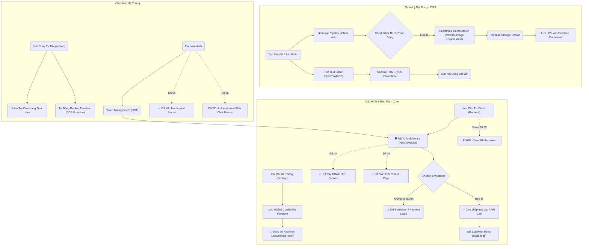

# 🧩 Workflows
## system-content
- **Title:** Hệ thống & Nội dung
- **Icon:** 📝
### 📁 Target Files (Các file đích)
- src/app/admin/settings/page.tsx (Cấu hình hệ thống)
- src/app/admin/posts/page.tsx (Quản lý bài viết CMS)
- src/app/(customer)/info/chinh-sach-mua-hang/page.tsx (Hiển thị chi nhánh và hotline từ system_config)
- src/app/admin/appearance/page.tsx (Cấu hình metadata và bộ lọc homepage; giá từ services, review từ Google Places)

### Google homepage reviews

- `/api/reviews/google` uses Google Place Details (New), not the Legacy endpoint.
- Default place: `ChIJmWqqJWcpdTERqc7cx-jP2E4`.
- Admin can override the Place ID from `/admin/appearance`.
- If Google Places is unavailable, the homepage falls back to an official Google Maps URL CTA without mock reviews.

## BUG-CONFIG-SESSION-001: Lưu cấu hình giao diện làm admin bị văng đăng nhập

- **Status:** fixed
- **Symptom:** Sau khi admin lưu thành công tại `/admin/appearance`, Router Cache của admin bị purge và tài khoản có thể bị chuyển về `/admin/login`.
- **Root cause:** Luồng lưu config gọi trực tiếp Server Action revalidation từ admin client. Server Action trả response có thể refresh Router Cache của tab admin; trước đó sentinel `layout` còn purge root layout bằng `revalidatePath('/', 'layout')`.
- **Fix:** Sentinel `layout` chỉ revalidate `/(customer)` layout. Config save gửi request nền tới `/api/revalidate`, route xác thực bằng cookie admin đã ký hoặc secret nội bộ. Storefront vẫn nhận cấu hình mới nhưng auth tree `/admin` không bị refresh bởi Server Action.
- **Files:** `src/lib/requestRevalidate.ts`, `src/lib/ConfigContext.tsx`, `src/app/api/revalidate/route.ts`, `src/lib/revalidate.ts`, `src/app/admin/settings/CategoriesTab.tsx`, `src/app/admin/settings/NavigationTab.tsx`

## BUG-AUTH-SESSION-002: Mở trang chủ làm văng tài khoản Admin

- **Status:** fixed
- **Symptom:** Đang đăng nhập Admin (hoặc staff), nếu mở trang chủ (`/`) ở một tab mới hoặc chuyển hướng về trang chủ, tài khoản Admin ở tất cả các tab khác sẽ lập tức bị văng và bị chuyển về màn hình đăng nhập.
- **Root cause:** Component `ChatWidget` trên trang chủ khởi chạy và kiểm tra session. Vì tiến trình khôi phục session Admin của `AuthContext` cần thời gian, `ChatWidget` thấy chưa có tài khoản nên lập tức gọi `signInAnonymously()`. Lệnh này tạo ra một phiên ẩn danh và đè mất session Admin hiện tại. Do các tab dùng chung IndexedDB, tab Admin phát hiện session bị thay đổi thành "Ẩn danh" và tự động văng ra ngoài.
- **Fix:** Bổ sung điều kiện kiểm tra trạng thái đang khôi phục session (`authLoading`) vào `ChatWidget.tsx`. Component này phải kiên nhẫn đợi `AuthContext` tải xong toàn bộ. Chỉ khi xác nhận không có tài khoản thật sự thì mới gọi `signInAnonymously()`.
- **Files:** `src/components/ChatWidget.tsx`

## FEATURE-CONFIG-WARRANTY-001: Mở rộng Cấu hình Mẫu Biên Nhận Bảo Hành

- **Status:** completed
- **Description:** Cung cấp tính năng tuỳ chỉnh 3 mẫu biên nhận bảo hành: Thiết Bị, Sửa Chữa và Phụ Kiện tại màn hình cài đặt biên nhận. Cho phép quản trị viên xem live preview và thay đổi nội dung các cột điều kiện bảo hành. Đã xác nhận requirement: Mã QR in trên hoá đơn thực tế sẽ chứa Order ID để nhân viên quét điện thoại truy xuất nhanh đơn hàng.
- **Files:** `src/app/admin/settings/receipt/page.tsx`, `src/app/admin/settings/receipt/WarrantyComponents.tsx`

## FEATURE-GLOBAL-SEARCH-001: Tìm kiếm toàn cục & Quét QR

- **Status:** pending
- **Description:** Xây dựng tính năng tìm kiếm toàn cục (Global Search) trên Admin Header, cho phép tìm kiếm xuyên suốt các collection: Sản phẩm, Dịch vụ, Đơn bán hàng (Orders) và Phiếu sửa chữa (Repair Tickets). Đặc biệt tích hợp tính năng Quét mã QR bằng Camera (sử dụng thư viện `@zxing/browser`) để tra cứu siêu tốc các mã đơn in trên hóa đơn/biên nhận khi khách hàng mang đến.
- **Files:** `src/components/admin/GlobalSearch.tsx`, `src/app/admin/layout.tsx`, `src/app/api/search/route.ts`
