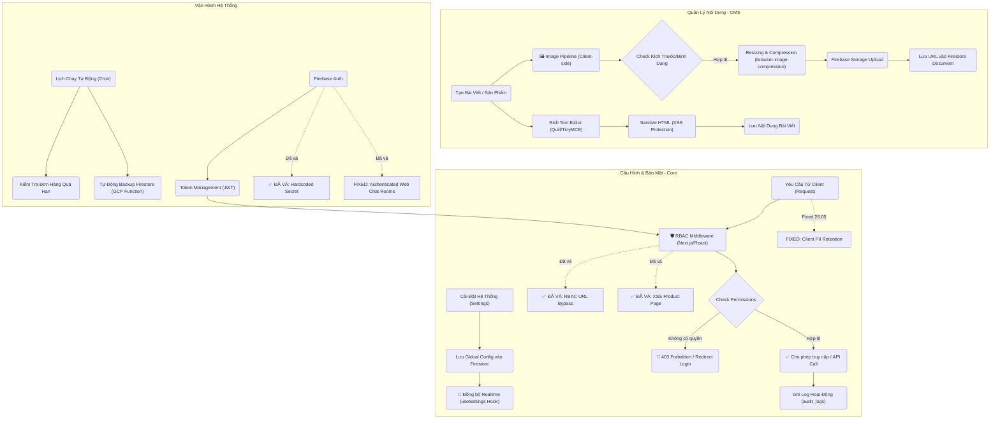

# 🧩 Workflows
## system-content
- **Title:** Hệ thống & Nội dung
- **Icon:** 📝
### 📁 Target Files (Các file đích)
- src/app/admin/settings/page.tsx (Cấu hình hệ thống)
- src/app/admin/posts/page.tsx (Quản lý bài viết CMS)
- src/app/(customer)/info/chinh-sach-mua-hang/page.tsx (Hiển thị chi nhánh và hotline từ system_config)
- src/app/admin/appearance/page.tsx (Cấu hình metadata và bộ lọc homepage; giá từ services, review từ Google Places)

### Google homepage reviews

- `/api/reviews/google` uses Google Place Details (New), not the Legacy endpoint.
- Default place: `ChIJmWqqJWcpdTERqc7cx-jP2E4`.
- Admin can override the Place ID from `/admin/appearance`.
- If Google Places is unavailable, the homepage falls back to an official Google Maps URL CTA without mock reviews.

# 🐛 Bugs

## BUG-ADMIN-MOBILE-001: Mobile admin missing logout, hidden taxonomy row actions, and stale menu suggestions

- **Status:** fixed
- **Severity:** medium
- **Symptom:** Mobile admin header/menu did not expose logout; taxonomy category rows hid add/edit/delete actions behind desktop hover; Navigation menu "Gợi ý từ Danh mục" could keep DEFAULT_CONFIG menu/taxonomy state after the real Firestore config loaded.
- **Root cause:** Mobile admin layout only rendered account avatar in the compact header; category row actions used `opacity-0 group-hover:opacity-100` for all viewports; `NavigationTab` initialized local state from config once during the DEFAULT_CONFIG phase and did not sync after config loading completed.
- **Fix:** Added explicit mobile logout buttons, made category row actions always visible on mobile and hover-only from `sm` upward, synchronized NavigationTab local menu state from loaded config, and scoped footer/home suggestions to the live service taxonomy.
- **Files:** `src/app/admin/layout.tsx`, `src/app/admin/settings/CategoriesTab.tsx`, `src/app/admin/settings/NavigationTab.tsx`
- **Verification:** Targeted lint/type/smoke checks in current fix session.

## BUG-HARDCODE-001: Hardcode cleanup cho secret, storefront fallback và business identity

- **Status:** fixed
- **Severity:** high
- **Plan:** `roadmap/ui/data/ai_plans/plan_hardcode_cleanup_20260607.md`
- **Task:** `roadmap/ui/data/ai_plans/task_hardcode_cleanup_20260607.md`
- **Scope:** Google Maps Embed key trong trang giới thiệu, fallback demo ở homepage, brand/hotline/domain/address rải rác trong customer UI/SEO/AI prompt, workflow status string ở repair/POS/inventory và demo/template admin.
- **Guardrail:** Storefront không hiển thị dữ liệu giả khi thiếu Firestore/config; secret/key không nằm thẳng trong page source; quyền admin không được suy luận bằng email string.
- **Verification:** Đã merge vào `master` qua PR #8; `pnpm lint`, `pnpm typecheck`, `pnpm build` và storefront browser QA pass. Smoke admin có dữ liệu thật được giữ thành residual verification, không còn là blocker của bản sửa code.

## BUG-CONFIG-SESSION-001: Lưu cấu hình giao diện làm admin bị văng đăng nhập

- **Status:** fixed
- **Symptom:** Sau khi admin lưu thành công tại `/admin/appearance`, Router Cache của admin bị purge và tài khoản có thể bị chuyển về `/admin/login`.
- **Root cause:** Luồng lưu config gọi trực tiếp Server Action revalidation từ admin client. Server Action trả response có thể refresh Router Cache của tab admin; trước đó sentinel `layout` còn purge root layout bằng `revalidatePath('/', 'layout')`.
- **Fix:** Sentinel `layout` chỉ revalidate `/(customer)` layout. Config save gửi request nền tới `/api/revalidate`, route xác thực bằng cookie admin đã ký hoặc secret nội bộ. Storefront vẫn nhận cấu hình mới nhưng auth tree `/admin` không bị refresh bởi Server Action.
- **Files:** `src/lib/requestRevalidate.ts`, `src/lib/ConfigContext.tsx`, `src/app/api/revalidate/route.ts`, `src/lib/revalidate.ts`, `src/app/admin/settings/CategoriesTab.tsx`, `src/app/admin/settings/NavigationTab.tsx`

## BUG-AUTH-SESSION-002: Mở trang chủ làm văng tài khoản Admin

- **Status:** fixed
- **Symptom:** Đang đăng nhập Admin (hoặc staff), nếu mở trang chủ (`/`) ở một tab mới hoặc chuyển hướng về trang chủ, tài khoản Admin ở tất cả các tab khác sẽ lập tức bị văng và bị chuyển về màn hình đăng nhập.
- **Root cause:** Component `ChatWidget` trên trang chủ khởi chạy và kiểm tra session. Vì tiến trình khôi phục session Admin của `AuthContext` cần thời gian, `ChatWidget` thấy chưa có tài khoản nên lập tức gọi `signInAnonymously()`. Lệnh này tạo ra một phiên ẩn danh và đè mất session Admin hiện tại. Do các tab dùng chung IndexedDB, tab Admin phát hiện session bị thay đổi thành "Ẩn danh" và tự động văng ra ngoài.
- **Fix:** Bổ sung điều kiện kiểm tra trạng thái đang khôi phục session (`authLoading`) vào `ChatWidget.tsx`. Component này phải kiên nhẫn đợi `AuthContext` tải xong toàn bộ. Chỉ khi xác nhận không có tài khoản thật sự thì mới gọi `signInAnonymously()`.
- **Files:** `src/components/ChatWidget.tsx`

## FEATURE-CONFIG-WARRANTY-001: Mở rộng Cấu hình Mẫu Biên Nhận Bảo Hành

- **Status:** completed
- **Description:** Cung cấp tính năng tuỳ chỉnh 3 mẫu biên nhận bảo hành: Thiết Bị, Sửa Chữa và Phụ Kiện tại màn hình cài đặt biên nhận. Cho phép quản trị viên xem live preview và thay đổi nội dung các cột điều kiện bảo hành. Đã xác nhận requirement: Mã QR in trên hoá đơn thực tế sẽ chứa Order ID để nhân viên quét điện thoại truy xuất nhanh đơn hàng.
- **Files:** `src/app/admin/settings/receipt/page.tsx`, `src/app/admin/settings/receipt/WarrantyComponents.tsx`

## FEATURE-PRINTABLE-WARRANTY-002: In Phiếu Bảo Hành từ Repair Ticket

- **Status:** completed
- **Description:** Hoàn thiện luồng in phiếu bảo hành cho module sửa chữa. Nút `In BH` chỉ hiển thị khi `ticket.categoryPath` resolve được `TaxonomyNode.warrantyType` và `system_config/receipt` có template tương ứng. Hỗ trợ fallback từ node cha xuống node con trong taxonomy, dùng lại `PrintableWarranty` và không áp dụng cho Orders cho đến khi order item có dữ liệu taxonomy đủ tin cậy.
- **Files:** `src/app/admin/repairs/page.tsx`, `src/components/admin/PrintableWarranty.tsx`, `src/components/admin/PrintableReceipt.tsx`, `src/app/admin/settings/CategoriesTab.tsx`

## BUG-BUILD-005: Typecheck/Lint/Build vỡ do file JSX bị cắt và artifact bị quét

- **Status:** fixed
- **Symptom:** `pnpm typecheck` fail vì JSX không đóng ở Products/Repairs/NavigationTab; `pnpm lint` fail vì thiếu `eslint-plugin-react-hooks` và quét cả `scratch/chrome-qa-profile`; production build không thể dùng làm gate deploy. Sau khi build pass, IDE/Edge Tools vẫn báo 2 lỗi `axe/forms` tại `CategoriesTab.tsx` vì `<select>` chưa có accessible name.
- **Root cause:** Một số file UI bị dán/cắt hỏng trong quá trình chỉnh sửa, `package.json` chưa khai báo peer plugin của `eslint-config-next`, file debug/script vào typecheck với import Firebase Admin sai, và type `FirestoreDateValue` chưa phản ánh dữ liệu bảo hành đang lưu dạng timestamp number. Riêng lỗi `axe/forms`: build/typecheck không bắt accessibility runtime rule; các `<select>` trong UI phải có `label` liên kết bằng `htmlFor/id`, hoặc `aria-label`/`title`.
- **Fix:** Khôi phục cấu trúc JSX bị mất, thêm `eslint-plugin-react-hooks`, ignore runtime artifacts trong ESLint, siết `/api/debug/users` bằng `manage_staff`, bỏ các `no-explicit-any` suppression liên quan và chuẩn hóa type warranty/service/product detail. Bổ sung accessible name cho các `<select>` trong `CategoriesTab.tsx`: filter loại danh mục có `title`/`aria-label`; select loại phiếu bảo hành có `label htmlFor`, `id`, `title`, `aria-label`.
- **Files:** `eslint.config.mjs`, `package.json`, `src/app/admin/products/page.tsx`, `src/app/admin/repairs/page.tsx`, `src/app/admin/settings/NavigationTab.tsx`, `src/app/admin/settings/CategoriesTab.tsx`, `src/app/api/repairs/handover/route.ts`, `src/app/api/debug/users/route.ts`, `src/lib/types.ts`, `src/components/admin/CurrencyInput.tsx`, `check_users.ts`
- **Verification:** `pnpm lint` pass (0 errors, existing warnings only), `pnpm typecheck` pass, `pnpm build` pass. Sau lỗi IDE axe, đã verify lại `eslint` riêng `CategoriesTab.tsx` và `next typegen && tsc --noEmit` bằng local binaries.
- **AI Guardrail:** Khi sửa UI form control (`input`, `select`, `textarea`, icon-only button), không chỉ dựa vào build. Luôn đảm bảo control có accessible name: visible `<label htmlFor="...">` + `id`, hoặc tối thiểu `aria-label`/`title`. Lỗi Edge Tools/axe có thể xuất hiện dù build thành công.

## BUG-DEPLOY-006: Firebase SSR deploy chạy npm ci dù dự án dùng pnpm

- **Status:** fixed
- **Symptom:** Local build/typecheck đã pass nhưng Firebase deploy vẫn fail trong Cloud Build tại SSR function `firebase-frameworks-qlch-vanlanh:ssrqlchvanlanh(asia-southeast1)`. Log dừng ở `npm ci` với lỗi `package.json` và `package-lock.json` không đồng bộ, ví dụ `sharp@0.34.5` trong dependency hiện tại nhưng npm lock cũ còn trạng thái `0.33.5`/thiếu các gói `@img/sharp-*`.
- **Root cause:** Dự án đã chuẩn hóa sang `pnpm-lock.yaml` nhưng root `package.json` chưa khai báo `packageManager`, trong khi Firebase Frameworks tạo bundle SSR dưới `.firebase/.../functions` kèm `package-lock.json`. Khi Cloud Build nhìn thấy npm lock trong bundle SSR, nó chạy `npm ci`. Lỗi sâu hơn là `firebase-frameworks@0.11.8` chỉ nhận peer optional `sharp ^0.32 || ^0.33`, còn `next@15.5.x` cần optional `sharp ^0.34.3`; nếu root function không pin `sharp`, npm lock dễ bị lệch/không thỏa peer ở Cloud Build. Đây là lỗi deploy pipeline/package manager, không phải lỗi TypeScript hay lỗi `next build` local.
- **Fix:** Khai báo rõ `packageManager: pnpm@10.30.3` và `engines.node: 22` trong root `package.json`; đổi script `verify` sang `pnpm lint && pnpm typecheck && pnpm build`; pin root dependency `sharp: 0.33.5` để thỏa `firebase-frameworks`, trong khi `next` vẫn giữ `sharp@0.34.5` riêng trong dependency tree. Đã clean artifact `.firebase/` cũ để Firebase Frameworks sinh lại bundle SSR từ source hiện tại ở lần deploy tiếp theo.
- **Files:** `package.json`, `pnpm-lock.yaml`, `.firebase/qlch-vanlanh/functions/package-lock.json` (generated artifact, ignored)
- **Verification:** `pnpm list sharp next firebase-frameworks --depth 1` xác nhận root có `sharp@0.33.5` và `next@15.5.18` có nested `sharp@0.34.5`; `pnpm typecheck` pass; `pnpm build` pass. Sau khi clean `.firebase/`, `firebase deploy --only hosting` pass: function `firebase-frameworks-qlch-vanlanh:ssrqlchvanlanh(asia-southeast1)` update thành công và hosting release complete. Generated function `npm ci --dry-run` pass.
- **AI Guardrail:** Khi deploy fail sau khi local build pass, đọc đúng stage trong log. Nếu lỗi nằm trong Cloud Build `npm ci`, ưu tiên kiểm tra package manager/lockfile/generated `.firebase` và peer conflict `firebase-frameworks`/`sharp` thay vì sửa source UI/TypeScript. Không commit `package-lock.json` hoặc artifact `.firebase/` vào repo pnpm. Warning hiện còn nhưng không chặn deploy: Firebase CLI trên Windows báo `node-which`/`esbuild` khi bundle `next.config.mjs`; chỉ xử lý nếu warning này chuyển thành lỗi runtime/deploy.

## BUG-DEPLOY-007: Firebase CLI Windows warning node-which/esbuild khi bundle next.config

- **Status:** in_progress
- **Symptom:** Trong deploy Firebase Hosting/Frameworks ngày 2026-06-09, CLI báo `'node-which' is not recognized` khi tìm `esbuild` bằng `npx which esbuild`, fallback `npm install esbuild@^0.19.2 --no-save` fail, và tiếp tục với warning `Unable to bundle next.config.mjs for use in Cloud Functions`. Log cũng có `@zxing/library@0.22.0` yêu cầu Node `>=24` trong khi runtime hiện tại là Node 22.
- **Root cause:** Đây là lỗi deploy toolchain/Firebase CLI trên Windows và dependency engine drift, khác với bug sharp/npm ci đã fixed. Rủi ro chính là `next.config.mjs` không được bundle đầy đủ vào SSR Cloud Function, ảnh hưởng headers/redirects/security config.
- **Plan:** Theo `roadmap/ui/data/ai_plans/plan_deploy_pipeline_cleanup_20260609.md`: reproduce bằng debug deploy, thêm direct `esbuild`/lookup helper nếu cần, validate `.firebase/qlch-vanlanh/functions` bằng `npm ci --dry-run`, xử lý ZXing Node engine warning bằng pin/downgrade hoặc runtime upgrade sau khi verify Firebase hỗ trợ, rồi deploy + smoke production.
- **AI Guardrail:** Không commit `.firebase/`, `.next/`, root `package-lock.json` hoặc npm cache. Không sửa UI/PWA để xử lý lỗi deploy toolchain. Không nâng Node runtime nếu chưa verify Firebase Functions/Hosting Frameworks hỗ trợ runtime đó.

## FEATURE-GLOBAL-SEARCH-001: Tìm kiếm toàn cục & Quét QR

- **Status:** completed
- **Branch:** `feature/global-search-qr`
- **Description:** Xây dựng tính năng tìm kiếm toàn cục (Global Search) trên Admin Header, cho phép tìm kiếm xuyên suốt các collection: Sản phẩm, Dịch vụ, Đơn bán hàng (Orders) và Phiếu sửa chữa (Repair Tickets). Đặc biệt tích hợp tính năng Quét mã QR bằng Camera (sử dụng thư viện `@zxing/browser`) để tra cứu siêu tốc các mã đơn in trên hóa đơn/biên nhận khi khách hàng mang đến.
- **Files:** `src/components/admin/GlobalSearch.tsx`, `src/app/admin/layout.tsx`, `src/app/api/search/route.ts`
- **Verification:** Commit tính năng đã nằm trong `master`; build/typecheck pass. Kiểm thử camera/thiết bị thật tiếp tục được theo dõi trong nhóm QR hardware validation.

## BUG-OTP-001: Lỗi OTP SMS không gửi được cho số thật (MALFORMED / INVALID_APP_CREDENTIAL / -39)

- **Status:** fixed
- **Severity:** high
- **Symptom:** Trên localhost: tất cả số thật gặp lỗi `Recaptcha verification failed - MALFORMED (auth/captcha-check-failed)`, chỉ số test hoạt động. Trên production (`fixphone.vn`): tương tự, số thật báo `INVALID_APP_CREDENTIAL` hoặc `Error code: 39`, không bao giờ nhận được SMS.
- **Root cause (Chuẩn đoán):**
  1. Code cũ phân nhánh localhost/production: trên localhost bật `appVerificationDisabledForTesting = true` rồi tạo `RecaptchaVerifier` mà **không gọi render()**, khiến token gửi lên Google bị MALFORMED. Cờ `appVerificationDisabledForTesting` chỉ bypass cho số test, không bypass cho số thật.
  2. Trên production, lỗi `INVALID_APP_CREDENTIAL` / `-39` do Google Cloud **API Key bị giới hạn** (restriction) chưa bao gồm `Identity Toolkit API` hoặc HTTP referrer chưa có `fixphone.vn`.
  3. Cơ chế SMS Toll Fraud Protection hoặc App Check Identity Toolkit ở trạng thái Enforce cũng có thể chặn số thật.
- **Fix đã áp dụng trong code (11.06.2026):**
  1. Xóa phân nhánh localhost/production trong `MissionsWidget.tsx`. Dùng luồng `RecaptchaVerifier` invisible **thống nhất** cho mọi môi trường, luôn gọi `render()` trước khi sử dụng.
  2. Xử lý lỗi reCAPTCHA đúng cách: khi gặp `auth/captcha-check-failed` hoặc `auth/argument-error`, xóa verifier cũ để tạo lại ở lần thử tiếp theo (tránh lỗi `already rendered`).
  3. Đã thêm `https://www.google.com` vào `connect-src`, `script-src` và `frame-src` trong cấu hình CSP của cả `next.config.mjs` (cho localhost) và `firebase.json` (cho production/deploy) để ngăn trình duyệt chặn kết nối API của reCAPTCHA.
- **Hành động còn lại (cần làm thủ công trên Console):**
  1. **Google Cloud Console → API Keys**: Mở API Key `AIzaSyAGTfTZ...`, kiểm tra tab **API restrictions** → đảm bảo `Identity Toolkit API` được phép. Kiểm tra tab **Application restrictions** → nếu có HTTP referrer, thêm `https://fixphone.vn/*` và `https://*.fixphone.vn/*`.
  2. **Google Cloud Console → reCAPTCHA Enterprise**: Mở site key được tạo tự động bởi Firebase, kiểm tra danh sách **Allowed domains** → thêm `fixphone.vn` và `localhost`.
  3. **Firebase Console → Authentication → Settings**: Đảm bảo SMS Toll Fraud Protection ở trạng thái **Audit** (không phải Enforce). Đảm bảo `fixphone.vn` nằm trong **Authorized domains**.
  4. **Firebase Console → App Check**: Đảm bảo Identity Toolkit API ở trạng thái **Unenforced** hoặc **Audit**.
- **Files:** `src/components/MissionsWidget.tsx`, `firebase.json`, `next.config.mjs`
- **AI Guardrail:** Không bao giờ dùng `appVerificationDisabledForTesting` cho số thật. Luôn gọi `RecaptchaVerifier.render()` trước khi truyền vào `signInWithPhoneNumber`. Khi reCAPTCHA lỗi, phải `clear()` và tạo lại instance mới.

### BUG-OTP-001 Follow-up 11.06.2026 - Khách cũ / voucher idempotent

- **Status:** fixed
- **Symptom:** Browser check xác nhận reCAPTCHA v2 render đúng trên local và `fixphone.vn`, nhưng nút “Nhận mã OTP” gọi thẳng Firebase `signInWithPhoneNumber`, không gọi `/api/bounty/request-otp`. Vì vậy server không kịp phát hiện SĐT đã nhận voucher và khách cũ/đã nhận voucher có thể thấy lỗi hoặc bị kẹt ở luồng OTP.
- **Root cause:** `MissionsWidget.tsx` bypass API preflight; `/api/bounty/claim` ném exception khi `customers/{phone}.missions.bounty_claimed` đã tồn tại và catch trả HTTP 500; checkout server chưa enforce `vouchers.ownerId`.
- **Fix:** Thêm `src/lib/phone.ts`; `MissionsWidget` gọi `/api/bounty/request-otp` trước Firebase OTP, xóa localStorage token/PII, xử lý `already_claimed_unused` và `already_claimed_used`; `/api/bounty/claim` idempotent với voucher doc deterministic `bounty_{phone}` và legacy `ownerId` fallback; `/api/checkout` enforce personal voucher owner và ghi `missions.bounty_redeemed`.
- **Verification:** `pnpm typecheck`, `pnpm lint`, `pnpm build` pass. Helper normalize SĐT pass. Local `/api/bounty/request-otp` trả typed `eligible` response. Browser smoke xác nhận widget và reCAPTCHA v2 render đúng; thao tác nhập text bằng Browser runtime bị chặn bởi thiếu virtual clipboard nên final form submit được xác nhận qua API/log local. Còn cần production smoke với số thật sau khi kiểm tra cấu hình Firebase Console nếu vẫn gặp `-39`.
- **Files:** `src/components/MissionsWidget.tsx`, `src/app/api/bounty/request-otp/route.ts`, `src/app/api/bounty/claim/route.ts`, `src/app/api/vouchers/validate/route.ts`, `src/app/api/checkout/route.ts`, `src/lib/phone.ts`.

### BUG-OTP-001 Follow-up 11.06.2026 - Firebase fail khong duoc ghi rate-limit

- **Status:** fixed
- **Symptom:** Khi test OTP that nhieu lan, Chrome console ghi nhan dong thoi `auth/too-many-requests`, `auth/error-code:-39` va loi noi bo "Ban thao tac qua nhanh". Nguoi dung thay nhieu loi chong nhau sau moi lan submit.
- **Root cause:** `/api/bounty/request-otp` ghi document `otp_progressive_limits` ngay trong buoc preflight, truoc khi Firebase `signInWithPhoneNumber` xac nhan da gui SMS thanh cong. Vi vay cac lan Firebase bi chan van tao khoa noi bo, lam lan test sau bi chan boi he thong cua minh thay vi chi phan anh trang thai Firebase.
- **Fix:** Tach API thanh `action: "check"` va `action: "record"`. Preflight chi doc trang thai voucher/rate-limit, khong ghi khoa. `MissionsWidget` chi goi `record` sau khi Firebase tra `confirmationResult`. Rate-limit moi co marker `source: "firebase_success"` de bo qua cac khoa cu da ghi sai. Khi gui SMS fail, widget giu nguoi dung o buoc nhap SDT, render lai reCAPTCHA va hien ma loi Firebase ro hon.
- **Verification:** `pnpm typecheck`, `pnpm lint`, `pnpm build` pass. Local `/api/bounty/request-otp` tiep tuc tra `eligible` cho SDT test, khong con bi khoa boi document cu khong co marker `firebase_success`.
- **Files:** `src/components/MissionsWidget.tsx`, `src/app/api/bounty/request-otp/route.ts`.

## BUG-CHAT-RTDB-001: Khach hang bi PERMISSION_DENIED khi bat dau chat

- **Status:** fixed
- **Symptom:** Khach nhap ten va so dien thoai, UI chuyen sang man hinh chat nhung RTDB bao `PERMISSION_DENIED` tai `chats/{uid}/info`; gui tin nhan tiep tuc that bai.
- **Root cause:** Rule `chats/$roomId` danh gia nhanh quyen admin trooc nhanh so huu phong. Voi anonymous user khong co `admin_roles`, bieu thuc nay tu choi request du `auth.uid` trung `$roomId`. UI lai dat `isRegistered=true` truoc khi lenh ghi thanh cong, tao trang thai thanh cong gia.
- **Fix:** Dua nhanh `auth.uid === $roomId` len truoc trong `.read/.write`, deploy RTDB rules; dong bo Firebase identity truoc moi lenh ghi; chi chuyen sang chat sau khi room metadata duoc luu; giu lai noi dung khi gui loi va hien thong bao tai form; listener RTDB co error callback thay vi nem loi khong duoc xu ly.
- **Verification:** Token anonymous moi doc/ghi duoc room cua chinh UID qua REST va du lieu probe da duoc don; `firebase deploy --only database` thanh cong. `pnpm typecheck`, targeted ESLint va `pnpm build` pass. Browser localhost dang ky phong va gui tin nhan thanh cong, message doc lai qua listener, khong con `PERMISSION_DENIED`, console error moi hoac framework overlay.
- **Files:** `database.rules.json`, `src/components/ChatWidget.tsx`, `src/lib/realtimedb.ts`.

## BUG-MEDIA-001: Lỗi thư mục Articles (Tin tức) không hiển thị trong Thư viện Media

- **Status:** fixed
- **Severity:** medium
- **Symptom:** Thư mục `articles` (Tin tức) không hiển thị trong dropdown bộ lọc ở tab Thư viện Media, khiến người dùng không tìm thấy ảnh của bài viết.
- **Root cause:**
  1. Các ảnh được upload trước đó từ bài viết bị thiếu trường `folder` trong Firestore `media_library` (do code cũ chưa ghi nhận trường này).
  2. Logic lọc trong `MediaManager.tsx` chỉ hiển thị các thư mục đang thực sự có ảnh (`activeFolders`), khiến cho thư mục mới hoặc thư mục trống (như `articles` khi chưa được nhận diện đúng) bị ẩn hoàn toàn khỏi danh sách bộ lọc.
  3. Trình duyệt của người dùng chưa được reload để nhận code "tự động chữa lành" (auto-healing) ở client-side.
- **Fix:**
  1. Sửa đổi `MediaManager.tsx` để luôn hiển thị đầy đủ tất cả các thư mục định nghĩa trong `MEDIA_FOLDERS` (kèm theo số lượng ảnh thực tế, kể cả 0), giúp tối ưu hoá trải nghiệm (UX) và khả năng tìm kiếm.
  2. Database migration script `scratch/heal_media.js` đã từng được dùng để cập nhật trường `folder` cho ảnh cũ; production hardening 2026-06-27 đã gỡ script này khỏi repo để tránh chạy nhầm sau go-live.
- **Files:** `src/components/admin/MediaManager.tsx`
- **Verification:** Sửa đổi `MediaManager.tsx` đã được áp dụng. Database migration script đã được viết sẵn sàng để chạy.

## BUG-MEDIA-002: Upload media trung hash bi im lang khi file Storage da mat

- **Status:** fixed
- **Severity:** high
- **Symptom:** Neu anh trong `media_library` van con ban ghi Firestore nhung file goc tren Firebase Storage da bi xoa truc tiep, upload lai cung mot file co the khong tao file moi va khong hien thong bao ro rang trong modal.
- **Root cause:**
  1. `MediaManager.tsx` dung document ID theo hash de chong trung, nhung nhanh trung lap chi kiem tra Firestore doc ma khong xac minh file Storage con ton tai.
  2. Loi upload chi render trong tab Upload, trong khi handler luon chuyen sang tab Thu vien sau khi xu ly, nen loi co the bi che.
  3. Cau hinh toi uu banner truoc do co the cat vat ly anh truoc khi upload, khien file tren Storage khong con nguyen ven.
  4. Rule 2MB ap dung truoc buoc nen anh lam banner lon hon 2MB bi reject truoc khi toi uu dung luong.
- **Fix:** Khi gap media trung hash, he thong kiem tra `getMetadata()` tren Storage; neu file con ton tai thi dua item len dau danh sach va bao ro, neu file da mat thi upload lai vao dung path hash va cap nhat Firestore. Loi/notice upload render o vung chung cua modal; banner chi resize/nen, khong crop noi dung anh. Rieng folder Banner cho phep anh nguon toi da 12MB de di qua buoc nen client-side truoc khi upload; cac khu vuc anh khac dung gioi han mac dinh 4MB.
- **Files:** `src/components/admin/MediaManager.tsx`, `src/lib/imageOptimizer.ts`, `src/lib/validateImage.ts`, `src/app/admin/appearance/page.tsx`
- **Verification:** Targeted lint/type/build va test upload tren Chrome ngoai.

## BUG-ARTICLES-PASTE-001: Paste noi dung bai viet lam mat anh va video

- **Status:** fixed
- **Severity:** medium
- **Symptom:** Tai `/admin/articles`, khi copy noi dung tu nguon ngoai gom anh/video, editor hien shortcode caption hoac text alt thay vi media that.
- **Root cause:** Luong paste cua ReactQuill chi xoa shortcode caption co ban va chi doc `data-src`/`data-lazy-src`. Mot so nguon nhu WordPress dung anh lazy-load bang `data-orig-file`, `data-large-file`, `srcset`/`data-srcset`, hoac video bang iframe/link YouTube/Facebook, nen Quill nhan placeholder SVG/HTML thua va render thanh broken image/text.
- **Fix:** Chuan hoa HTML truoc khi dua vao Quill: xoa shortcode caption trong text node, chon URL anh tot nhat tu lazy attributes/srcset, bo placeholder khong dung duoc, chuan hoa iframe/link video YouTube/Facebook thanh embed URL, va gan ref Quill co type ro rang.
- **Files:** `src/features/articles/ArticleEditorModal.tsx`
- **Verification:** `.\node_modules\.bin\eslint.CMD src/features/articles/ArticleEditorModal.tsx` pass. `.\node_modules\.bin\tsc.CMD --noEmit --pretty false --incremental false` bi chan boi cac loi implicit-any san co o nhieu trang admin khac, khong phai loi moi cua file paste.
