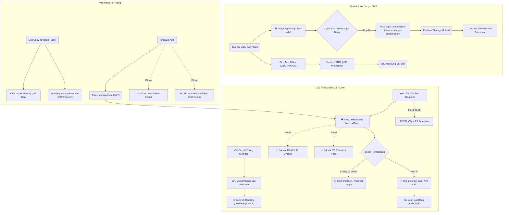

# 🧩 Workflows
## system-content
- **Title:** Hệ thống & Nội dung
- **Icon:** 📝
### 📁 Target Files (Các file đích)
- src/app/admin/settings/page.tsx (Cấu hình hệ thống)
- src/app/admin/posts/page.tsx (Quản lý bài viết CMS)
- src/app/(customer)/info/chinh-sach-mua-hang/page.tsx (Hiển thị chi nhánh và hotline từ system_config)
- src/app/admin/appearance/page.tsx (Cấu hình metadata và bộ lọc homepage; giá từ services, review từ Google Places)

### Google homepage reviews

- `/api/reviews/google` uses Google Place Details (New), not the Legacy endpoint.
- Default place: `ChIJmWqqJWcpdTERqc7cx-jP2E4`.
- Admin can override the Place ID from `/admin/appearance`.
- If Google Places is unavailable, the homepage falls back to an official Google Maps URL CTA without mock reviews.

## BUG-CONFIG-SESSION-001: Lưu cấu hình giao diện làm admin bị văng đăng nhập

- **Status:** fixed
- **Symptom:** Sau khi admin lưu thành công tại `/admin/appearance`, Router Cache của admin bị purge và tài khoản có thể bị chuyển về `/admin/login`.
- **Root cause:** Luồng lưu config gọi trực tiếp Server Action revalidation từ admin client. Server Action trả response có thể refresh Router Cache của tab admin; trước đó sentinel `layout` còn purge root layout bằng `revalidatePath('/', 'layout')`.
- **Fix:** Sentinel `layout` chỉ revalidate `/(customer)` layout. Config save gửi request nền tới `/api/revalidate`, route xác thực bằng cookie admin đã ký hoặc secret nội bộ. Storefront vẫn nhận cấu hình mới nhưng auth tree `/admin` không bị refresh bởi Server Action.
- **Files:** `src/lib/requestRevalidate.ts`, `src/lib/ConfigContext.tsx`, `src/app/api/revalidate/route.ts`, `src/lib/revalidate.ts`, `src/app/admin/settings/CategoriesTab.tsx`, `src/app/admin/settings/NavigationTab.tsx`

## BUG-AUTH-SESSION-002: Mở trang chủ làm văng tài khoản Admin

- **Status:** fixed
- **Symptom:** Đang đăng nhập Admin (hoặc staff), nếu mở trang chủ (`/`) ở một tab mới hoặc chuyển hướng về trang chủ, tài khoản Admin ở tất cả các tab khác sẽ lập tức bị văng và bị chuyển về màn hình đăng nhập.
- **Root cause:** Component `ChatWidget` trên trang chủ khởi chạy và kiểm tra session. Vì tiến trình khôi phục session Admin của `AuthContext` cần thời gian, `ChatWidget` thấy chưa có tài khoản nên lập tức gọi `signInAnonymously()`. Lệnh này tạo ra một phiên ẩn danh và đè mất session Admin hiện tại. Do các tab dùng chung IndexedDB, tab Admin phát hiện session bị thay đổi thành "Ẩn danh" và tự động văng ra ngoài.
- **Fix:** Bổ sung điều kiện kiểm tra trạng thái đang khôi phục session (`authLoading`) vào `ChatWidget.tsx`. Component này phải kiên nhẫn đợi `AuthContext` tải xong toàn bộ. Chỉ khi xác nhận không có tài khoản thật sự thì mới gọi `signInAnonymously()`.
- **Files:** `src/components/ChatWidget.tsx`

## FEATURE-CONFIG-WARRANTY-001: Mở rộng Cấu hình Mẫu Biên Nhận Bảo Hành

- **Status:** completed
- **Description:** Cung cấp tính năng tuỳ chỉnh 3 mẫu biên nhận bảo hành: Thiết Bị, Sửa Chữa và Phụ Kiện tại màn hình cài đặt biên nhận. Cho phép quản trị viên xem live preview và thay đổi nội dung các cột điều kiện bảo hành. Đã xác nhận requirement: Mã QR in trên hoá đơn thực tế sẽ chứa Order ID để nhân viên quét điện thoại truy xuất nhanh đơn hàng.
- **Files:** `src/app/admin/settings/receipt/page.tsx`, `src/app/admin/settings/receipt/WarrantyComponents.tsx`

## FEATURE-PRINTABLE-WARRANTY-002: In Phiếu Bảo Hành từ Repair Ticket

- **Status:** completed
- **Description:** Hoàn thiện luồng in phiếu bảo hành cho module sửa chữa. Nút `In BH` chỉ hiển thị khi `ticket.categoryPath` resolve được `TaxonomyNode.warrantyType` và `system_config/receipt` có template tương ứng. Hỗ trợ fallback từ node cha xuống node con trong taxonomy, dùng lại `PrintableWarranty` và không áp dụng cho Orders cho đến khi order item có dữ liệu taxonomy đủ tin cậy.
- **Files:** `src/app/admin/repairs/page.tsx`, `src/components/admin/PrintableWarranty.tsx`, `src/components/admin/PrintableReceipt.tsx`, `src/app/admin/settings/CategoriesTab.tsx`

## BUG-BUILD-005: Typecheck/Lint/Build vỡ do file JSX bị cắt và artifact bị quét

- **Status:** fixed
- **Symptom:** `pnpm typecheck` fail vì JSX không đóng ở Products/Repairs/NavigationTab; `pnpm lint` fail vì thiếu `eslint-plugin-react-hooks` và quét cả `scratch/chrome-qa-profile`; production build không thể dùng làm gate deploy. Sau khi build pass, IDE/Edge Tools vẫn báo 2 lỗi `axe/forms` tại `CategoriesTab.tsx` vì `<select>` chưa có accessible name.
- **Root cause:** Một số file UI bị dán/cắt hỏng trong quá trình chỉnh sửa, `package.json` chưa khai báo peer plugin của `eslint-config-next`, file debug/script vào typecheck với import Firebase Admin sai, và type `FirestoreDateValue` chưa phản ánh dữ liệu bảo hành đang lưu dạng timestamp number. Riêng lỗi `axe/forms`: build/typecheck không bắt accessibility runtime rule; các `<select>` trong UI phải có `label` liên kết bằng `htmlFor/id`, hoặc `aria-label`/`title`.
- **Fix:** Khôi phục cấu trúc JSX bị mất, thêm `eslint-plugin-react-hooks`, ignore runtime artifacts trong ESLint, siết `/api/debug/users` bằng `manage_staff`, bỏ các `no-explicit-any` suppression liên quan và chuẩn hóa type warranty/service/product detail. Bổ sung accessible name cho các `<select>` trong `CategoriesTab.tsx`: filter loại danh mục có `title`/`aria-label`; select loại phiếu bảo hành có `label htmlFor`, `id`, `title`, `aria-label`.
- **Files:** `eslint.config.mjs`, `package.json`, `src/app/admin/products/page.tsx`, `src/app/admin/repairs/page.tsx`, `src/app/admin/settings/NavigationTab.tsx`, `src/app/admin/settings/CategoriesTab.tsx`, `src/app/api/repairs/handover/route.ts`, `src/app/api/debug/users/route.ts`, `src/lib/types.ts`, `src/components/admin/CurrencyInput.tsx`, `check_users.ts`
- **Verification:** `pnpm lint` pass (0 errors, existing warnings only), `pnpm typecheck` pass, `pnpm build` pass. Sau lỗi IDE axe, đã verify lại `eslint` riêng `CategoriesTab.tsx` và `next typegen && tsc --noEmit` bằng local binaries.
- **AI Guardrail:** Khi sửa UI form control (`input`, `select`, `textarea`, icon-only button), không chỉ dựa vào build. Luôn đảm bảo control có accessible name: visible `<label htmlFor="...">` + `id`, hoặc tối thiểu `aria-label`/`title`. Lỗi Edge Tools/axe có thể xuất hiện dù build thành công.

## BUG-DEPLOY-006: Firebase SSR deploy chạy npm ci dù dự án dùng pnpm

- **Status:** fixed
- **Symptom:** Local build/typecheck đã pass nhưng Firebase deploy vẫn fail trong Cloud Build tại SSR function `firebase-frameworks-qlch-vanlanh:ssrqlchvanlanh(asia-southeast1)`. Log dừng ở `npm ci` với lỗi `package.json` và `package-lock.json` không đồng bộ, ví dụ `sharp@0.34.5` trong dependency hiện tại nhưng npm lock cũ còn trạng thái `0.33.5`/thiếu các gói `@img/sharp-*`.
- **Root cause:** Dự án đã chuẩn hóa sang `pnpm-lock.yaml` nhưng root `package.json` chưa khai báo `packageManager`, trong khi Firebase Frameworks tạo bundle SSR dưới `.firebase/.../functions` kèm `package-lock.json`. Khi Cloud Build nhìn thấy npm lock trong bundle SSR, nó chạy `npm ci`. Lỗi sâu hơn là `firebase-frameworks@0.11.8` chỉ nhận peer optional `sharp ^0.32 || ^0.33`, còn `next@15.5.x` cần optional `sharp ^0.34.3`; nếu root function không pin `sharp`, npm lock dễ bị lệch/không thỏa peer ở Cloud Build. Đây là lỗi deploy pipeline/package manager, không phải lỗi TypeScript hay lỗi `next build` local.
- **Fix:** Khai báo rõ `packageManager: pnpm@10.30.3` và `engines.node: 22` trong root `package.json`; đổi script `verify` sang `pnpm lint && pnpm typecheck && pnpm build`; pin root dependency `sharp: 0.33.5` để thỏa `firebase-frameworks`, trong khi `next` vẫn giữ `sharp@0.34.5` riêng trong dependency tree. Đã clean artifact `.firebase/` cũ để Firebase Frameworks sinh lại bundle SSR từ source hiện tại ở lần deploy tiếp theo.
- **Files:** `package.json`, `pnpm-lock.yaml`, `.firebase/qlch-vanlanh/functions/package-lock.json` (generated artifact, ignored)
- **Verification:** `pnpm list sharp next firebase-frameworks --depth 1` xác nhận root có `sharp@0.33.5` và `next@15.5.18` có nested `sharp@0.34.5`; `pnpm typecheck` pass; `pnpm build` pass. Sau khi clean `.firebase/`, `firebase deploy --only hosting` pass: function `firebase-frameworks-qlch-vanlanh:ssrqlchvanlanh(asia-southeast1)` update thành công và hosting release complete. Generated function `npm ci --dry-run` pass.
- **AI Guardrail:** Khi deploy fail sau khi local build pass, đọc đúng stage trong log. Nếu lỗi nằm trong Cloud Build `npm ci`, ưu tiên kiểm tra package manager/lockfile/generated `.firebase` và peer conflict `firebase-frameworks`/`sharp` thay vì sửa source UI/TypeScript. Không commit `package-lock.json` hoặc artifact `.firebase/` vào repo pnpm. Warning hiện còn nhưng không chặn deploy: Firebase CLI trên Windows báo `node-which`/`esbuild` khi bundle `next.config.mjs`; chỉ xử lý nếu warning này chuyển thành lỗi runtime/deploy.

## FEATURE-GLOBAL-SEARCH-001: Tìm kiếm toàn cục & Quét QR

- **Status:** in-progress
- **Branch:** `feature/global-search-qr`
- **Description:** Xây dựng tính năng tìm kiếm toàn cục (Global Search) trên Admin Header, cho phép tìm kiếm xuyên suốt các collection: Sản phẩm, Dịch vụ, Đơn bán hàng (Orders) và Phiếu sửa chữa (Repair Tickets). Đặc biệt tích hợp tính năng Quét mã QR bằng Camera (sử dụng thư viện `@zxing/browser`) để tra cứu siêu tốc các mã đơn in trên hóa đơn/biên nhận khi khách hàng mang đến.
- **Files:** `src/components/admin/GlobalSearch.tsx`, `src/app/admin/layout.tsx`, `src/app/api/search/route.ts`
